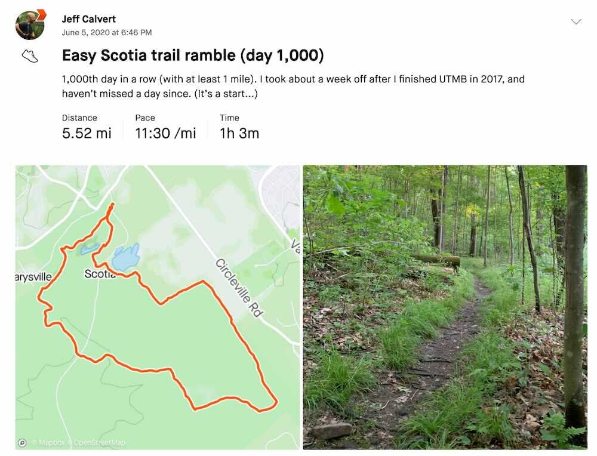

*Originally published to Strava on 5 June 2020 (Friday)*

### Easy Scotia trail ramble (day 1,000):

1,000th day in a row (with at least 1 mile).  I took about a week off after I finished UTMB in 2017, and haven’t missed a day since.  (It’s a start...)

 [ Strava activity link ]
