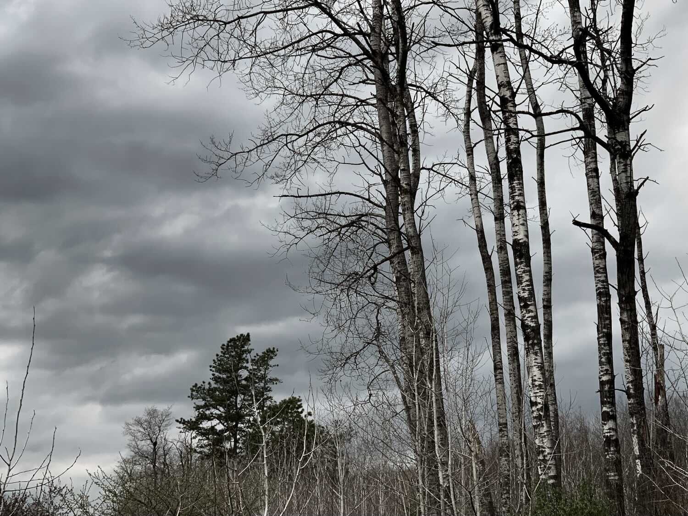

*From my journal: 8 May 2020 (Friday)*

We’re under the influence of a mid-May polar vertex, with the temperature at about 43F, and down to the very low 30s tonight, and similar tomorrow and Sunday. I’m glad I have my ten-run done already. I’m also glad to see the prediction for high 60s and maybe up to 70 by next weekend.

**And I’m embarrassed** to be talking about this. I’ve always prided myself on not letting the weather rule me, and I’ve looked down on those who do. Was that a pose? Or am I just getting softer as I get older, allowing myself to let my comfort zone contract?

It might be a little of both. It might also be that there’s been an aspirational element to it all along. I *wanted* to be that way, immune to the weather, or at least not in thrall to it. My comfort zone hasn’t changed much, and I don’t think I ever didn’t mind cold and rain and wind. But maybe I’ve become less demanding of myself lately, or more indulgent of the softness of my body when it wants not to go out into things. Maybe I’m not seeing the point of arbitrary suffering in the same way that I used to.

**Or maybe** I’ve realized that I no longer have much to prove in this arena. I’ve tested myself with some pretty poor weather through the years, and endured it without much complaint, made it through. Kerry Way, The Bear, Hellgate — I can look back at any and all of those (and many others) and be assured that I’m not soft, that I’m not becoming weak and fragile in my middle-agedness.

But having nothing to prove is not the same as having nothing to learn.

Maybe I want to believe I no longer need to practice this skill. Is it permanent, a non-perishable status that doesn’t require periodic sustainment training? Have I graduated from my old requirement — do I no longer need a monthly Adversity Run to remain competent?

That would probably be a bad assumption to make.
