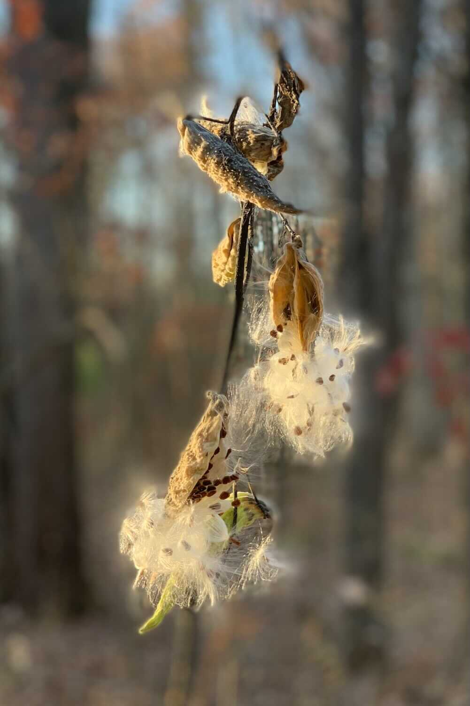

*From my journal: 7 November 2020 (Saturday) (with photos from Sunday’s run)*

**I am slowly** but surely pulling myself out of this election quicksand, clawing my way back to the normalcy I thought I’d achieve a week ago.

I just replaced “find” with “achieve” in that sentence, even though it seems off to talk about normalcy as something to achieve. It may seem off, but I think it’s accurate, and it’s also much harder to get to than it should be.

I guess that’s the journey our country is embarking on now, too.

**The presidential race** has still not been called, but the outcome has been clear for a couple days now, and it’s only a matter of time, as the remaining votes are counted.

Biden hasn’t yet claimed victory (and Trump has of course claimed victory repeatedly) but his speech last night was more assertive than the one the night before. I think he’s doing this well, and I think the slow and rolling nature of this victory is a good thing.

Because it’s hard to maintain emotional intensity for a week, at least at the level likely to bring violence. Instead, that intensity is slowly dissipating, and the underlying exhaustion is doing its work. Of course there are still hotheads and trolls who are actively stoking the fires of chaos, but they are fewer now, and fewer people are paying any attention to them.

At least that’s how it looks to me.

**That doesn’t mean the dissension will disappear** — it surely will not. We have to acknowledge that perception is reality as far as the way it effects people’s actions, and there’s a sizable number of people who believe the election has been stolen. That there’s no truth in that belief is of almost no importance. It only matters what they think.

Or at least at some level it only matters what they think.

But of course it also matters what actions they take, and it seems to me those actions will still be threatening to our future, but in a different way. The memory will be there waiting to be used by the next contender, and there will be many people actively trying to keep the embers of victimhood smoldering, ready to reignite the blaze.

Figuring out how to keep that from happening is the real trick here.

