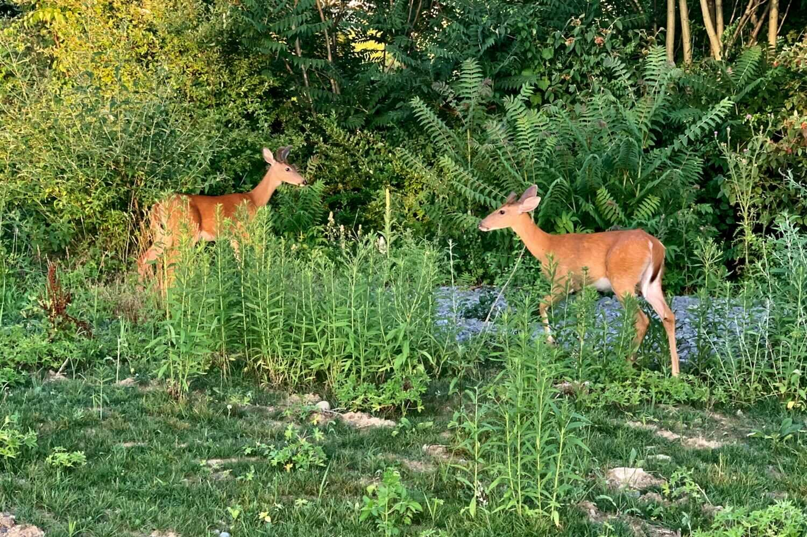
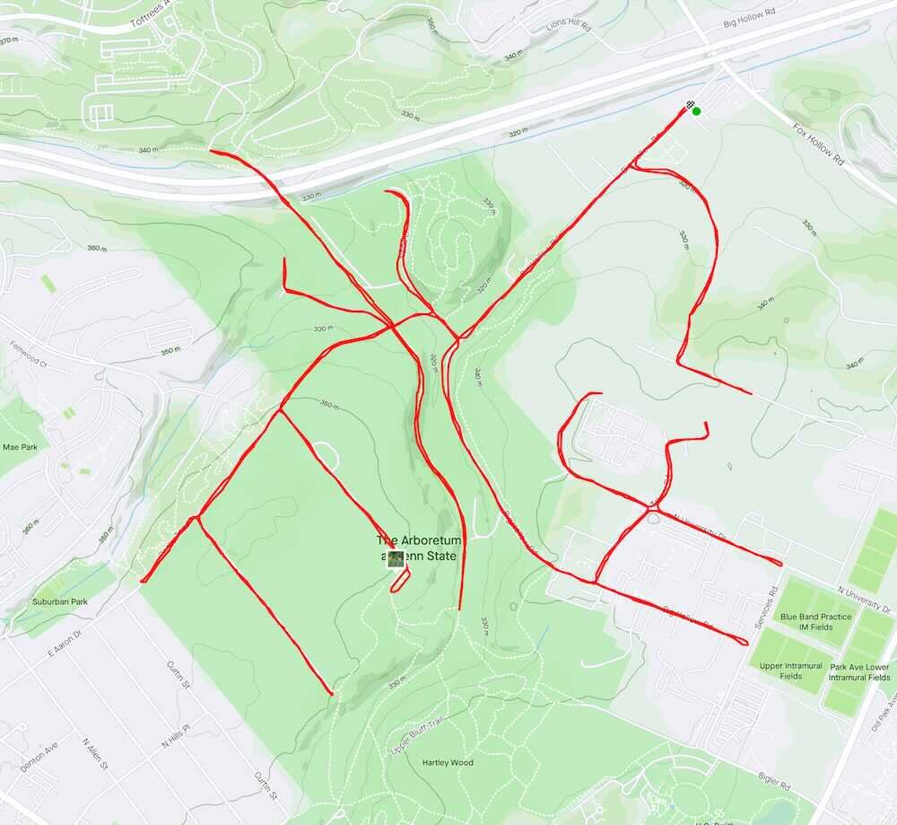

*Originally published to Strava on 14 July 2020 (Tuesday)*

## Big Hollow branches (at least some of them).

Some quality time with the fearless young bucks.

And who says Strava isn’t motivational?  This started as a check-the-box 4-miler, but then I started thinking about what the track could look like, and I just kept going [to 10.8 miles].

 [Strava activity](https://www.strava.com/activities/3763883934)
