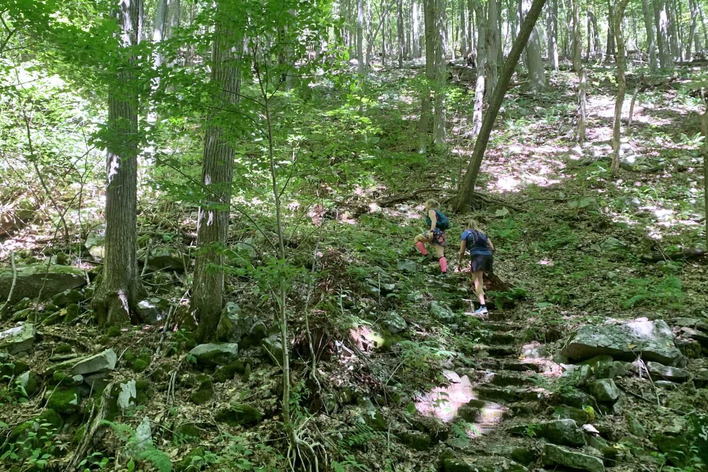

*From my journal: 6 September 2020 (Sunday)*

**We** (Renee, Kayla, and I) did the Rock’n the Knob course at Blue Knob yesterday.

The weather was nearly perfect for late-summer, and while the pace was pretty slow, I didn’t mind, since I was nursing my problem knee along.

The pace was also in line with my idea that these runs with Renee roughly simulate my target 100-mile pace (especially  given this route’s 220 feet/mile elevation density).  I don’t know if this tactic of running some hard and fast runs on my own, and then doing long runs at these unnatural (for me) paces will pay off or not, but it’s at least a reasonable thing to try.

**The main idea is** that I get my distance in this way while getting extra time my feet, but with less of the pounding and trouble I might bring to myself if I were doing those long runs at the pace I’d likely do them on my own.  The fact is, I couldn’t hold that natural pace for a hundred, but I can hold Renee’s 20-mile pace for a hundred, so I’m getting a lot of practice at my hundred-mile pace (which I haven’t really done much of in the past).

**The risk is** that I’ll get to the race without enough training sessions that were both long *and* hard (and also with no intermediate-distance races that serve the same purpose).  My counter-thought is that those long-and-hards are hard on the body, that they might break it down more than they build it up, and that they should be used very carefully and infrequently.  Yes, there are some major psychological benefits to be had from those runs that are hard to get in any other way, and I’m sure those lessons require periodic reinforcement, but I think I’ve visited those lessons enough that I don’t need quite as much reinforcement as I used to.

I was aware of my knee issue for the entire run, start to finish yesterday, but it never made me consider cutting the run short (which I had the opportunity to do).  The slow pace allowed me to be careful with my steps, and also to pay attention to what kind of steps and what conditions made it worse or allowed it to fade.  The transitions from level or downhill running to climbing were the main culprit, and often the first 5-10 steps of a climb brought significant soreness.  But just as I can work through it in controlled and supported exercise here at home, once I repeated the painful movement many times, it was like that muscle combination or range of motion of whatever was now loosened up and functional again, like a rusty hinge.

---

**We had a very good visit** to Berlin (and some flashbacks to that reunion evening on the deck, over a month ago).

The crowd was larger than advertised, which we should have anticipated.   And of course we had the only masks to be seen (this is deep-red rural PA, after all), and most everyone was inside most of the time, and there was lots of hugging.

The hugging part was a surprise, but I guess nothing about any of this should surprise me anymore.

We stayed on the deck (except to get food, and then with a mask) and most everyone made it out there sooner or later.  So I got to talk with some people I haven’t seen for a long time, and it was a good visit.

**But it was also surreal.**

It wasn’t the strangeness of wearing a mask — we’re used to that now.  It was the strangeness of wearing one when no one else was, and the way some of them didn’t seem to even know how to handle that.  It was strange, awkward... *surreal*.

**A side note…**

The “no politics” rule was plainly stated, and generally obeyed, but of course I couldn’t resist just one jab (irresponsible, but harmless).

It started with someone asking Renee if she’s afraid to be alone on the trail, and her mentioning that some women carry handguns, and that she was thinking about doing that, and me pointing out that this wasn’t the main reason we were shopping for handguns now, and someone asking what that main reason was.

**This set me up** for what I still think is a pretty great line:

> “Because in November there will be herds of disgruntled Trumpsters roaming the countryside thinking they’re the only ones with guns”.

The referees reacted instantly and shut things down without response.  It was a good, clean, accurate, and unanswered shot — I don’t regret it.
