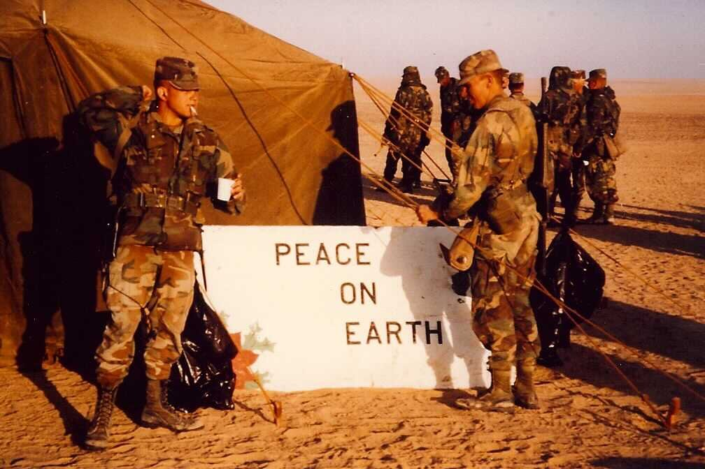

*From my journal: 24 December 2020 (Thursday)*

I’ve been thinking about making a Christmas Eve post on Facebook. I could put up my Christmas photo from Desert Storm, the one I took 30 years ago tomorrow, and add a message to it.

I want it to remind people that sometimes we have to do hard things (like protecting ourselves and our families from a deadly virus by staying apart during a pandemic). And yes, I want to chide the people who think that’s just too much hardship for them to bear (or guilt them, or something — and only very gently).

Maybe something like this:

> *I took this photo in northern Saudi Arabia, 30 years ago on Christmas morning. It’s one of three times I was deployed away from home and family on Christmas. If you're "away" this year, please trust me when I say:*
>
> *You can do this. It isn’t pleasant, it might even be hard, but it will be alright.*
>
> *Soldiers (and ultra-runners) learn early to modulate our perception of deprivation, to tolerate hardship and delay gratification in the interest of a mission. You, too, may discover that you’re stronger than you thought. And you might find that times like these help you appreciate the other times in a deeper and better way. May you all have a happy, peaceful, and responsible (mission-focused) Christmas.*

Or something like that.

 Christmas in Iraq, 1990 (D Company, 1st Squadron, 2nd Armored Cavalry Regiment)
