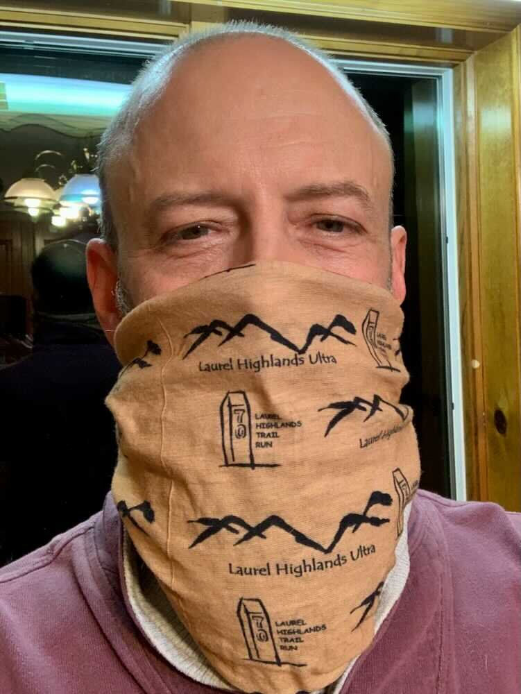
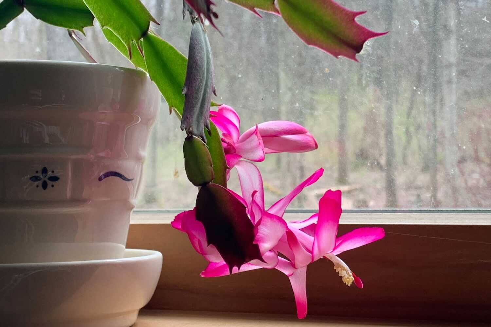

*From my journal: 4 April 2020 (Saturday)*

## A death

The other news is that we had the first Covid-19 death of an acquaintance.

**I knew that** COL Fuoco had the disease, but I found out yesterday that he has died from it. I spent a number of years working with/for him in Philadelphia and Staten Island. He was a good man, a good soldier, and I’m sorry to hear he has passed.

---

## Masks

**Other than that**, there’s no personal pandemic news, but there’s the new development that we are officially advised/requested to wear masks when we go out in public. This has led to arguments about the wisdom of this on Facebook, which is one of the games I’ve been participating in.

People (like Dave, for example) are saying they won’t wear a mask, citing some study that at first glance would seem to say it doesn’t help. I looked at the study, and it clearly doesn’t fit or have much bearing on the question, and I couldn’t keep myself from saying so. …

---

## *And…*

*Originally published to Facebook on 4 April 2020 (Saturday)*

It’s not Christmas, and the cactus doesn’t care...

