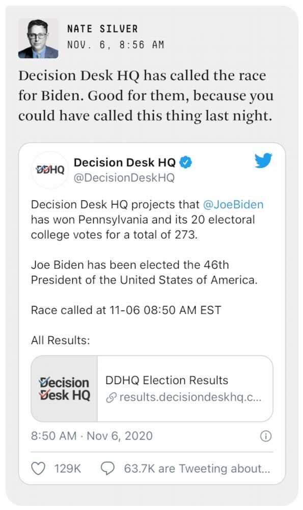

*From my journal: 6 November 2020 (Friday)*

The situation is different today, but it’s no more conducive to me getting legitimate inside work accomplished. So I’ll do a quick roll-up of the situation, and then I’ll probably escape back out to the yard for another afternoon of work out there.

**First, the election situation is resolving**. In the early-morning hours, the lead shifted to Biden in both Georgia and Pennsylvania, and his lead is growing in both places (and in Arizona and Nevada) as the the remaining votes are counted. I think it’s nearly all over but the crying and whining and poor-loser-ing.

Some good signs as I made a quick pass through my Facebook feed — most of the usual trolls are either silent, or have changed the subject entirely. There are still a couple of hotheads, and there’s some small amount of victorious gloating, but for the most part I’m not seeing emotions build, but rather just kind of seep away.

That’s a good thing because I believe it’s a sign that the same is true in the real world, and that lowers the chance that there will be much violence around this mess.

---

**Second, there’s a positive C19 test** at the animal hospital (an employee) and they’ve all been exposed, and therefore must all self-isolate for 10-14 days (and therefore they must close). I’ve spent most of the morning talking with Renee about this, trying to walk her through a list of things to address or at least think about, and trying to help her figure out the intricacies of the employee emergency leave laws and so on.

This is not a good situation, but there doesn’t appear to be a way around it. They’ll make it through, and the financial hit will hopefully be survivable. I mainly take it as an opportunity for them to take a breath and reevaluate their approach going forward.
