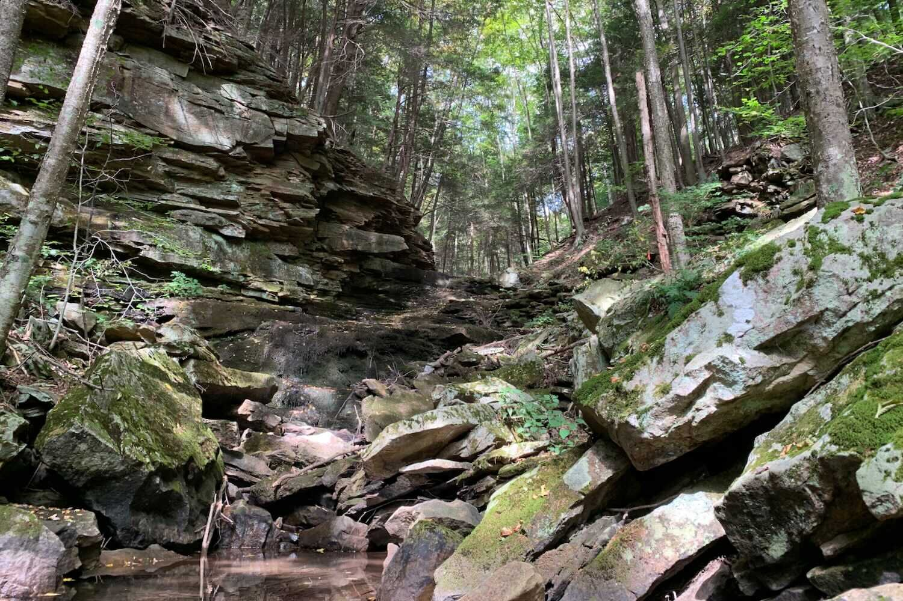
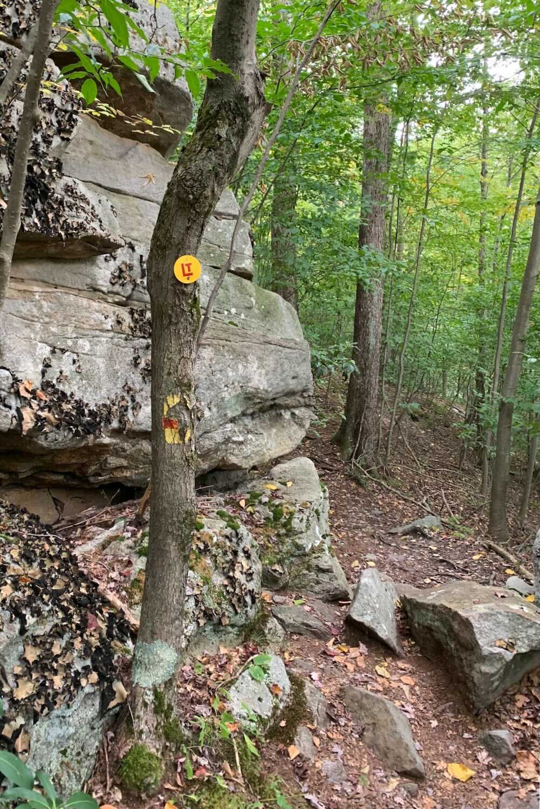
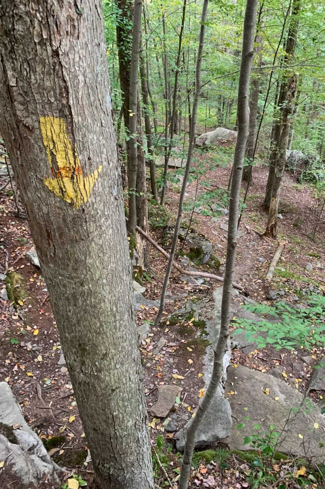
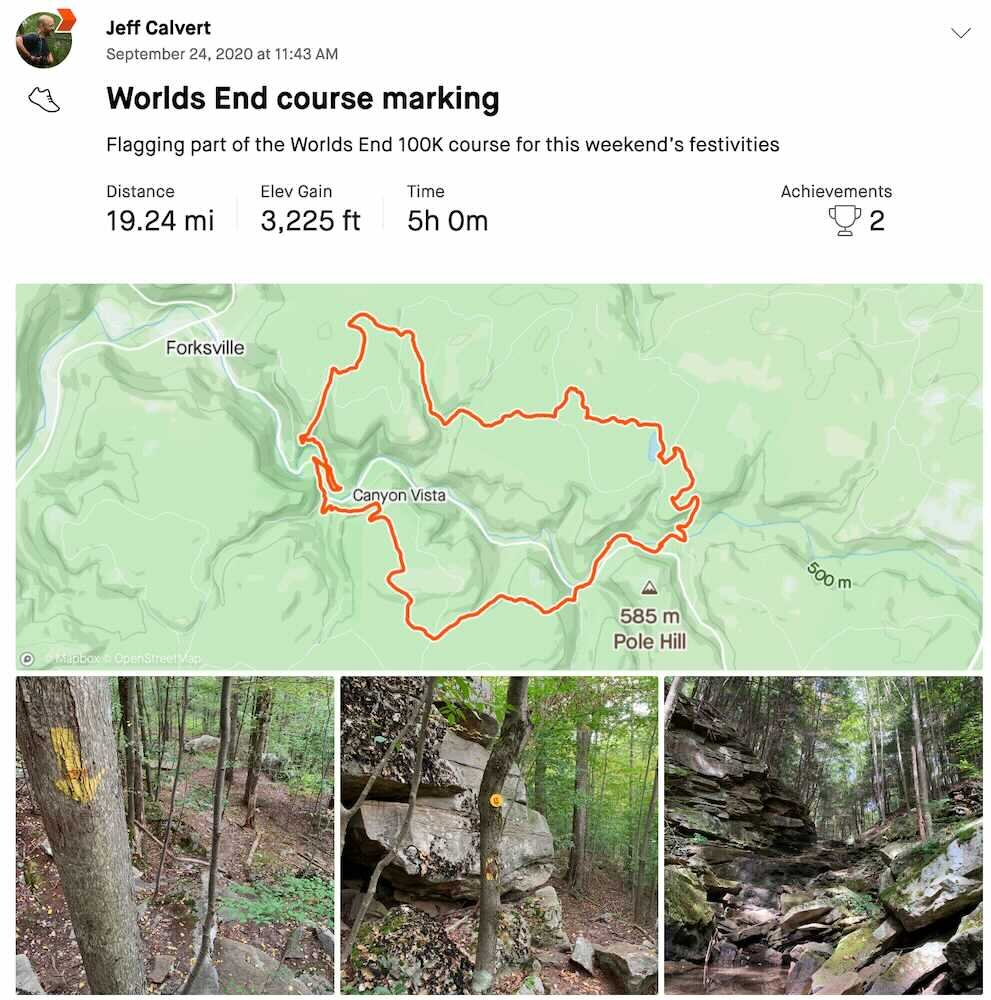

*From my journal: 25 September 2020 (Friday)*

**It was good to get back** up there and get out on those trails.

The last time was the race, over a year ago, but it’s pretty much the same, except it’s *so* much dryer now.  I did the entire first loop without getting my feet wet (and that includes routing the course under the Shanerburg Road bridge).  Most of the creeks are completely dry, most of the various swampy seeps are completely dry, and the Loyalsock is very low.

I’m not sure when the last time I marked trail was — maybe Eastern States 2019?  Anyway, it was like I’d never been away.  I’m pretty sure I was re-using some of the same branches that I used the last time I marked Worlds End, back in 2018.

 (Truth in advertising)

**I made my first-ever** 911 call yesterday, to report a fire that was at least threatening to grow.

I’d met this group of backpackers on the trail right at the start of my loop, and we’d chatted a little bit.  When I met them later in the day along the Link Trail, they were sitting along the Loyalsock with their packs off, getting ready to make camp.  we chatted again, and they told me about this fire they’d found.

Back from the trail there was a fire pit someone had dug, and apparently they hadn’t put their fire completely out, because it was still burning down in the duff and the roots, spreading.  The backpackers had tried to stomp it out, and I tried, but there is too much root structure and too much duff there for that.  And it was clearly smoldering along its margins in an expanding circle, and there’s a drought, and anyway, they were going to have a hard time putting it out with their water bottles.

But there’s no cell service down there, so I told them I’d contact someone as soon as I got to service.  At the top of the next hill, I got a signal, but it was already at least 1800 by then, so the park office would be closed, and called 911 instead.  It was pretty uneventful, and they might have already known about it, but if not, I hope they got someone out there to take care of it.

Beyond that, there was nothing too exciting to report, no bear encounters or snake encounters or other people encounters.  I did stop in a Dave’s cabin at the end of the day (I was parked there) and chatted with him and with Brad Bason for a while, and that was nice.  And I got over 19 miles, a decent workout, a nice day in the woods, and I did part of my bit for the race.  It was a good day.

 [Strava activity](https://www.strava.com/activities/4108750569)
