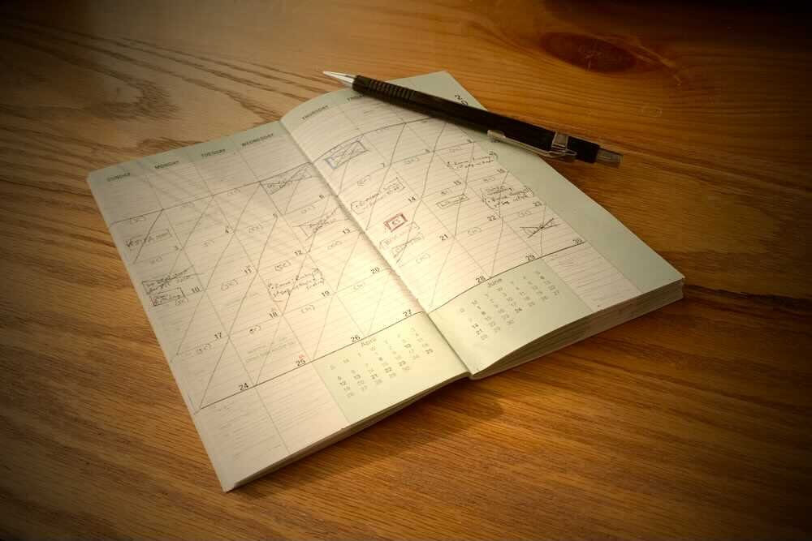

*From my journal: 19 May 2020 (Tuesday)*

**For at least 27 years** (since I first read *First Things First*) I’ve been formally viewing my life through the window of the week, using that as my basic unit of measure and building block of plans.

Of course even before that “formal adoption” it was still the basic unit, or at least one of them, because it’s *our* basic unit, the unit we build our calendars around. Yes, there are also hours and days and months and years, and each of those has its place. But for functional planning, the week is the closest to ideal in scale. Hours are far too short to be useful, months and quarters and years are too long to truly grasp, but the week is just on the edge, in the sweet spot where we can almost imagine it as a real thing rather than the representation of a thing.

Oddly it is also a measure that isn’t astronomical. The day is based on the rotation of the Earth and it’s a real thing. The month is (loosely) based on the revolution of the Moon around the Earth and that’s a real thing. The year is (roughly) based on the revolution of the Earth around the Sun, and that’s a real thing.

**But the week** is arbitrary.

Without researching its origins, my guess is that we realized we needed some intermediate measure of things, some supplemental guiding rhythm for our affairs, and the week emerged. And whether by intention or evolution, it’s an acceptable solution for that functional need.

I’d be much happier with it if it were a better number of days, like ten, and I’d also be happier with it if our standard depiction on calendars put the entire weekend at the end of the week. But all in all, it’s a good measure, short enough to be comprehensible, long enough to dampen some of the perturbations and unevenness inherent in shorter units.

**So as I approach** my 55th birthday (which, to be clear, marks the end of my 55th year — sadly I have to keep figuring that out), I calculate that I’m in my 2,869th week.

Roughly speaking, 5,000 weeks of life would give you between 95 and 96 years, so that’s not a bad figure for putting the week into the context of a lifetime. I could view each week as one 5,000th of my life. Or to add more sense of practical urgency, I could view each week as roughly one 2,000th of the time I have left — that should surely help me to focus on the important things, right?

**None of us** is guaranteed (or owed) even one more hour, of course, let alone another 2,000 weeks, so add that dose of reality to the process (and maybe find some suitable memento mori to help keep that in mind).

But still, that sense of aspirational optimism that I try to allow myself says that this is an appropriate framework for conceptualizing and planning — I’ll use it.

