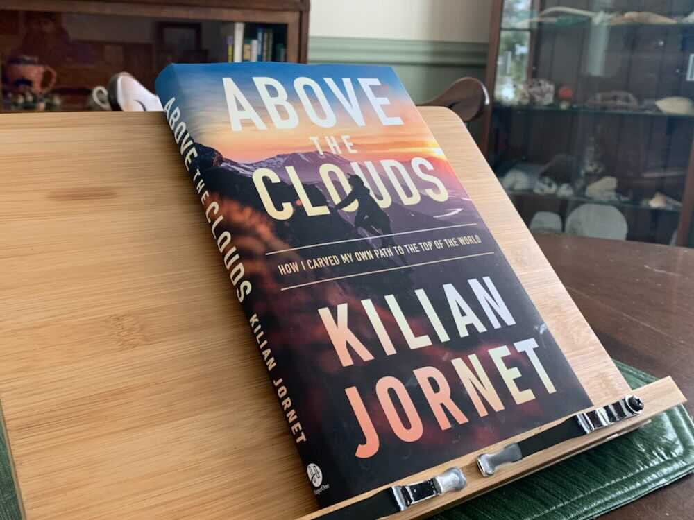

*From my journal: 17 December 2020 (Thursday)*

As I’ve been reading Kilian Jornet’s book (*Above the Clouds*), I’ve been looking for similarities or points of intersection between his experiences and my own, and I think there might be the kernel of a post there.

It would not be a review of the book.  The book is good; everyone with any interest in either Kilian or his sports (ski mountaineering, trail running, climbing) should read it.  Instead, it would be what I just said, a look at how the experiences and insights of a best-in-the-world professional mountain athlete and those of a middle-aged mid-pack trail runner overlap.  I’m looking for solidarity between his experiences and my own.

**I believe there *are* some points of intersection**, for me, and for anyone who does the kind of things that we do.  Of course the dealing-with-fame aspect of the book is not one of those, but the rest of it pretty much is, from the reasons to be out there in the first place, to the physical aspects of training and finding personal limits and making yourself better at what you do, to the contemplation of the selfishness of it all when viewed from the perspective of the suffering in the world.

One of those is the idea of risk.  I just read his description of a preparatory climb near Everest where he got to a point and backed down because of the life-risking nature of what he was contemplating.

At first glance there might not be much similarity between his situation on exposed high-altitude rock walls, extreme skiing, etc. and my own adventures on and off trail.  But if you look deeper and consider context, the principles involved are very much the same.  A 2,000-foot fall is certainly more dramatic than a 20-foot fall, but both are likely to kill you.  The risk of death is present when I push the pace on a Kettle descent, and when I inch my way around a narrow ledge on Bear Mountain.  The amount of risk involved isn’t only a matter of the terrain feature itself, but of my skills on that terrain.  So while we might not realize it, most of us have dealt with exactly the same nature of decision that Kilian discusses.  That’s a point of solidarity.

The same is true when he talks about competition.  No, the actual numbers aren’t the same, and few of us will ever come near to a sub-24-hour Hardrock.  But that doesn’t mean we can’t relate to the idea (and the sensation, the pain and the triumph) of going harder than you thought possible, and of knowing that you got the very best possible performance from your particular body on that particular route on a given day.  More solidarity.

The more I think about this idea, the better I like it.  I’m not sure if “solidarity” is the right word, but it’s at least almost the right word, and I like the tone of it.  The main thing is that I’m almost done with the book, and I’ve highlighted it as I go, so once I get those quotes captured, I’ll have a good base of ideas to structure a piece around.  I’m eager to get to work on it.
