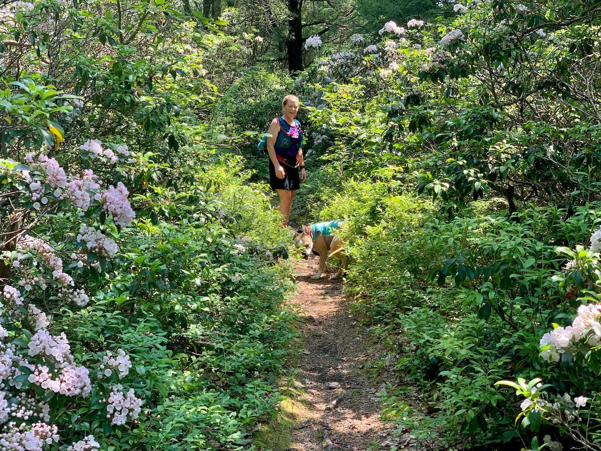
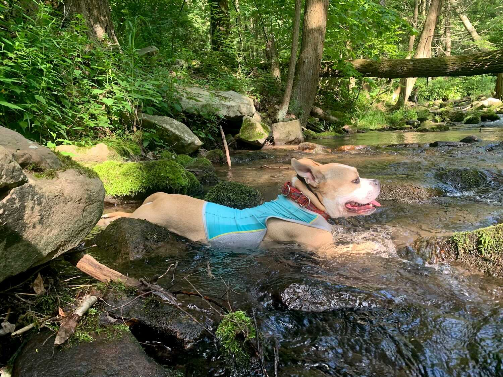

*Originally published to Strava on 28 June 2020 (Sunday)*

## Rothrock trails (with Renee and Scotia)

Yeah, early summer is a tough time here in central PA — so drab.

 Little Flat laurel (top of Spruce Gap Trail)
 Scotia in Galbraith Gap Run
