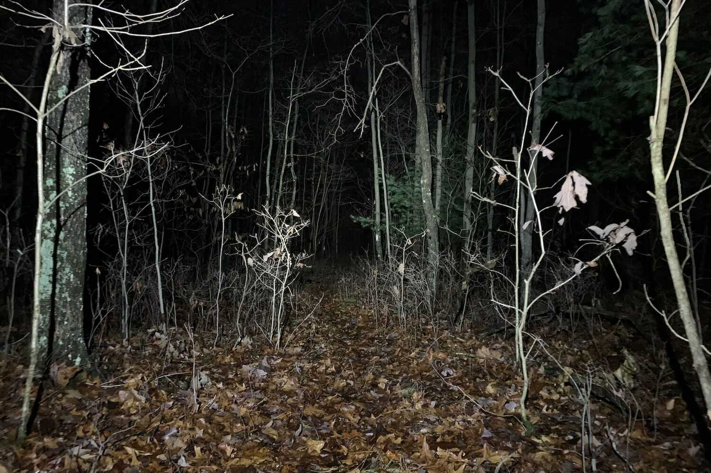
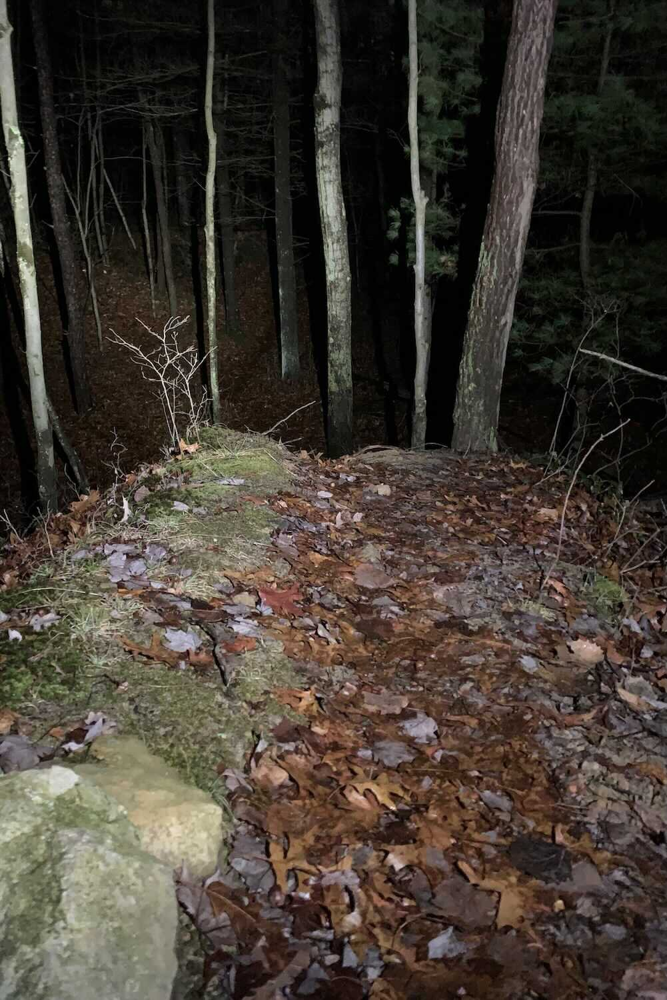
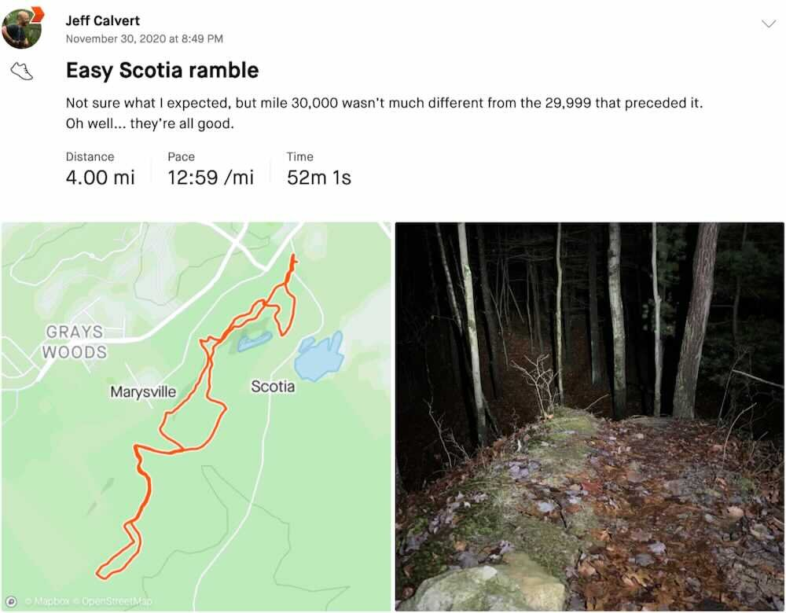

It was right about here (the last step of my 30,000th recorded mile)…

or maybe here…

…in the darkness, on a nameless trail in the Scotia Barrens, stars overhead, owl-hoot in the distance, steady gentle crunch of leaves underfoot…

and it was just like every mile before and since,

each pointless and precious,

each unique,

and all the same.

---

*Originally published to Strava on 30 November 2020 (Monday)*

 [ Strava activity link ]
