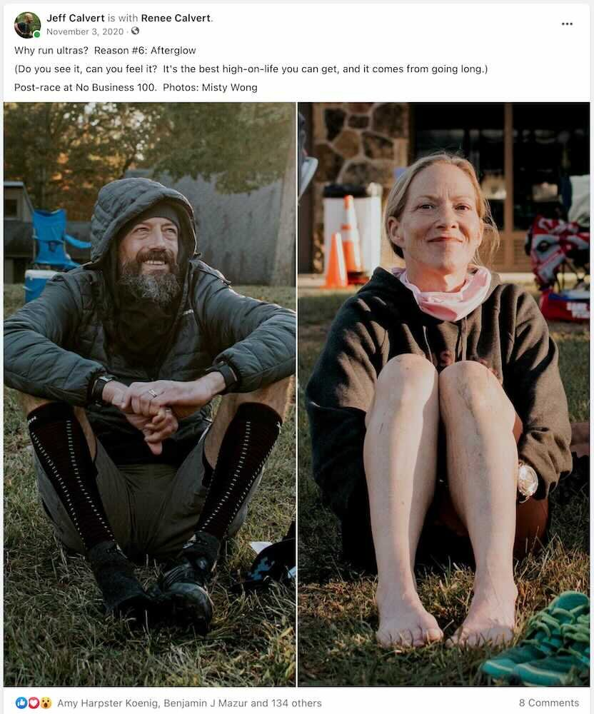

*From my journal: 2 November 2020 (Monday)*

Wars, separation, pandemics, elections, life, death…

I run my way through all of it.

Why?

First a caveat: I don’t have to justify myself to you or to anyone.

I do it, and that’s enough. Anything more is supplemental and speculative.

And just because I do it doesn’t mean that I understand why I do it, or at least that I’ve found adequate words for that why (or that the why isn’t constantly changing). So when I’m writing about it, it’s mainly for me.

Some of the reasons (an incomplete starter list):

### 1. Good Animal

First be a good animal. There are other interpretations of Emerson’s directive, but I like mine the best…

To be a good human, you must first be a good animal, you must experience and exercise your animal potential, and you must incorporate that into your human existence. And our animal potential is first and foremost that of the persistence predator, long distance pursuit, patience through the long-distance grind, regardless of terrain or weather, the optimism that you can outlast your prey, and that at the end of the pursuit, if you are steadfast, you will feast, and you and your offspring will survive.

### 2. Second Sunrise

I want to know who I am at second sunrise. [see my post [The “second sunrise” why](/writing/pandemic-diary/second-sunrise-why/)]

### 3. Second Sunrise (part two)

Second sunrise is a good one, but it only works for the first couple ultras. I already know who I am then. Maybe I need reassurance that I’m still that person, but I think it’s more likely I like that person and I want to spend more time with him, get to know him better.

### 4. Smiling Through

Smiling through a 3-in-the-morning thunderstorm. This is a variation on the second-sunrise reason, but it’s potentially more intense.

### 5. Is that all?

Is that all you’ve got? (That’s me addressing the mountain, the course, the challenge I’ve just completed.) Shades of “Shoot me again, I ain’t dead yet”, but also “Pride goeth before destruction, and an haughty spirit before a fall”.

### 6. Afterglow

Do you see it? Can you feel it? It’s the best high-on-life you can get, and the only path I’ve found to it is through the adversity of the extended physical and mental effort that gets you through a hundred miles. It comes from going long.

---

*Originally published to Facebook on 3 November 2020 (Tuesday) (Election Day)*

