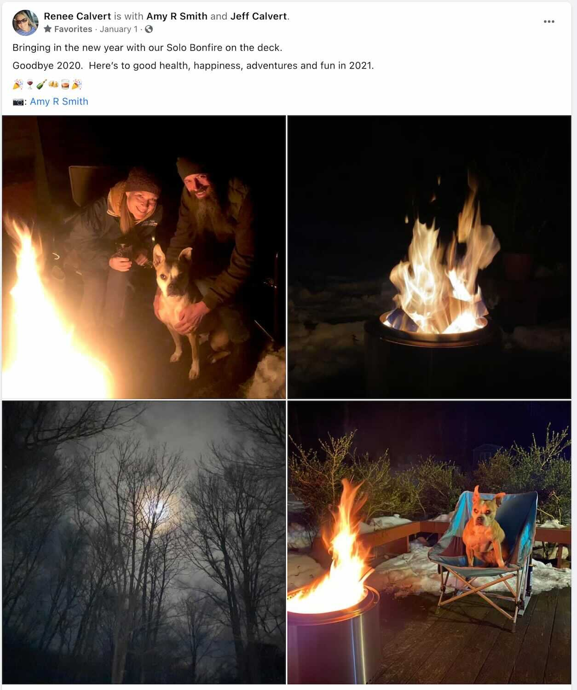
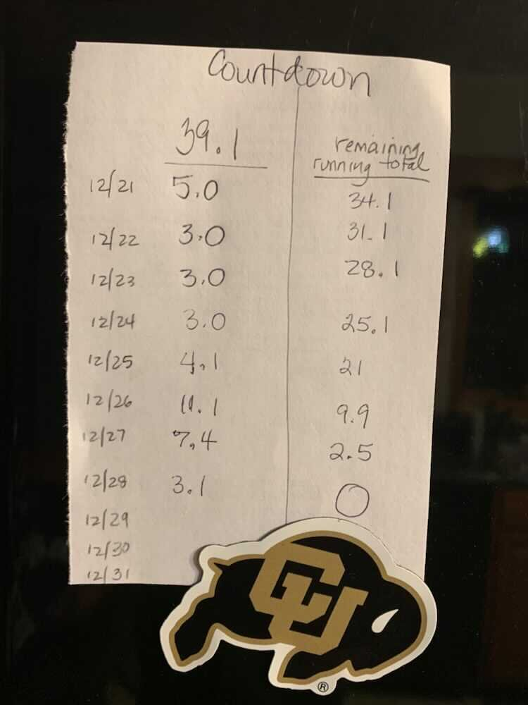
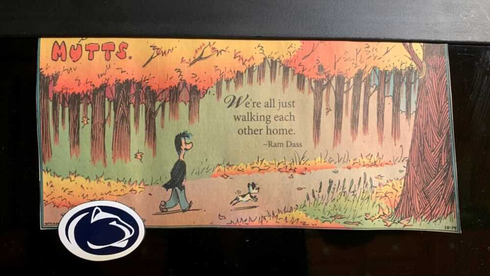

*From my journal: 31 December 2020 (Thursday)*

Oh, by the way, today is the last day of 2020.

Everyone speaks so badly of 2020, but I’ve had a good year. I’ve run more miles than any previous year, and I ran my fastest hundred-miler. I’ve gone an entire year without a cold or sore throat or flu or anything like that (isolation has many benefits). I’ve finally launched my website. I published an article (one that I’m proud of) in a magazine. We’ve stayed healthy, productive, reasonably happy, of sound mind and body, and we’re ready for 2021.

I’ll not argue about the relative merits of this year, and I think it’s probably not healthy to personify an arbitrary arrangement of time, anyway. I’ll let people have their melodrama (and in some cases it is actually drama), I’ll be thankful for what I’ve got, and I’ll face the new year with optimism and vigor.

In the short term, however, I’ll write another 200 words, close out my journal year, and go for a run.

I’ll run, and then I’ll get a fire ready to start in the Bonfire (it’s maiden voyage), I’ll clean up the deck, clear some snow, maybe put some chairs out so we can sit comfortably around the fire once it’s started, and I’ll get ready to settle in for the evening, and for the end of this year.

---

Found on our fridge at the end of the year…

