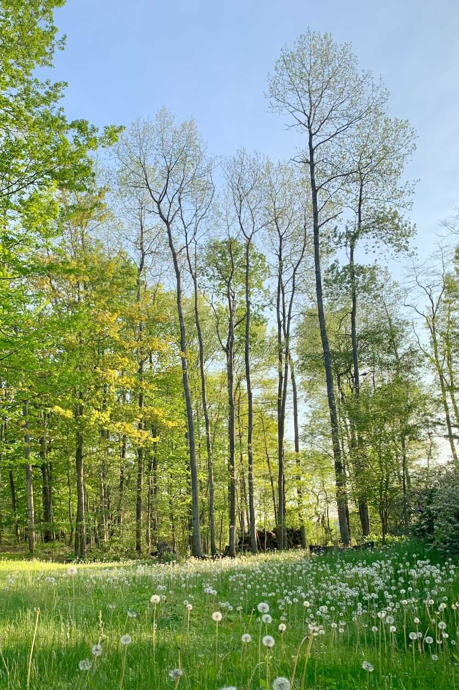
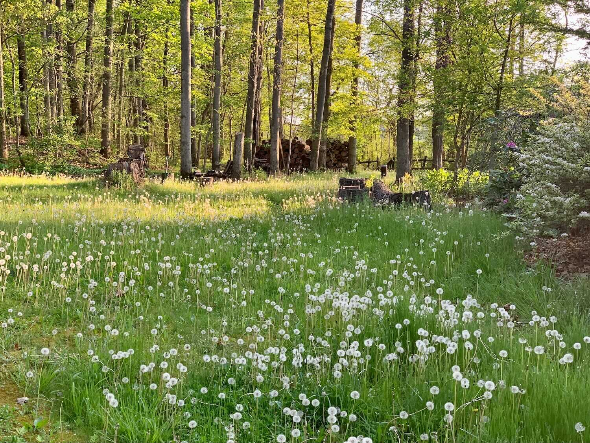
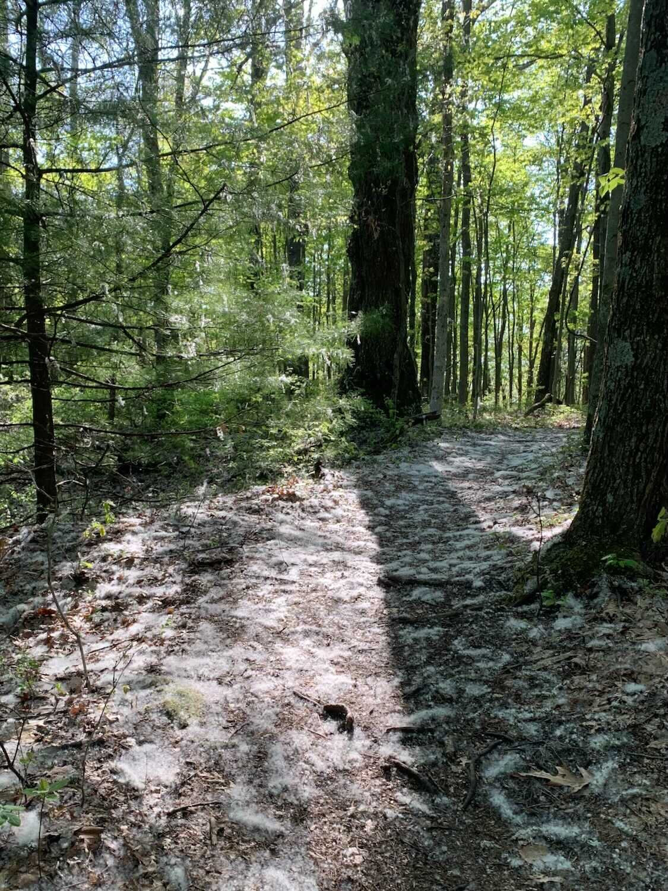
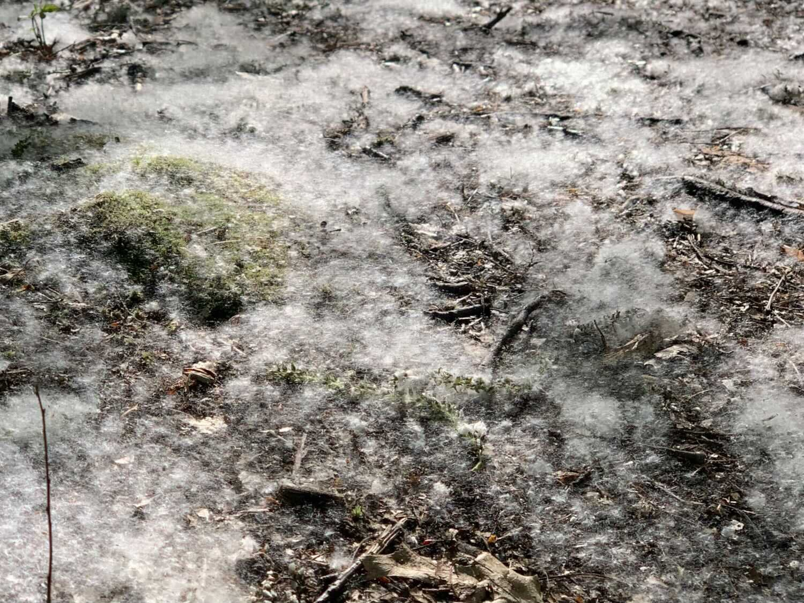

*Originally published to Facebook on 25 May 2020 (Monday) (Memorial Day)*

I never get tired of the view from my deck.

(by the way, it’s No-mow May)

---

And (from today’s run)…

It was a cottony day out on the Scotia trails today (aspen seeds).

