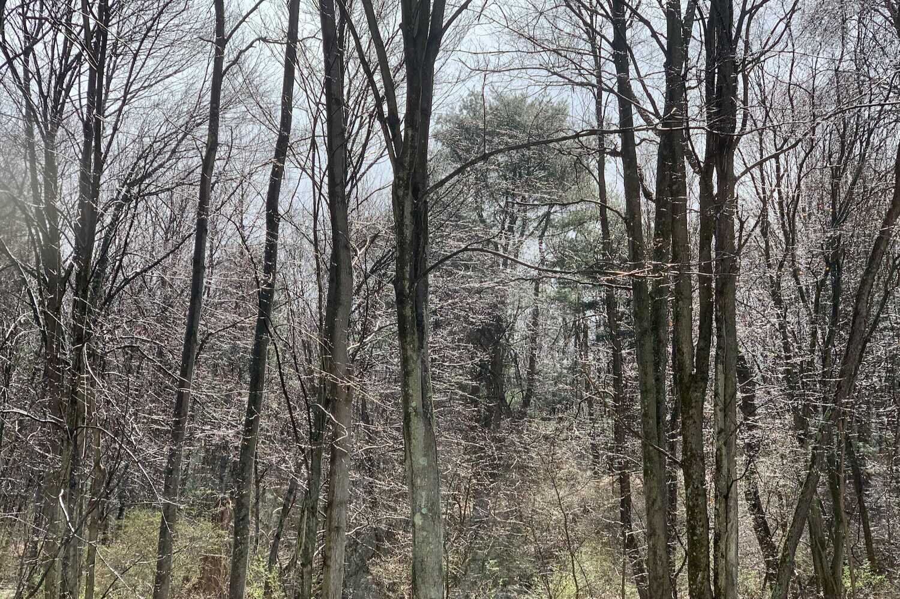

*From my journal: 1 April 2020 (Wednesday)*

We just had a flash rain storm, and now the sun has come out and the bare branches of the trees behind the house are glistening as if they were coated with ice. I tried to capture it with a photograph, but of course that was futile, so I just stood there on the deck for a moment and just stared, bathed in it. The sun felt warm and the grass and moss glowed green and it felt like at least May, and things just felt right…

And things *will* be right.

