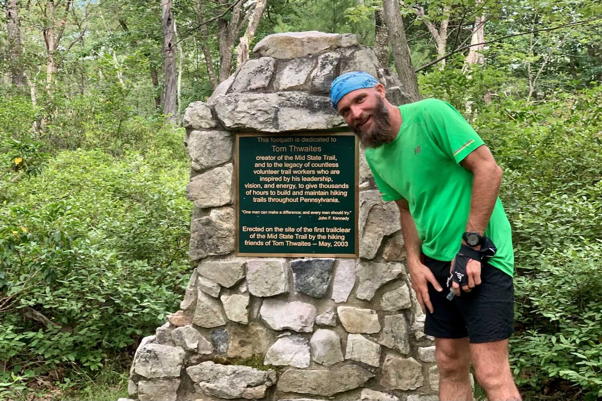
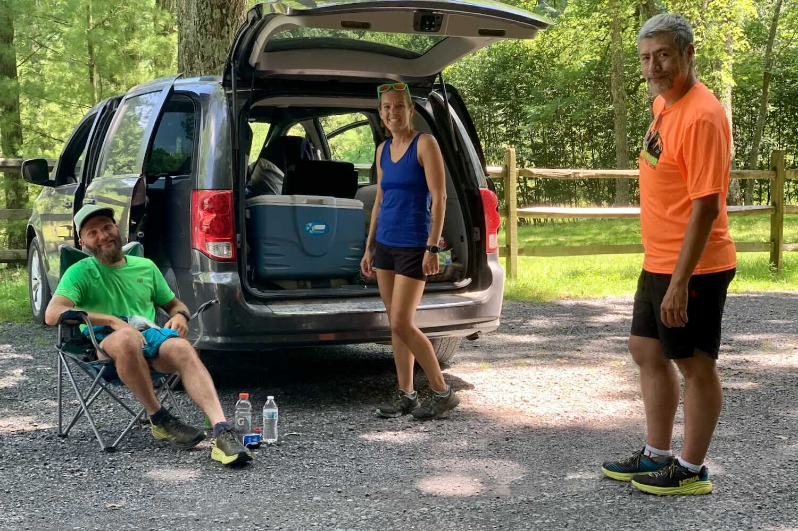
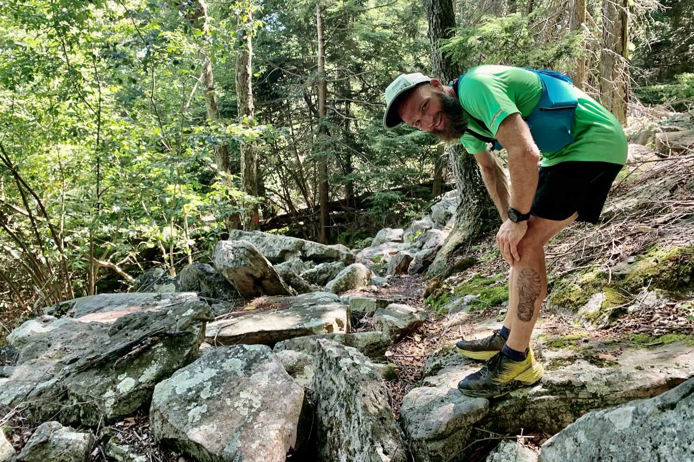

*From my journal: 20 July 2020 (Monday)*

**Well, actually**, pacing a *tiny* segment of an FKT attempt, but it still feels like a big deal.

Eric Kosek is running the Mid State Trail (south to north), and I got myself involved (against my better judgment, but I just couldn’t help myself) by reaching out to Ben (who is crewing him for the first half) yesterday.  I didn’t commit to a lot, only 10 or 15 miles, but the timing is working out pretty well, and I’m looking forward to it.

Erik started this morning at Colerain Road, and made it to Pennsylvania Furnace Road about 2.5 hours later (so a 20-minute pace), and now Ben (and Becky, I assume) are waiting for him at Jo Hays Vista.  I’m to join him at Little Flat, and unless he gets significantly faster, I think I have until about 0900 to get there.

I’ll stay with him (assuming I can keep up with him) until at least Penn Roosevelt State Park, which is about 10 miles, but I might go on to 322 (or the road intersection just beyond that), which would be about 18 miles.  Anyway, I’ll get some good trail miles in, and I’ll be a tiny part of history.  It should be a good day.

---

*From my Facebook post: 20 July 2020 (Monday)*

**I just had** the pleasure/privilege of sharing some miles with Eric “Idiotrunner” Kosek, showing him around our local section (the very BEST section) of the Mid State Trail (I was with him from Little Flat to Sand Mt Rd — only about 20 miles of the much longer distance he ran today) as he works his way northward enroute to the FKT (fastest known time) on this wildest of PA’s many wild trails.  Well over 100 miles into the 323-mile effort, he was strong, steady, and smooth (even with temps in the 80’s).  He’ll finish today 13 miles ahead of schedule.

---

*From my journal: 21 July 2020 (Tuesday)*

**I ran with Eric** for most of the day yesterday, and it was a good day.  I got up to the intersection of the MST and Laurel Run Road just in time to talk with Ben and Becky at the aid station they had set up there (their cars) for a few minutes before he arrived.  I guess I cut that a little close, but it worked out, and the rest of the day worked out, and I think I probably helped the FKT effort in a small way (or at least didn’t hurt it).

I was there with him for over 7 hours.  We had good conversation, and I managed not to slow him down.  Or at least I was able to keep up with him for the whole thing, which isn’t *necessarily* the same, because he might have gone faster without the distraction of conversation.  But he might also have gone more slowly.  I’ll quit questioning myself on it and take him on his word that he was happy I was there, and I’ll be glad for the experience and hopefully watch the rest of his trek online.

When I started running with him, he’d already been out for at least 13 miles, and he was coming off a 40 or 50-mile day, after another 40 or 50-mile day.  I, on the other hand, was coming off the 2-mile walk up from the parking lot, and a 50-mile week.  Yet I was often pushing to keep up with him, and a couple times I thought that if we keep going at this pace, I’m not going to make it.

But I did keep up, and his surges were mixed with plenty of hiking, and I felt good.  It was hot, and it was the longest run I’ve done since Hellgate, but I stayed hydrated and I felt good through the entire thing.

That sounds pitiful I know, to even be commenting on my own little 23-mile effort in the context of this 323-mile run he is on, but there it is, and I’ll take it.

](image-03.jpg)

---

*From my Facebook post: 22 July 2020 (Wednesday)*

I**n case you’ve missed** this rather epic adventure that’s rapidly building to its conclusion...  Eric “Idiotrunner” Kosek is closing in on the northern terminus of PA’s Mid State Trail.  The current FKT is a bit more than 11 days, and he’s moving almost twice that fast (in a heat wave!).  If you’ve spent any time on this trail, you’ll appreciate just how mind-blowing that is.  If not, just know that this is a world-class effort by first-rate runner (who also happens to be a really great guy).

---

*From my journal: 24 July 2020 (Friday)*

**Eric finished the thing**, in 6 days, 6 hours, and some minutes.  It’s a rather huge accomplishment, and it makes me feel a little silly looking back at my own old speculations for how long it would take me to do it.  I’m so glad that I got out there and did my little bit in helping this along on Monday, and I’m so happy for him.

I can say that more confidently after having spent that day with him, because before then I didn’t really know him.  Still don’t know him a lot, but trail time is some of the most efficient time for learning the important things about a person, and it worked that way on Monday.  Anyway, I am feeling really good about this, and the reaction I’m seeing to it online.

It’s exactly the kind of thing that we need right now.

](image-04.jpg)

---

### In case you’re curious (or need some inspiration), here’s the rest of Eric’s extensive [FKT resume](https://fastestknowntime.com/athlete/eric-kosek)
