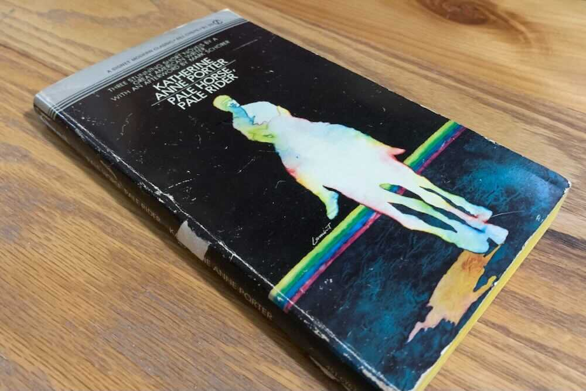

*From my journal: 27 September 2020 (Sunday)*

[**Triggered by a conversation** in the book about conspiracy theories around the Spanish Flu and WW1, the Lusk Committee, etc. Turns out pandemic conspiracy theories (and the mocking of them) aren’t a new thing — who’d have guessed it?]

---

> “…they think the germs were sprayed over the city — it started in Boston, you know — and somebody reported seeing a strange, thick, greasy-looking cloud float up out of Boston Harbor and spread slowly all over that end of town.  I think it was an old woman who saw it.”
>
> “Should have been,” said Chuck.
>
> “I read it in a New York newspaper,” said Towney; “so it’s bound to be true.”
>
> Chuck and Miranda laughed so loudly at this that Bill stood up and glared at them.  “Towney still reads the newspapers,” explained Chuck.
>
> “Well, what’s funny about that?” asked Bill, sitting down again and frowning into the clutter before him.
>
> “It was a noncombatant saw that cloud,” said Miranda.
>
> “Naturally,” said Towney.
>
> “Member of the Lusk Committee, maybe,” said Miranda.
>
> “The Angel of Mons,” said Chuck, “or a dollar-a-year man.”
>
>         —Katherine Anne Porter in Pale Horse, Pale Rider (published in 1939)

---

**Maybe we must get used to** feeling like the minority, the opposition.

Maybe we should act that way, even if it isn't true.

We’re so used to the idea that democracy is ascendant in the world that we began to think it was a given. The same is true for equality within our own country. Our current situation shows that as a bad assumption. Fascism is real, George Orwell was a prophet, and maybe the primacy of democracy and human rights isn’t inevitable.

**Our nation has been hijacked before**, held hostage by a minority. Are these features or bugs, the electoral college, the fact that a person from Wyoming or Vermont has far more per capita representation than a Pennsylvanian or Californian?

The “arc of history” (or “the moral universe”) is long… Yes, but the “bends towards justice” part? I *want* to believe.

I don't know if things have improved much (since ~1918). It might be that it's so intangible, or the selection of metrics is so controversial that we can’t really know.

**But knowing the answer** to that doesn't matter — I’m suggesting we at least *act* as if these things are fragile, that their ultimate victory is not a given.
