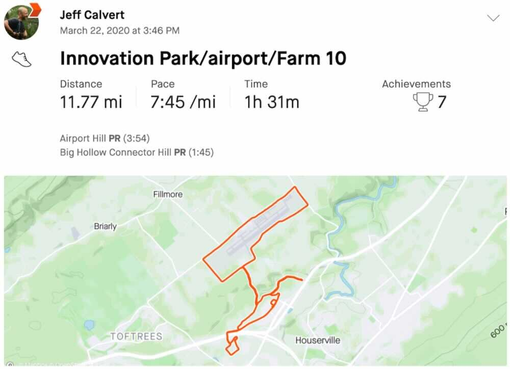

*From my journal: 23 March 2020 (Monday)*

**That run yesterday...**

…it wasn’t supposed to be much more than a box-checker, a token run that would be at least 10 miles long, and it could be slow if I wanted because I managed to get out there early enough that there was no pressure to beat the sunset or anything, and if I felt ok I’d go 11.5 miles to take me over 40 for the week. I was still nursing the sore knee, I was feeling kind of depressed about the whole thing, and I just wanted to have it over with.

And then I went out and ran a really strong performance, somehow, for some reason.

…

 [ Strava activity link ]

**I needed a run like that.** I needed a surprise affirmation that what I’ve been doing has been good for me, that regardless of my knee, I’m in general still doing well, still strong and able, perhaps even still improving.

…

Obviously, I want to continue this pattern, especially that synergy, and see how far I can take it. I remember thinking last year when I was trying to go faster on the road and I was struggling to get my pace down that, regardless of where I was aerobically, I just didn’t have the muscular endurance to run fast enough to hold pace for anything near a 3:30 marathon. But after yesterday, I’m starting to feel like that’s a possibility for me now.

I was 10-15 seconds ahead of the pace I’d need for 3:30, and yes, I know that was for not even a half-marathon, but I also know that there was over 800 feet of climbing involved. I know it would still be a monumental challenge for me, but it feels like I’ve progressed to the point where it’s not out of the range of at least possibility.

**To get there, though**, I’ll need to continue to progress. And the current situation in our world has given me the opportunity to do that. There are no races happening anytime soon, so I can put together a long term plan that isn’t interrupted by tapers or recoveries or race efforts.

I can chug along with 40-mile weeks that emphasize the basics, that allow me to re-acclimate my feet and legs to truly minimal running. With no pressure to build mileage to pre-race peaks and that sort of thing, I can run the runs that make sense, start working in some careful and selective speed sessions, and at the same time work on strength, get back to calisthenics, and maybe even work in some cross training, diversify my experiences.

And I can do most of that by feel, based on my body’s reaction to the work, rather than the need to push up the mileage totals so I feel prepared for a certain race.

**That freedom** is coming at a perfect time for me, too. I’d already scaled back my racing before the pandemic hit and canceled everything. I’m coming off a period where I was racing a lot (for me), and that was great, but I was getting tired of it, and I was already drifting in this direction.

The racing was great, the races and the experience of the races was great, but this break is right on time for me, and I intend to take full advantage of it.

It’s given me an excuse for what I already wanted to do.
