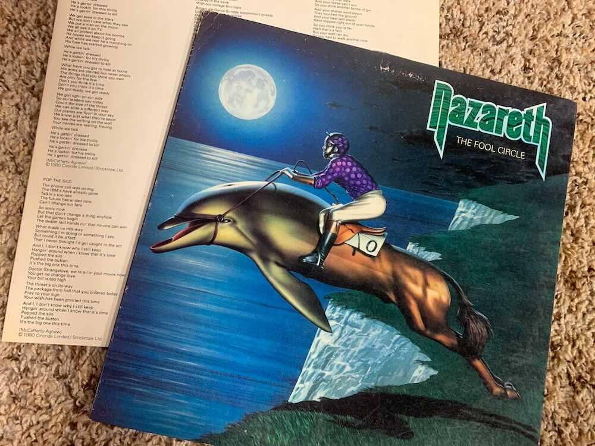

*From my journal: 27 March 2020 (Friday)*

For whatever reason, that old Nazareth song from back in 1981 is stuck in my head this morning. Of course it’s there for its apocalyptic nature, and even though it doesn’t exactly fit with our current tiny apocalypse, it’s close enough to resonate (especially that lyric I excerpted above).

**I’m not sure** how or why I discovered this album.

I guess I probably heard “Hair of the Dog” on the radio, got that album, and went on to this one from there. My memory, uncertain as it is, says that the junior class had a magazine subscription sale and I won a stereo as a prize in that. And this must have been one of the first records I was playing on that stereo (a machine that I really, really wish I still had).

**What I know for sure** now is that when I rediscovered this album, it made me feel very good in a deeply nostalgic way. It was like a direct line into that time. I’m feeling the same way right now as I listen to it while I write, and it’s reminding me yet again of the power of music.

Is that direct-line-to-the-past experience a permanent phenomenon?

*My suspicion is* that, with music that has deep association with a particular period in your past, the first revisit is a fragile, perishable moment. I suspect that as you get re-hooked on the music (if it still resonates with you), its ties to that period diffuse into your current situation and lose some of their power.

Of course you’ll still remember those old associations. I’m just not sure you continue to feel it in the same deep and direct way. The caution I’m giving myself here is to be careful with those fleeting moments of reconnection, not necessarily to ration them, but to pay attention, and to treat them as the precious and finite treasures they are.

**How much does the medium matter?** I think I’m having a very full effect as I stream this album from Spotify into my expensive wireless headphones, surely with higher sound quality than I ever had back in the day, but that’s only the aural side of it (only the tip of the iceberg, maybe).

What about the physical act of holding that album, gently cradling the record itself in hand as you slip it from the sleeve and place it on the turntable (being careful to touch only the edges)? What about sitting there exploring the album cover as you listen? What about the hot plastic smell of the stereo, the mesmerizing mechanical spin, the fuzzy crackle of those cheap old speakers, all the other little environmental cues and elements of the experience?

**Of course the music is the thing**, the main and most important thing, but the memory of the experience is much bigger, and that’s one of the fleeting but powerful memories you tap into when you pull up an old album.

Not just record albums, of course. For example, Heavy Horses will always be an 8-track for me (probably the 8-track deck on that same stereo — oh how much I wish I hadn’t gotten rid of that). Just as there’s a long list of albums that are cassette tapes for me, and another long list that I learned on CD. Again, the music is the thing, and Spotify (and its kin) is a miracle and a blessing.

**But there *is* a reason** I still have those old records in the basement (and the cassettes and CDs).

