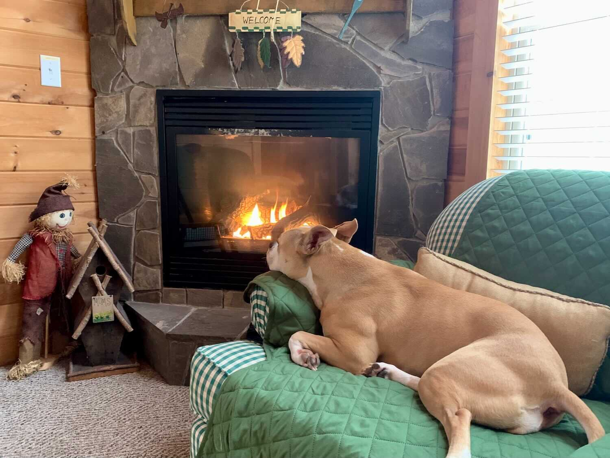

*From my journal: 13 December 2020 (Sunday)*

**The race is over** (we both PR’d, and we both got our Western States tickets punched again), and our vacation has begun.  We're moved into a cozy little cabin at Canaan, and I'm sitting here by the fireplace (gas) feeling warm and relaxed and (slightly) accomplished.  I don't think I'm going to break out the computer or keyboard tonight, though — just not really feeling like that right now.  Tomorrow (I promise) I’ll do that.  Tonight I'll just sit here and chill in the heat (and I guess we might try out that hot tub).

