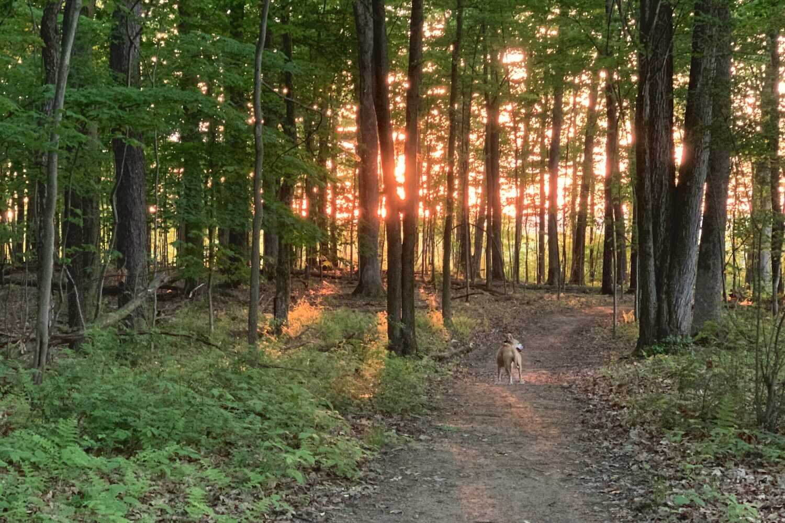
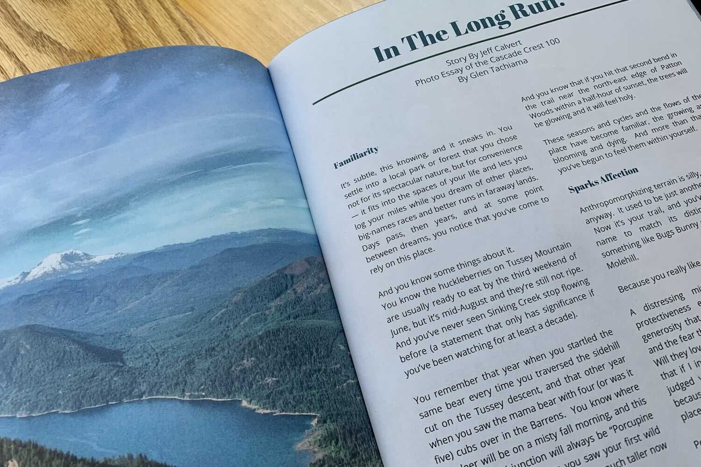

*From my journal: 18 August 2020 (Tuesday)*

Well, it took me almost 2 hours to work up my response to Jess’s “What are some of your ideas???”, but I’m pleased with the result, and I think I’ll be able to use most of it in some way in the article.  I hope it’s not too precious, because it’s certainly designed to raise an emotional response, and I could possibly get carried away on that.  In fact, I made myself cry as I wrote it.  But I read it several times, and I tweaked it each time, and I feel like it might be powerful without being precious.  I guess I’ll just have to wait for the response.  But I did want to capture it here, too:

> ```
> So I’m pretty much a bottomless pit when it comes to ideas for writing about running, but here’s one that might go well as a riff on your “create your own adventure / running to see a place” theme.
> ```
>
> ```
> My thought is that it’s easy to get caught up in the excitement/drama/inspiration of big-name races and life-list destination adventures.  Those runs are important, powerful things, but if you focus only on them, you might miss out on the more subtle but equal power that can flow from a committed long-term relationship with a particular local trail.
> ```
>
> ```
> I’ve done plenty of both, and while I treasure my experiences in the Alps and the San Juans and the Sonora and coastal Ireland and everywhere else I’ve been, my deepest and best memories come from my local trails, on routes I’ve run hundreds (in some cases thousands) of times.
> ```
>
> ```
> This piece is not about convincing people to run local — they already do that (I suspect that most of us do the great majority of our mileage on trails that are within 20-30 minutes of home).  It’s about urging us to Pay Attention, to not take those runs for granted or treat them as junk miles between exotic adventures.  Because the accumulated intimacy of years (decades) spent with a place is priceless and irreplaceable, and there's only one way to get it: spend years with that place.
> ```
>
> ```
> I’m thinking about examples of things (big and small) that you can only really get to this way:
> ```
>
> ```
> - you know the huckleberries are usually ready to eat by the third weekend of June, but it’s mid-August and they’re still not ripe, and you’ve never seen that creek-bed completely dry before (a statement that only has significance if you’ve been watching that creek for at least a decade)
> ```
>
> ```
> - you remember this section before they clear-cut it, what it was like immediately after, and now those new aspens are already 15 feet tall
> ```
>
> ```
> -  you remember that one year when you saw the same bear every time you got to this section of trail, and that other year when you saw the mother bear with four (or was it five) cubs, and you’ll always think of this particular trail junction as “Porcupine Flats” because it's where you saw your first wild porcupine, climbing to the top of the (much taller now) white pine that marks the turn
> ```
>
> ```
> - you know that if you hit that particular bend in the trail near the edge of the woods within a half-hour of sunset, the woods will be glowing and it will feel holy
> ```
>
> ```
> - you’ve seen it at it’s best and it’s worst, in icy cold and darkness, in sweltering heat and the insectile torments of summer, in the perfect-weather glory of spring and autumn, and everything in between
> ```
>
> ```
> - likewise, it's seen you at your best (and you might imagine it shared your joy or exhilaration), and your worst (it was there to console you when no one else was, to help you through some period of tragedy or heartbreak as one bit of reliability in a chaotic world)
> ```
>
> ```
> I’m thinking about the way we use our foundational local routes as reference points for those destination runs (“that climb is two Spruce Gaps, but not quite as steep”, and “that’s a Kettle Trail descent”).  And how you might take a ceremonial last run on your home trail before you head off to one of those destination races (and a welcome-home loop at the same place when you return -- victorious or defeated), because of the symbolism, and to ground yourself in the comfort of familiarity with an old friend.  And how you might feel paternal (maternal) about “your” trails, and be nervous about sharing them with someone for the first time — will they love and appreciate them the way you do?
> ```
>
> ```
> Anyway, that’s what I’m thinking about (in very rough form).  What do you think?
> ```

That’s it, and I’m still happy with it after reading it yet again, so we’ll see what she thinks, and I’ll go from there.

 “…if you hit that particular bend in the trail near the edge of the woods within a half-hour of sunset, the woods will be glowing and it will feel holy.

---

[Note: my article was published in the Fall 2020 edition — subscribe to the mag here: [Eat Clean, Run Dirty](https://www.eatcleanrundirty.com/)]


