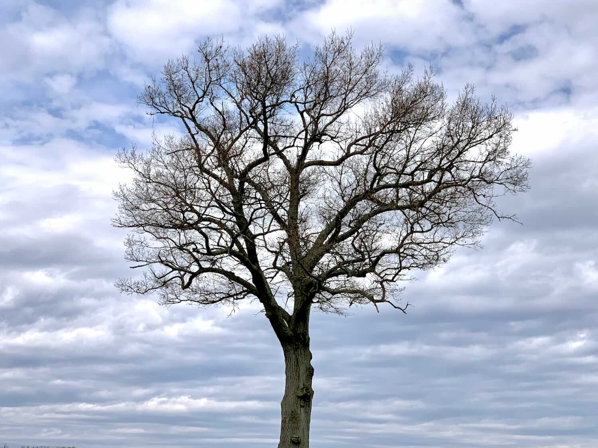

*Originally published to Strava on 7 April 2020 (Tuesday)*

Roadrunning with Vivaldi — an accident that made this very ordinary run feel both epic and elegant (who would have thought?).

I rarely run with music outside, and if I do it’s Tool or similar.  But I did it today, and forgot to switch from my writing playlist before I tucked the phone away.

*(Cherry trees at The Penn Stater)*

](image-03.jpg)
