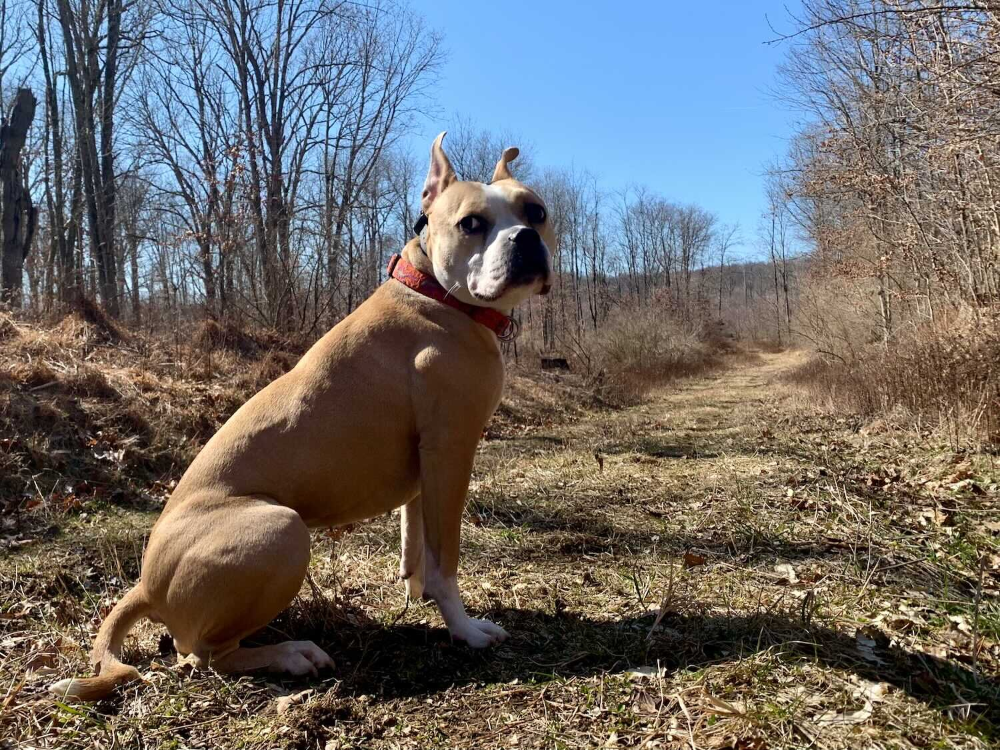
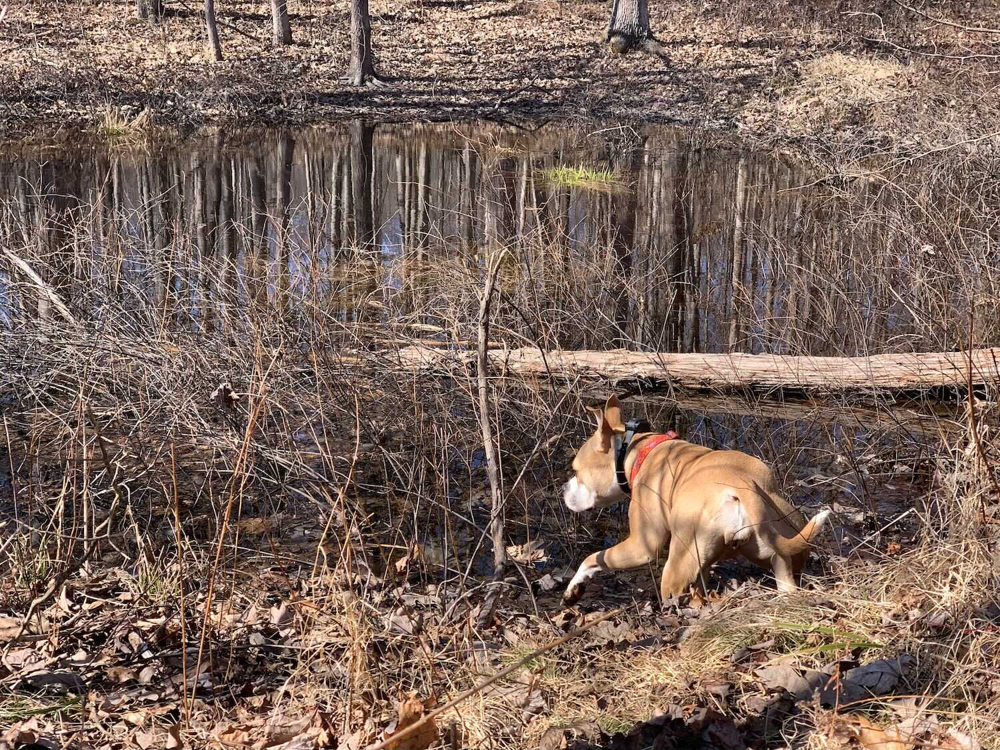
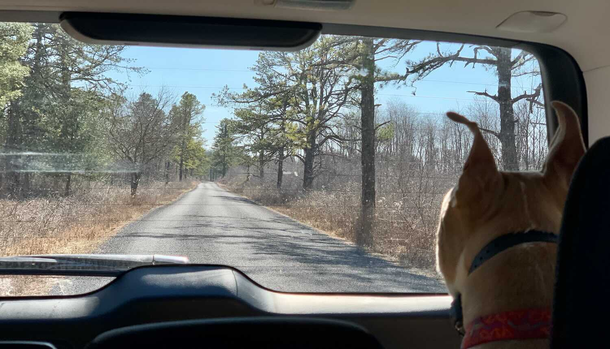

*From my journal: 8 March 2020 (Sunday)*

**I can already smell the end** of the day, and it’s a little bit maddening.

Renee has a lamb shoulder in the crock pot and it’s filling the house with a wonderful smell, and since I haven’t eaten yet today, it’s making me think mainly of food right now.  Not that I’m hungry or need food (I’m not and I don’t), but I’m almost always interested in eating.

**But it’s only 1300** and there’s a lot of time between now and supper, so I’ll just have to put that thought and that urge aside and get on to the next thing — a run.

It won’t be hard to get out there, either.

It’s 52F and climbing, with full sun in a cloudless blue sky.  And since I covered my ten-streak yesterday, the pressure is off for this one.  In fact I’ll probably take Scotia with me for this one, as a good diversion for her (Renee didn’t think Scotia was quite ready to accompany her on the 18 miles she’s doing in Rothrock right now) and a nice change for me, too.

**We’ll go to Scotia game lands** and wander around on some of the easier parts there, maybe some of those big grassy highways.  And I intend for her to be off-leash as much as possible, to try my hand at that approach to things.  She was visibly disappointed when Renee left without her, so I think she’ll be enthused when I load her up and we head out.

Then later, we’ll eat that lamb.

