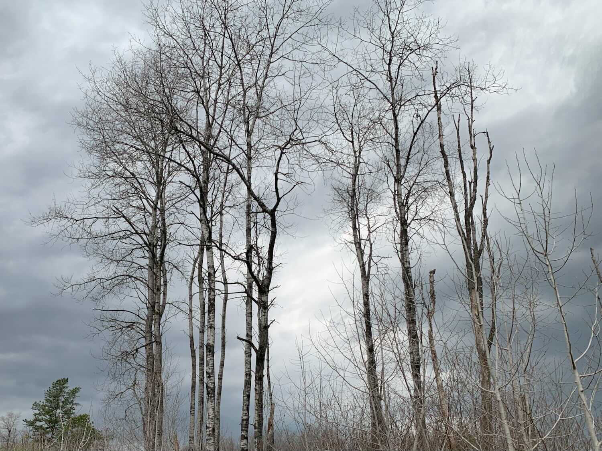

*From my journal: 28 April 2020 (Tuesday)*

**My tolerance for disruption** is a casualty of the pandemic.

That’s not necessarily a bad thing. If that lowered tolerance leads me to reduce the disruptive forces I allow into my life in the first place, I’ll say thank you and be better off for the change. But it doesn’t seem to be going that way.

**Here I sit**, in the middle of the longest stretch of undisturbed time I’ve ever had, and I’m still feeling stressed by the passage of time and the disruptions it brings. These are small disruptions, things I’ve just absorbed in the past, unfazed.

Now they put me on edge, make me cringe and look for escape routes.

…

**It’s an old thing**, this desire to yell “stop the ride, I want to get off”, and I’ve felt it for as long as I can remember. I don’t really want to get off, but I do want a pause button, a way to freeze the world in place for just a little while, just long enough for me catch up. Then, I’m back on the ride — push play and let’s roll.

**This pandemic** is the closest thing to a pause button I’m ever likely to get, and it feels like I’m squandering it. I’m not sure how or why, but I’m pretty sure it’s true.

