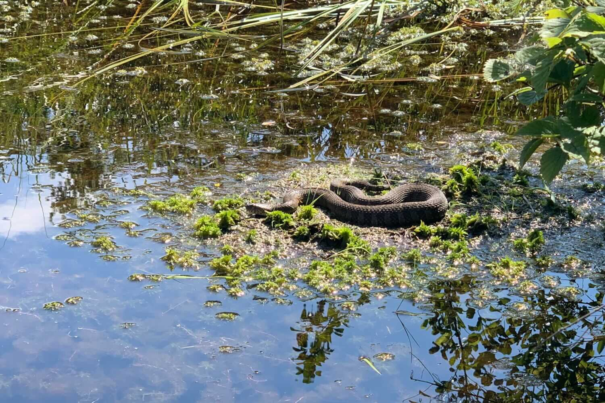

*From my journal: 16 August 2020 (Sunday)*

**It’s a family run** day — Renee and I — and it looks like a pretty perfect day for that.

But we have to get by our typical bit of dissonance first.  She’s a morning person and wants to go now, or soon, or the sooner the better.  I’m the exact opposite, not good with mornings, want to go later, and the later the better.  Of course we’ll meet somewhere in the middle (and since it’s already almost noon, we’re already into my ground rather than hers), and it will be fine, but I suppose I should be a good guy and wrap this up pretty quickly and get myself ready for the run.

We must choose a route, and I havn’t started into that process yet.  It’s to be 18 miles, the number I put on her training plan when I made it many months ago (also the number I need to get to 50 miles for the week).  We’ll probably head off into Rothrock again, with some combination of mild trails and roads, in line with what we can expect at No Business in a couple months.

**The total ascent** for that race is somewhere between 8,800 feet (according to the course map) and 12,000 feet (according to Renee’s Garmin track from last time), and either way, that isn’t much, as these races go.  It’s an elevation density roughly between 90 and 120 feet per mile, about half the density of Eastern States, about a third of UTMB or Hardrock.  And it’s relatively non-technical, at least relative to our home trails.  So the take-away message is that it’s alright to make some of these long runs “easier” by choosing easier trails and not focusing so much on climbing.  Meaning it will be alright to choose one of our easier routes for today’s run.

It looks like a high of 80F for today (quite mild compared to what we’ve become used to), and almost no chance of rain.  So probably a good evening for a campfire, too.

