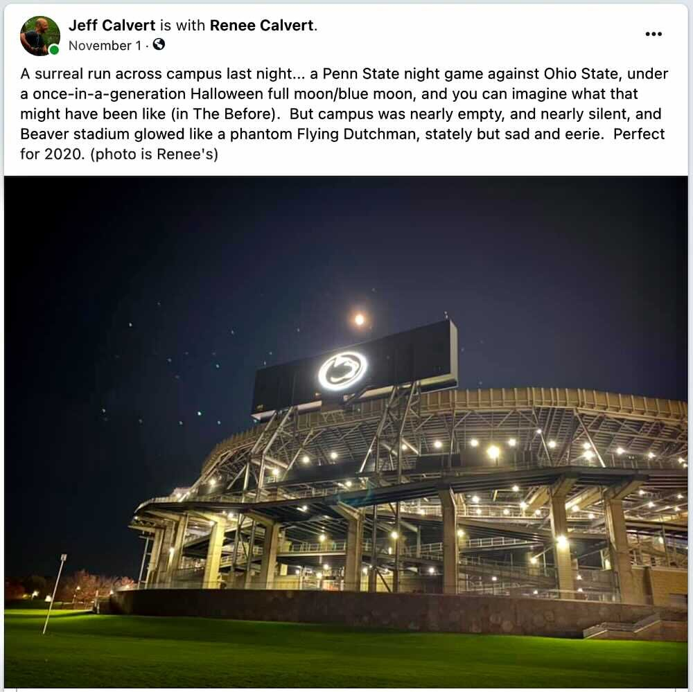
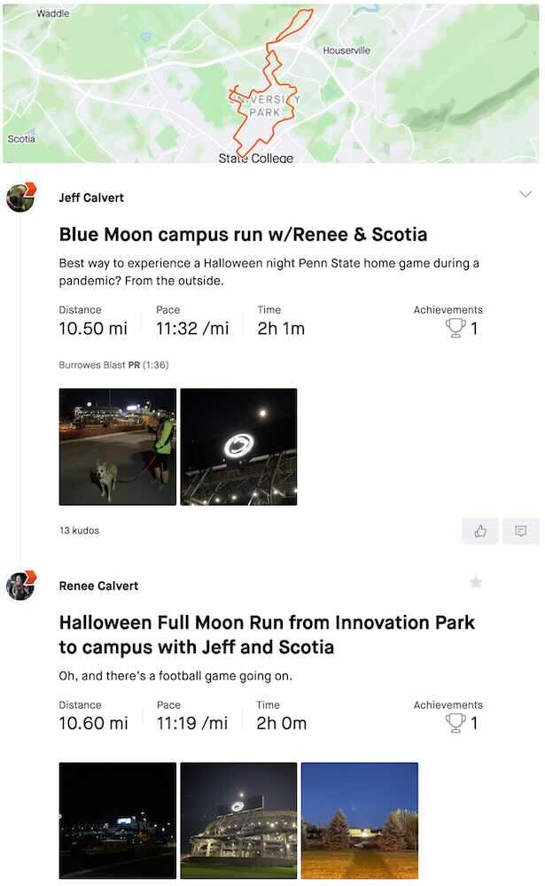

*Originally published to Strava on 31 October 2020 (Halloween)*

Best way to experience a Halloween night Penn State home game during a pandemic? From the outside.

*Originally published to Facebook on 1 November 2020 (Sunday)*

A surreal run across campus last night... a Penn State night game against Ohio State, under a once-in-a-generation Halloween full moon/blue moon, and you can imagine what that might have been like (in The Before).

But campus was nearly empty, and nearly silent, and Beaver stadium glowed like a phantom Flying Dutchman, stately but sad and eerie.

Perfect for 2020.

---

 [Strava activity](https://www.strava.com/activities/4269256735)
