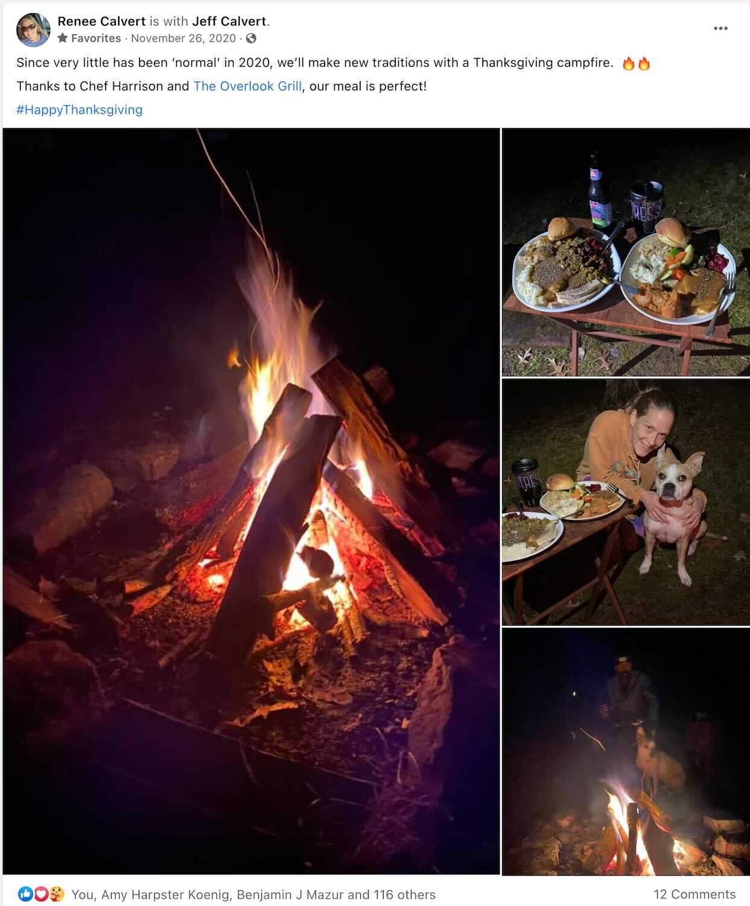

*From my journal: 26 November 2020 (Thursday)*

It’s as atypical a Thanksgiving Day as I’ve ever had. In fact there has so far been absolutely nothing different or special about it. I got up and followed my normal routine: some reading, my coffee, and into my writing. Now I’m approaching the end of that, and getting ready to go out for a run.

After the run it will start being Thanksgiving, since we’re having Thanksgiving dinner. But, it will be take-out (from Harrison’s), and it will be at fireside (I’ll build a campfire when I’m back from the run), and it will probably be just the two of us.

But that’s how things are now, and while I miss it all, it’s the right thing to do this year, and the best thing is to not fret about this break from tradition. Those traditions are treasured, but they’re also arbitrary.

I’m feeling thankful for what I have in place of the tradition.

I’ll have a good run, and we’ll have a good supper by the campfire, and life will go on.

