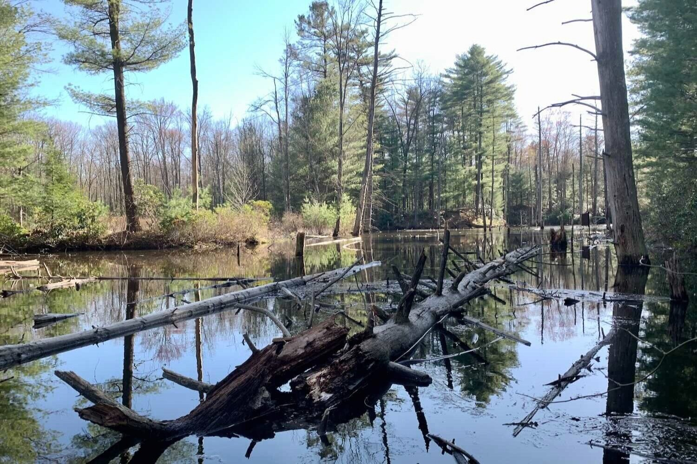
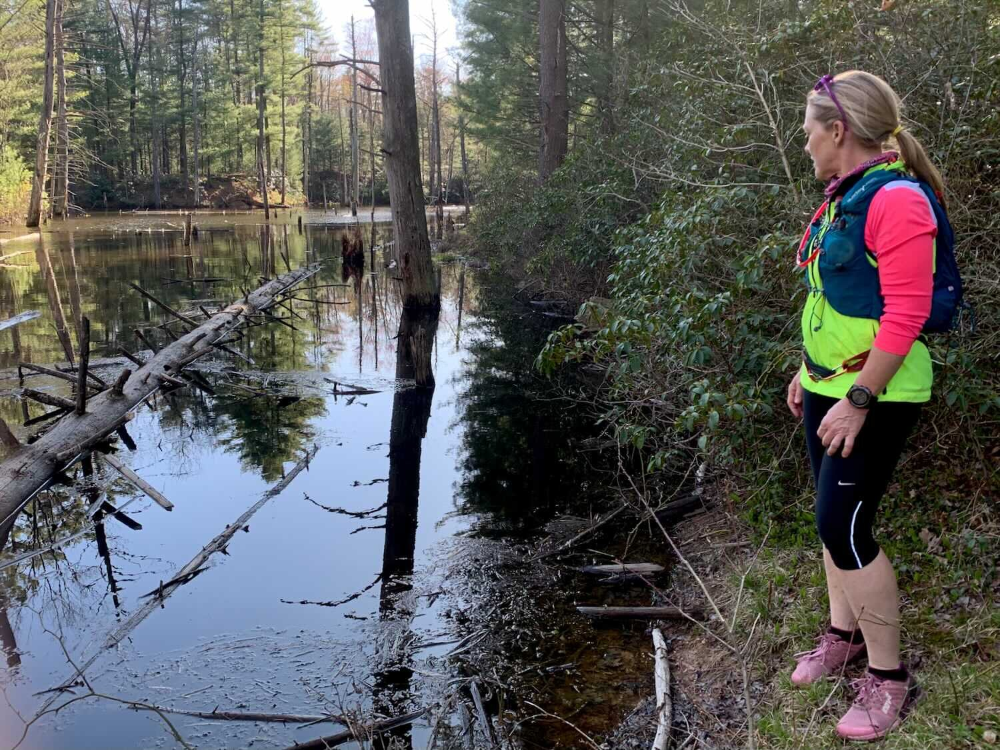
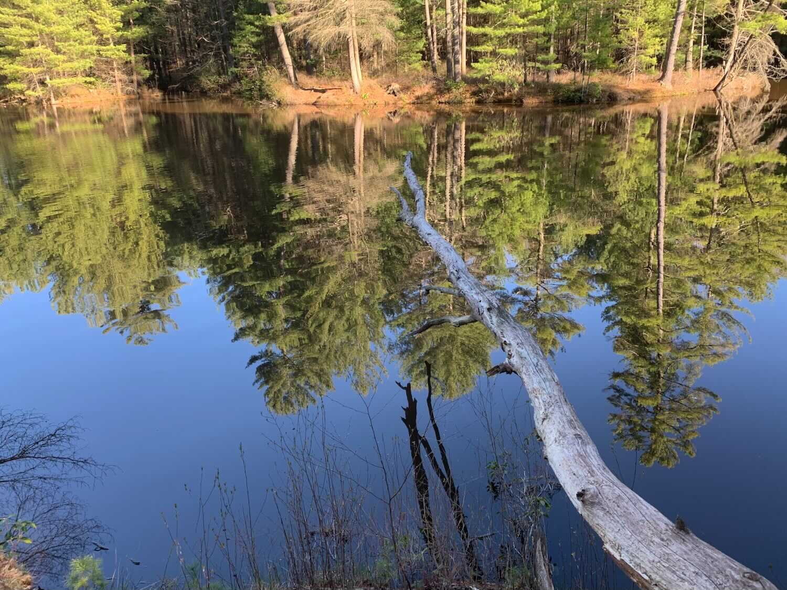
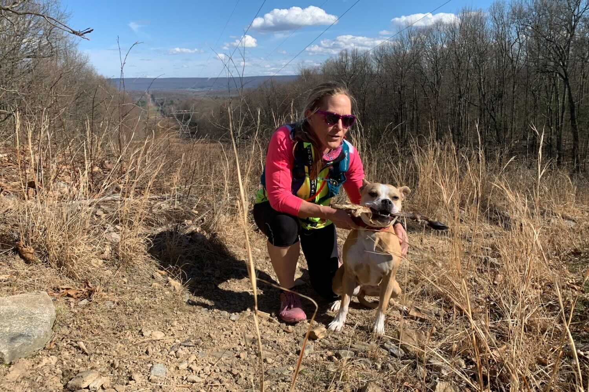
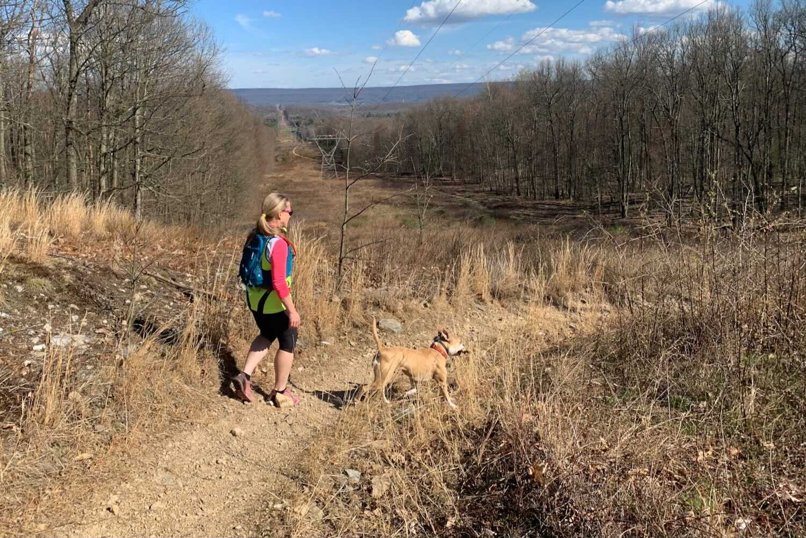
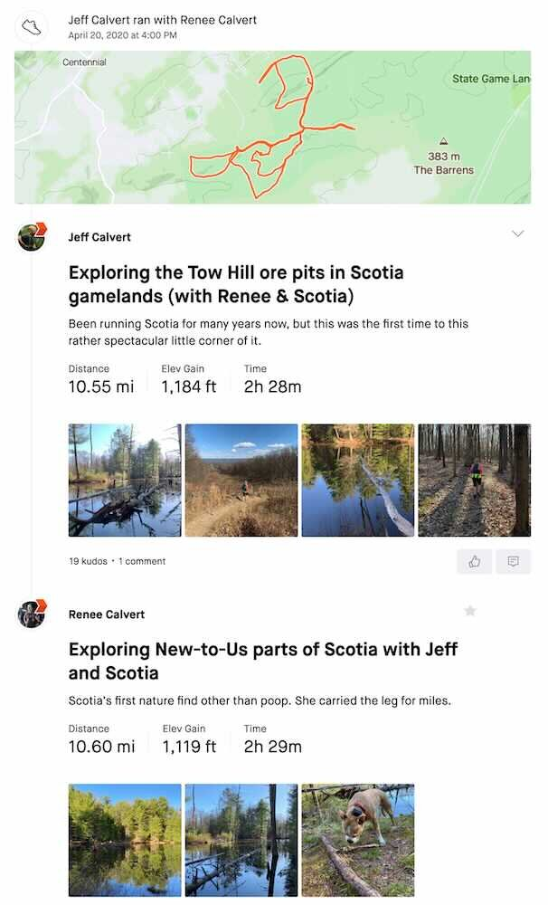

*Originally published to Strava on 20 April 2020 (Monday)*

### Exploring the Tow Hill ore pits in Scotia gamelands (with Renee & Scotia)

I’ve been running Scotia for many years now, but this was the first visit to this rather spectacular little corner of it.

And it was Scotia’s lucky day (she carried that deer shank for many miles).

 [Strava activity](https://www.strava.com/activities/3328584123)
