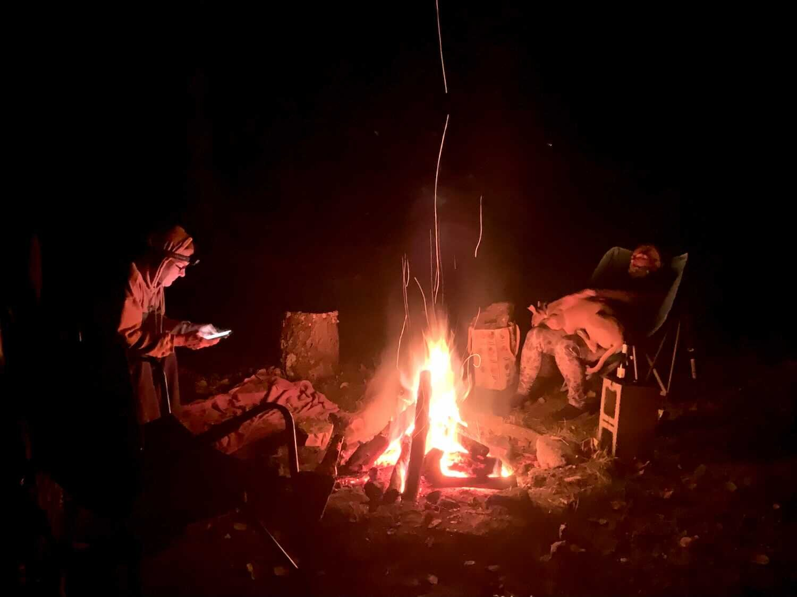

*From my journal: 7 November 2020 (Saturday)*

**And boom! Just like that things are suddenly different.** The only thing that has really changed is that the Associated Press has finally declared the inevitable and called PA, and thus the presidency, for Joe Biden.

We already knew this was how it would go, but now it’s fairly official, and it feels different in a way I didn’t expect. I feel jubilant, and I feel almost like crying (almost) and I feel huge relief and exhilaration.

**The good guys** really do win sometimes, and all is not wrong with the world.

