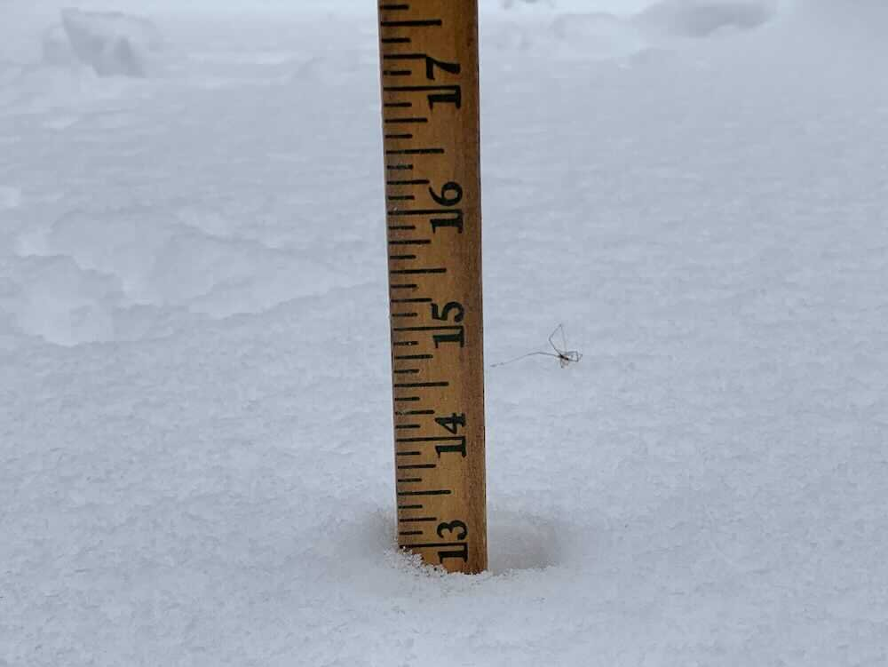
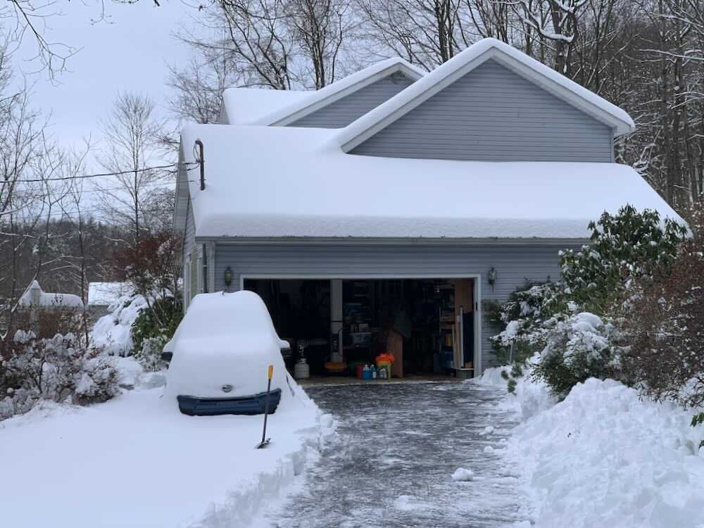

*From my journal: 18 December 2020 (Friday)*

I just finished 4.5 hours of heavy shoveling and woveling, just to get the smallest passable path cleared from the road to the house.  I measured 13 inches of snow, but that was after it’s been sitting for at least a day and a half.  I’m not sure if I’ve done that much by myself before.  If I did, it was when I was younger and more energetic — this job wiped me out.

It also likely damaged me, at least for the next few days.  I was on the edge of quitting, thinking I could finish things tomorrow, but I realized that I probably won’t be able to move freely by tomorrow, and decided I’d better just keep on going with it.  It was so heavy, and it was sticking to the shovel, and my shoulder and elbow were in misery.

Along with being some of the hardest clearing I’ve done, it is probably the most basic, or minimal.  I’m usually pretty thorough, clearing the driveway edge to edge, clearing the full parking lot, making a very wide transition from the driveway to the road.  Not this time.

Normally I start by clearing the parking lot, but this time I knew that Renee would be getting back after her run at some point and needed to be able to at least get off the road, so I cleared her parking spot, then a car width (barely) path to the far edge of the parking lot.

Then, realizing this was really slow work, I did a single shovel-width path to the end of the driveway, so I could make a place where she could at least get off the road.  The entrance is wider than one car, but not by much.  Then I worked my way back to the house, and instead of clearing the full parking lot, I did only a single turnaround spot, just a bit wider than a car.  And I did the front and side sidewalks.

I’m banking on the idea that this snow will melt before more arrives.

