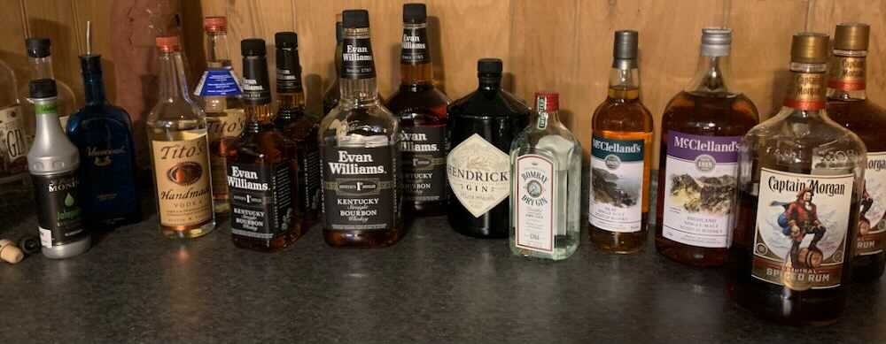

*From my journal: 18 March 2020 (Wednesday)*

Even though the direct effects this is having on my life are pretty minor, I’ve allowed it to throw me way off track, in so many ways.

**First, there’s this insatiable need** to read more and more about it, which is really just an immense curiosity about What Happens Next. There’s a morbid but addicting fascination in watching this play out. The fact that there are frequent significant developments makes it even harder to turn away from the news, because enough is happening that you really might miss something.

Of course the great majority of the things you might miss are not within your circle of influence, and so it’s not really much different than watching a show on Netflix — it’s effectively only entertainment, no matter how you dress it up and try to justify the time it steals from you. I know that, and I try to fight it, but I’m certain I can do better.

Some of the things that have gotten me off my track are real (which doesn’t imply that they’re important, but some of them are, at least sort of).

**I ventured out** into town on Monday because I needed a prescription refill, and I thought I’d better get in sooner rather than later. And since I was already out and exposed, I made other stops, thinking this would be my last venture out for a while. I stopped at the liquor store, the beer distributor, and the gas station, and I ended the trip with fast food, as a final pre-quarantine treat.

**But then the governor announced** that the state liquor stores would close indefinitely on Tuesday night, and … I went back to the liquor store yesterday, and this time I really stocked up.

