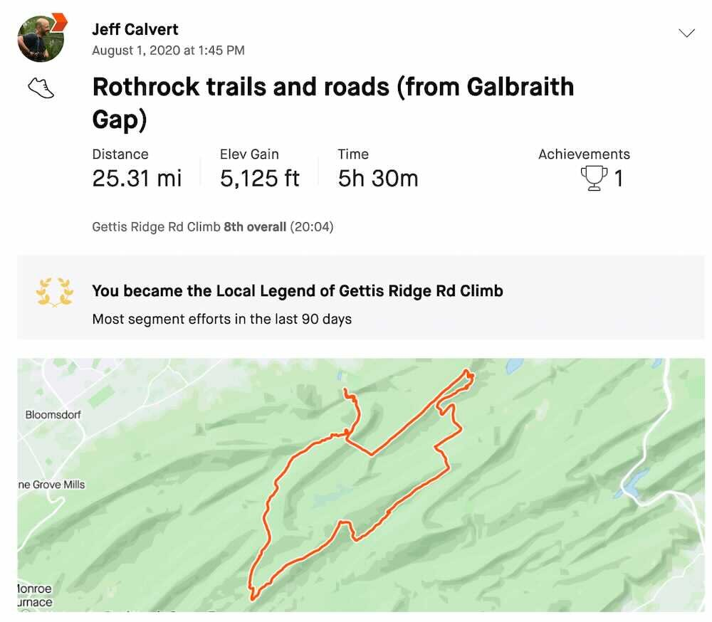

*From my journal: 2 August 2020 (Sunday)*

**I managed over 25 miles yesterday**, with over 5,000 feet of climbing and an average pace of 14:36.  That’s not as great as it sounds, because I included a lot of roads in the route, but it was also in the 80s (at least when I started) and the trail parts included some PA-level technical stuff.  It’s hard to quantify all of that, so I’ll just say it was a hard effort that I managed well.

I did a better job of throttling myself so that I didn’t get into trouble, I did a better job of staying hydrated, I did a good job of incorporating some food into the effort, and all in all I was much more like a veteran ultrarunner than the over-enthusiastic beginner I’ve been in some of my earlier efforts this summer.

I did get close to overdoing it, though.  I probably pushed harder on the climb up Bear Gap Road than I should have, and that was probably what caused the cramps that started to worm their way into my legs after that.

But I recognized what was happening this time.  I slowed the pace and pushed the water, and I beat it, I was able to keep going.

**I rebounded well**.  I’d given myself the option of cutting the run short, making it a 20-miler, and I hadn’t really decided which way I’d turn at the beer tap on Tussey Ridge until I got to the beer tap.  I guess I was feeling good enough when I got there for my competitive nature to override my native laziness.  I turned left and pushed on for the longer option.

As I went along that ridge, I started feeling even better than I had, like I’d settled into the run, and even though I was tired, I was also feeling steady and enduring.

**So I started doing some trail math**, started thinking about other options.  I’d been hoping I might get across the 4,000-foot threshold on this run, but to my surprise, I was already past that at the start of Tussey Ridge.  So I decided to take Kettle from Tussey Ridge, and then to stay on Kettle up to Little Flat instead of turning right onto Lonberger (yes, I was feeling *that* good).

It was a good, steady climb, and when I got to the top, I was just over 4,800 feet.

**For someone like me**, being so close to a threshold like that is maddening.  I thought and thought about how I might get the extra climbing in an organic way, but I couldn’t come up with a solution that got me the climbing without adding a lot of distance.

So I ended up doing my own version of running loops in the parking lot at the end of a run — when I got to the bottom of Spruce Gap I turned around and started back up, watching my watch to see when I hit the threshold (and going a little bit beyond, just to cover differences in data interpretation, because if it’s not on Strava, it didn’t really happen, right?).

Anyway, I got the miles, and I got the ascent, and I got the average pace under 15:00, and I finished feeling reasonably strong and steady, and it was a good run.  And it came on top of the solid 8-mile effort I made on Friday, so I went over my 30-mile back-to-back informal standard for this point in my training cycle (which is another reason I feel fine about a very relaxed effort today).

**Best of all**, my knees held up for the entire thing, including the time on the Mid State Trail, and including that Kettle climb and that Spruce Gap descent late in the run.  I think it might have been my graduation run, the end of my knee rehab, and I am happy about that.

**On the other hand**, that nagging hamstring thing is still there in my hip, and nothing I do seems to effect it much.  It didn’t get worse yesterday, and it’s not worse today, but I’m still constantly feeling it, and I guess I also fear all the time that something I do will irritate it and send it in the other direction.

But I’ve also decided that I can’t (or at least I won’t) keep waiting around for it to get better.  I might have to accept it as something permanent, and treat it that way.  If it’s not going away, then I must manage it and learn to perform as well as I can with it.  I don’t like that idea, but there are a lot of things I don’t like but have learned to live with and function effectively with.

This is just another one of them.

 [ Strava activity link ]
