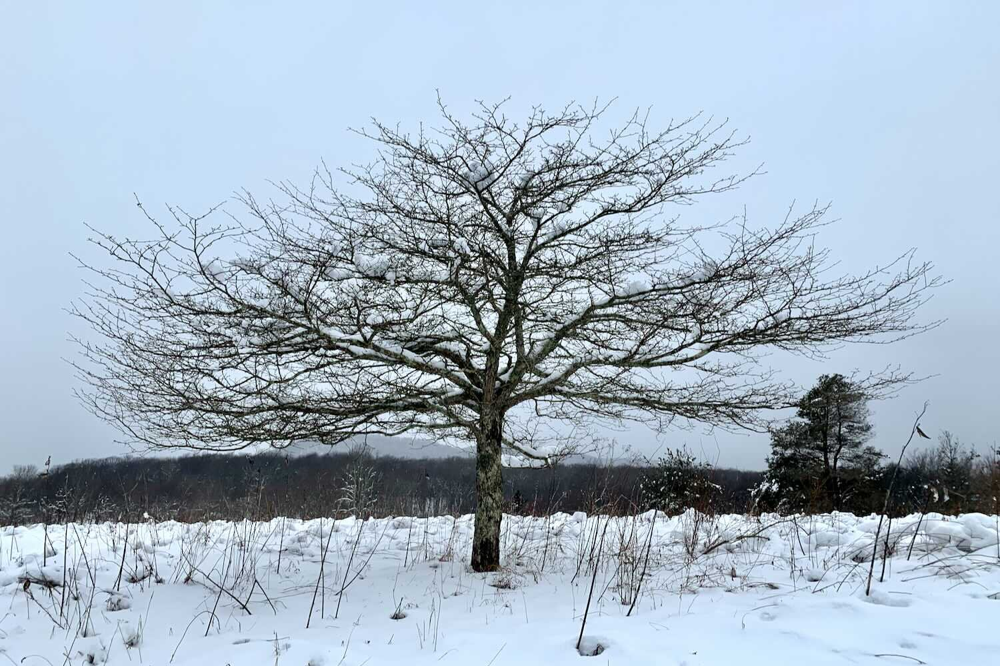
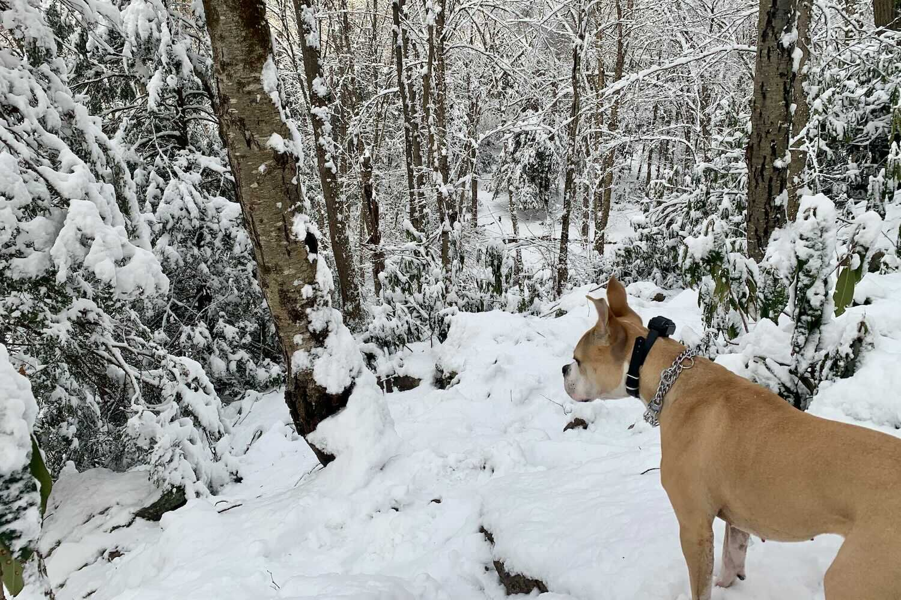
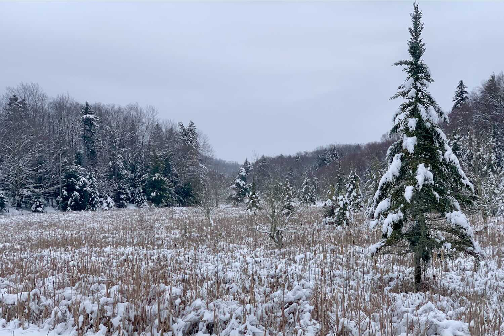

*From my journal: 16 December 2020 (Wednesday)*

**It has started to snow**, and it’s to accumulate about an inch per hour for most of the day.  Four days ago it was much different, we were enjoying September-in-December.  Now winter is here (not officially for a few days, but functionally) and whether we’re ready for it, whether we want it, this will be The Way Things Are for some long months ahead.  Winter doesn’t care whether we’re ready, or want it.  It arrives, and then it leaves, and we can do whatever we want with that.

**What I’ll do with it** is tolerate it, try to embrace it, try to enjoy it.

But regardless of how effective I am in those aspirations, I’ll be out there in it every day (or at least most days — I do have that damn treadmill option when I’m at home).  Whether I suffer or thrive (or both) while I’m out there is completely up to me.

That’s part of the beauty of this practice I’ve established, the streaking.

I’ve eliminated the hardest part of the equation, the part where I’d otherwise have to decide if I’m going to run today.  That’s not an open question, so my starting point in the process is different than it would be without the practice.

This is an important point.

The mental energy that might otherwise have been necessary just to get out the door can now be directed at that suffer-or-thrive question.  Having not depleted my mental energy convincing myself to run, I have more of it left for that difficult — but fundamental — process of Embracing.  And there are surely times when I need every bit of the mental energy I can find for that challenge.

Today might be one of those days.  And it will only get harder as the winter drags on, as the novelty of it dissipates and the perceived level of hardship rises.  The practice gives me a head start, a running start, a better chance at success.

**Put as much of the mundanity** of your life on autopilot as possible.  Reserve your energy, your focus, your enthusiasm, for the good parts.  Establish processes so you can focus on the objects of those processes rather than the processes themselves.

Because while your energy and enthusiasm are not finite, they do have some functional limits.  And your time is certainly finite.  You can spend your assets (your time and your energy) on mundane things or Big Things — automate the mundane, concentrate on the rest.

