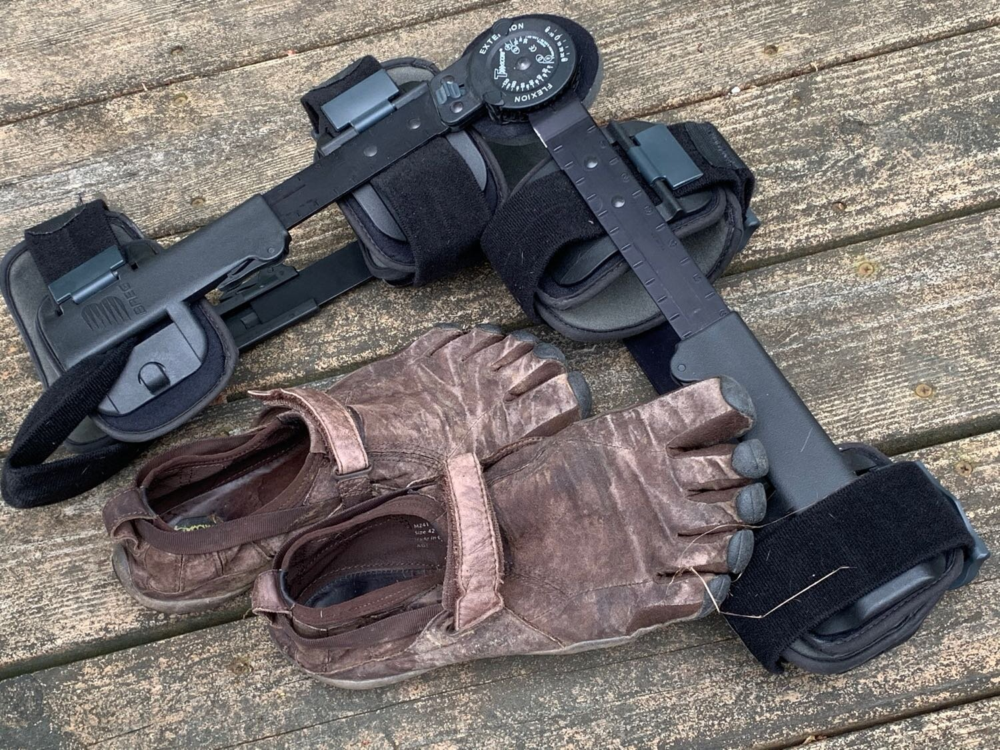

*Originally published to Facebook on 9 March 2011*

This past weekend was the 6-month anniversary of the knee injury that claimed my right ACL, so it seems like a good time to give an update on that. While I'm very pleased (amazed, actually) with my results so far, I'm not posting this as a brag, but rather as an example of what might be possible if you find yourself in a similar situation, with decisions to make about surgery, etc. For what it's worth...

## The Accident

The accident happened the Sunday before Labor Day in a pick-up soccer game with the middle school team and a few parents. I landed wrong after jumping for the ball, twisting my knee. My instant impression was of the way it feels when you twist and pull a drumstick off a roasted chicken — that same gristly pop. That and a feeling of anger and intense frustration — I knew I'd just done something really dumb that I couldn't take back.

## Diagnosis and Decision

The MRI showed a complete tear of the anterior cruciate ligament, and the orthopedic surgeon said without hesitation that it required surgery, and that it would be at least 6-9 months until I could run again. Thankfully I'd done some Googling ahead of time and knew that it wasn't as clear-cut as that. There are many examples of people who get along just fine without an ACL (Hines Ward, for one). So I asked if we might try some rehab for awhile first.  He looked irritated that I'd question his opinion on the matter, but he agreed.

## Rehab and Recovery

The physical therapy sessions were mainly educational (once a week at first and then every few weeks), focused on balance and proprioception exercises to build strength and capability in the injured knee. The therapist was incredibly positive, and as I started seeing results I got that way, too. In fact, by maybe the third session I realized that I'm probably going to come out of this as a stronger runner than I was before the injury.

I didn't think it could happen as fast as it has, though. I've run steadily since the accident, (including a 10-miler the first week, which was more accurately a long, slow shuffle, with a big brace on and an average pace of 14:55). I've now done 494 post-ACL miles (including 274 miles either barefoot or in VFFs — but that's another topic), and I'm running faster and stronger now than before the accident. In fact, on today's run I managed my fastest average pace ever for a training run longer than 14 miles. The only time I've run faster on a long run was in the 2009 Steamtown Marathon (where I finished 92 seconds too late to qualify for Boston — that's another topic, too).

## The Point

The point is, the recommended surgery would have been absolutely the wrong choice for me. That's not necessarily the case for everyone, but if you find yourself in that situation and you're reasonably healthy and motivated, you owe it to yourself to at least consider that there are better alternatives that can work for some people.
