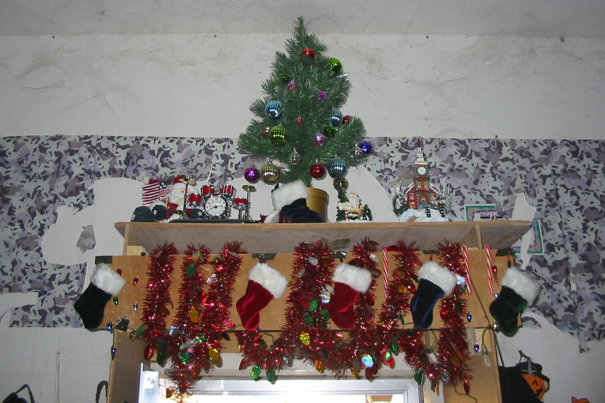
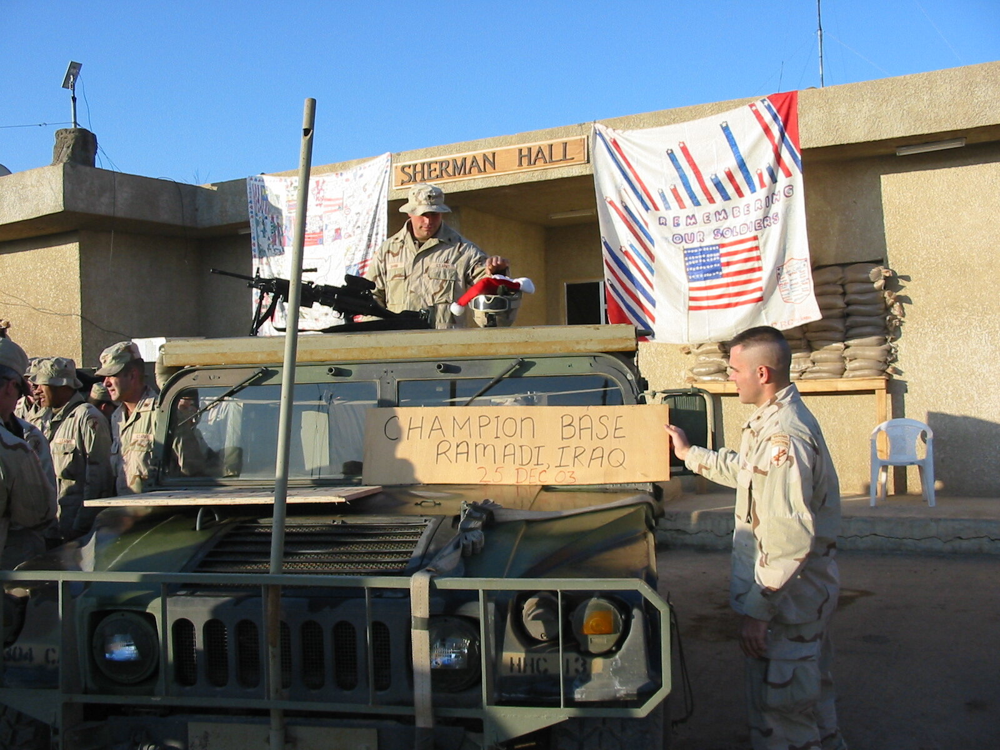
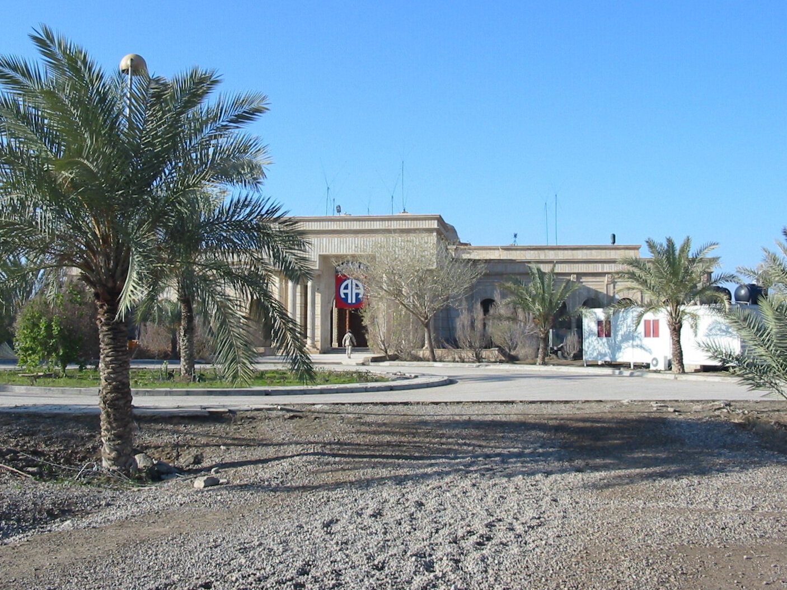
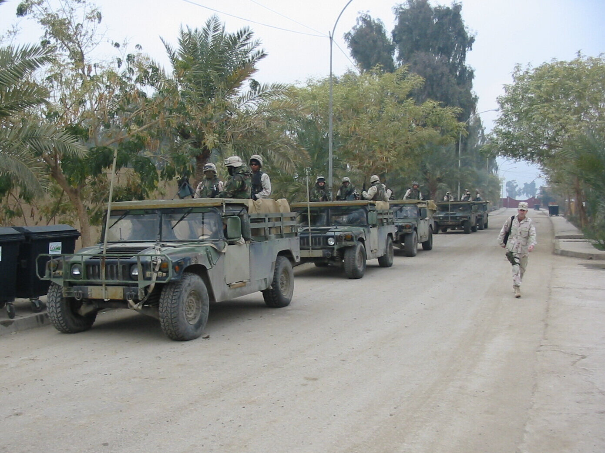

*Our traditional family Christmas letter, written December 27, 2003, emailed home, then mailed to family and friends. [Quotes are from my journal.] [Photos were not part of original letter.]*

Dear Family and Friends,  
  
I hope you are all well, and I wish you happy holidays. It’s a most unusual season for me, the conclusion of a long and challenging year. My unit, the 304th Civil Affairs Brigade, is mobilized for Op Iraqi Freedom. I left home in January, spent April to September doing tactical CMO (civil-military operations) in support of British forces in southern Iraq (Umm Qasr, Safwan, Az Zubair), and I’ve been working in Ar Ramadi as the 82nd Airborne Division’s CMO Plans Officer since October. We expect to be home sometime in late spring. You may not find the usual levity in this year’s letter — it just doesn’t feel appropriate right now. But maybe I can bring it around to something positive by the end. Please bear with me — the theme is paradox.

> *11 Dec 03: “This afternoon, as we sat in the main HQ of the 82nd in Ar Ramadi, Iraq planning a jobs initiative to get 12,000 local Iraqi’s back to work, a car-bomb went off inside our perimeter. The driver — and the young soldier in the cab escorting him — were killed instantly, vaporized in a blast that left a 5-foot deep crater in the paved road, and blew out all the windows in the palace where we work, ~100m away…”*

Jobs programs and suicide bombers — it’s the kind of extreme paradox that has become commonplace here. There is progress and terror and hope and hatred on both sides. US deaths in the hundreds, Iraqi deaths in the thousands, dollars in the billions… We plan and build and mentor, and we barely flinch at the explosions, or when the mortar rounds land around us.

> *15 Dec 03: “A convoy of ours [304th Civil Affairs soldiers — 5 vehicles] was ambushed this morning on the way to Baghdad. They were hit near Fallujah, first by a couple IEDs, and then by about 20 attackers with AK-47s and RPGs. They attacked from 150 meters and were spread out over about 600 meters. We had no casualties, and we killed at least 2 of the attackers, wounded an unknown number…”*

Peacekeepers as killers, lives risked and taken on a trip to coordinate developmental projects with CPA… and the projects are slowly but surely being started. The electricity is getting more reliable and the people have food and water and health care. Schools are in session and we’ve started a women’s organization and a human rights group, and we are training policeman, coaching city councils on the functional nuts and bolts of democracy… but the natives are still restless here in the Sunni Triangle.

> *15 Dec 03: “… a quiet night last night — no more gunfire than usual, nothing to indicate they even noticed the Saddam capture. But around 1600 today the gunfire really picked up. High rates of fire from many weapons all around us, sustained for about 1½ hrs. Nearly continuous machine-gun fire… Also several rather large explosions, lots and lots of honking horns, people shouting and singing. Some of it was just random or celebratory, some of it directed at our towers, and some of it was an attack on the police stations downtown. At first we thought maybe they’d just gotten the news about the capture, but the real reason was an Al Jazeera report saying that the US had actually captured a body-double, that Saddam is still free…”*

There is a cynical explanation making the rounds here for the state of things (in Iraq and at home): “People get the government they deserve”. Let’s hope it isn’t so, because some of the most deeply disturbing paradoxes are coming from home. We talk of freedom and democracy in the Middle East, while we voluntarily relinquish our own freedoms in the name of safety (and doublespeak it as “patriotism”). Benjamin Franklin said if you’re willing to do that, you deserve neither freedom nor safety.

There is hope here, though. Regardless of how or why we got into this situation, we’ve done a good and noble thing. There may be ignorance, arrogance, and ineptitude at the top, making the price in lives and dollars much higher than it could have been, but there are also thousands of dedicated people at all levels working hard to make a difference and help Iraq capitalize on its new liberty, and its potential. We can still succeed here, if we stay the course. But we must be strong enough to be truthful, to not falsely portray early success in the interest of winning an election or justifying defense policy. We have years of hard work ahead of us if we want genuine success, and we owe that to those who have died here.

Enough of that, though, because life goes on at home and I need to mention that, too. Whatever my situation has been, Renee has had the tougher challenge, and she’s managed to keep home and business going (even growing) through the whole thing. She has effectively been a single, working mother now for 22 of the last 24 months, with more ahead. But she is an exceptionally strong and resourceful person, and she’s had indispensable support from a steadfast network of friends, family, and clients. Thanks to all of those people (and to those who have sent letters and care-packages to me). It is deeply appreciated.

Lucas is now in first grade at Nittany Valley Charter School. He’s a great reader and swimmer and soccer player, and he’s learning to speak Spanish. We have a lot of catching up to do when I get home. We have a cat now, too — a Sphinx named Angelica. (And we’ll have a dog again, soon after I get home.)

I did get 2 weeks of leave in Oct. We spent the time in Baltimore, and Harrisonburg, VA — a pure vacation visit. We went to the aquarium and ships and submarine in Baltimore, and spent our mountain time doing a lot of swimming and biking and climbing and eating at nice restaurants, and trying our best to stretch out the visit. (I managed to run a personal-best marathon in Richmond while I was there, too.) We look forward to a lot more catch-up time when I get home next year.

I‘ll close with a plug for a couple of country music singers. I’d never heard of them, and it’s not my kind of music, but please — go out and buy Craig Morgan’s album, and Jolie Edward’s, too. I’ve always been cynical about USO-type tours — never saw them going to the front where I was. But on Christmas evening they were here with us, and they didn’t need to be. He has a top-10 hit (“Almost Home”), she has a new record contract, and they would have been just fine at home with their families for Christmas. But instead, they were here in Ar Ramadi, playing to 100 soldiers in the back of an army mess hall, risking their lives to fly in and back out. They were (to quote Joni Mitchell – I think) “just playing real good for free”, and from the looks (and some tears) on the faces of the soldiers, probably making a greater impact than they’ll make again for a long time.

They ended the show with a wonderful rendition of Silent Night. I walked outside and it was clear and cold, and the sky was full of stars. For at least that moment, it really was “calm and bright” and in spite of everything, that’s how I will remember the end of 2003. We wish the same for you.

The Calverts  
Jeff, Renee, and Lucas

