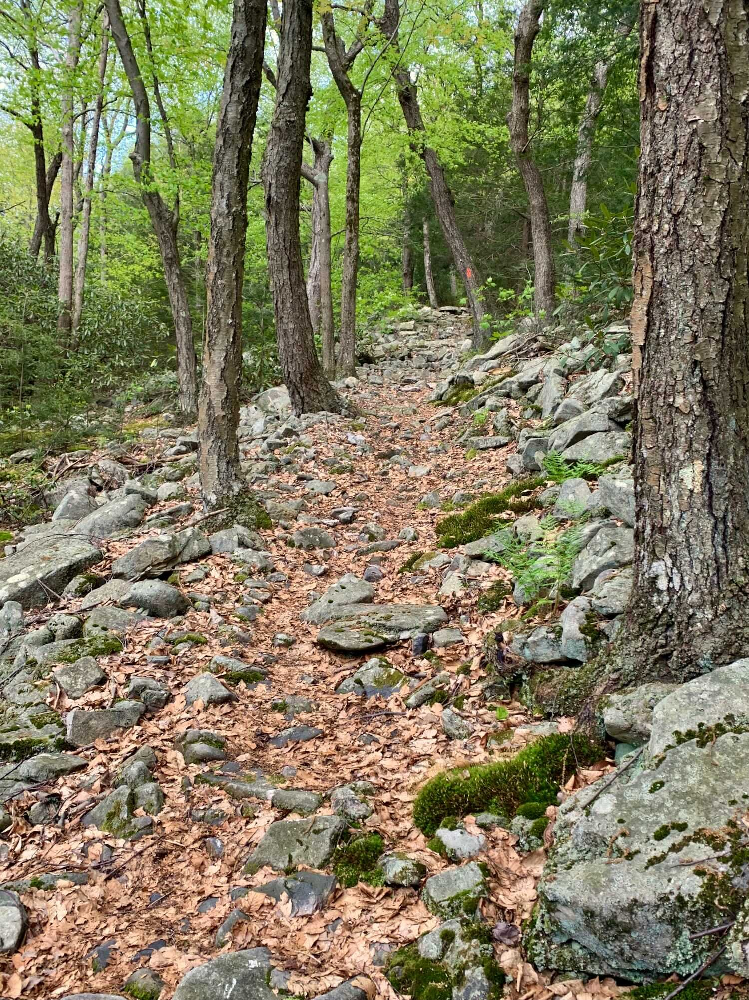
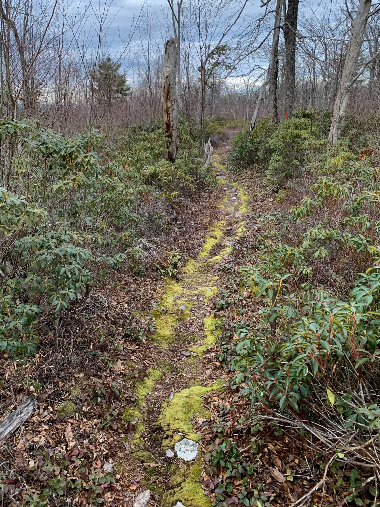
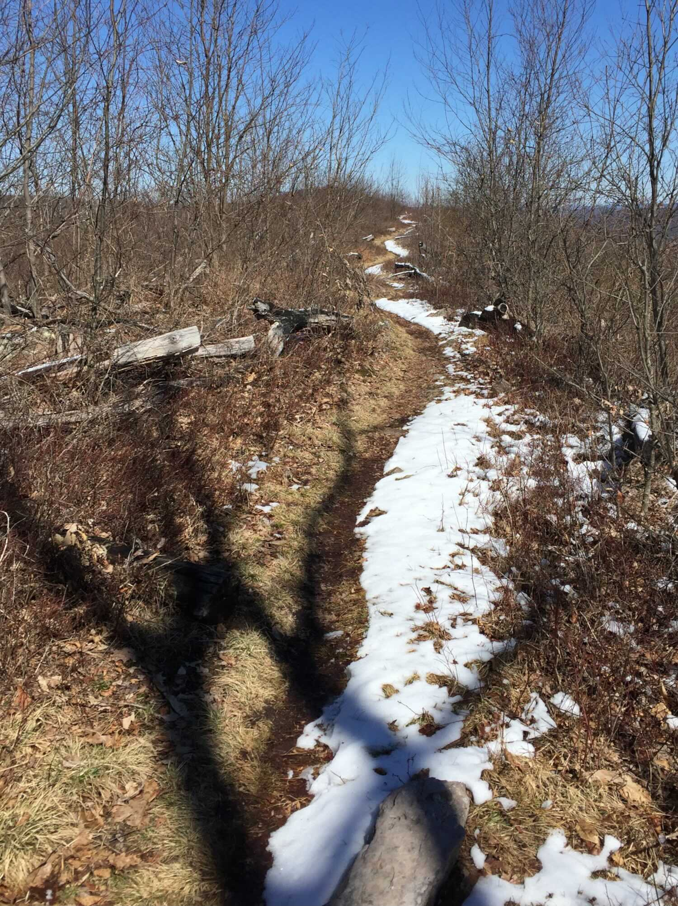
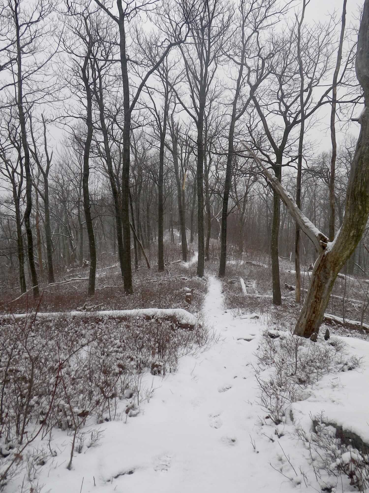
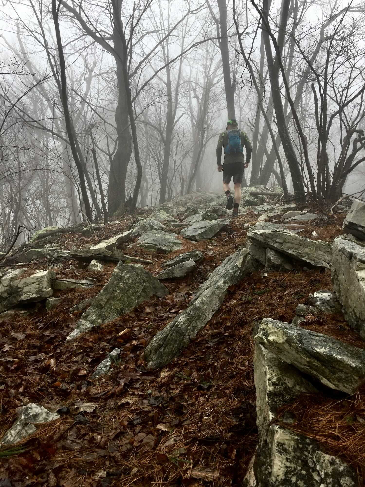
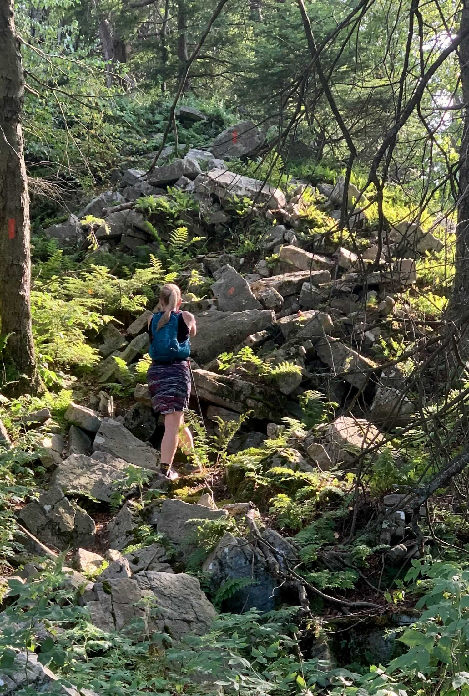
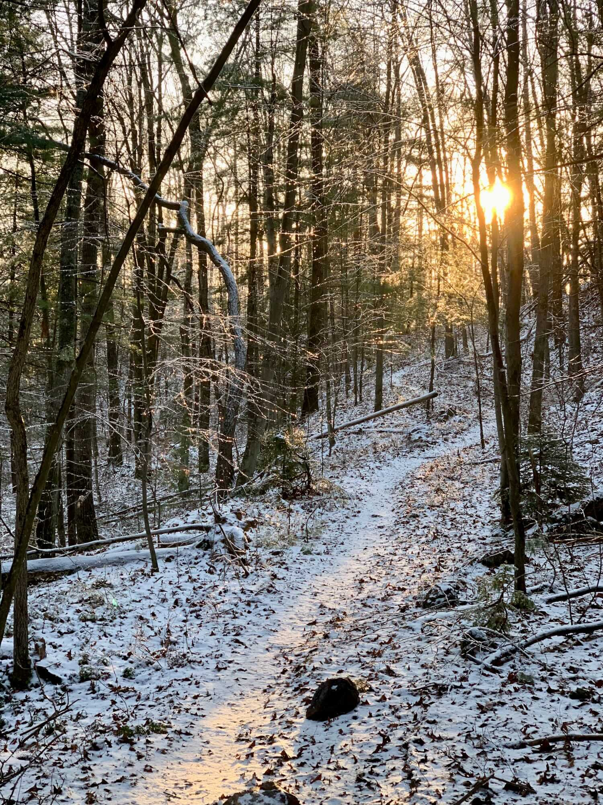

#### (knowing a place versus visiting)

*[This essay was originally published as “In the Long Run” in the Fall 2020 issue of* [*Eat Clean, Run Dirty*](https://www.eatcleanrundirty.com) *Magazine. I’m posting it here with permission.]*

---

*We shall not cease from exploration  
And the end of all exploring  
Will be to arrive where we started  
And know the place for the first time.* — T.S. Eliot, Four Quartets

## Familiarity…

**It’s subtle, this knowing**, and it sneaks in.  You settle into a local park or forest that you chose not for its spectacular nature, but for convenience — it fits into the spaces of your life and lets you log your miles while you dream of other places, big-name races and *better* runs in faraway lands.  Days pass, then years, and at some point between dreams, you notice that you’ve come to rely on this place.

And you know some things about it.

You know the huckleberries on Tussey Mountain are usually ready to eat by the third weekend of June, but it’s mid-August and they’re still not ripe.  And you’ve never seen Sinking Creek stop flowing before (a statement that only has significance if you’ve been watching for at least a decade).

**You remember** that year when you startled the same bear every time you traversed the side-hill cut on the Tussey descent, and that other year when you saw the mama bear with four (or was it five) cubs over in the Barrens.  You know where the deer will be on a misty fall morning, and this particular trail junction will always be “Porcupine Flats” because it's where you saw your first wild porcupine (it was climbing the — much taller now — white pine that marks the turn).

**You learn** some of the place’s secrets (and some of its secret places).  You found that mossy spring that’s hidden by rhododendrons (it’s well off the trail, beyond the big hemlock stump, next to the boulder that looks like a bear) and sometimes you go there to hide.

And you know that if you hit that second bend in the trail near the north-east edge of Patton Woods within a half-hour of sunset, the trees will be glowing and it will feel holy.

**These seasons and cycles and the flows** of the place have become familiar, the growing and blooming and dying.  And more than that — you’ve begun to feel them within yourself.

---

## …Sparks Affection…

**Anthropomorphizing terrain** is silly, but you do it anyway.  It used to be just another obscure trail.  Now it’s *your* trail, and you’ve given it a pet name to match its distinctive personality, something like Bugs Bunny or Sledgehammer or Molehill.

Because you really like this place.

**A distressing mix** of parental pride and protectiveness emerges.  Torn between a generosity that wants to share with the world, and the fear that sharing it will ruin it, you worry: Will they love and respect it the way I do?  (Know that if I invite you into one of “my” places, I’ve judged you worthy and decided to trust you, because you “get it” and are likely to get this place.)

Perhaps there’s misplaced possessiveness, too, as you suffer through pandemic tourists and day-tripping deer hunters out for their once-a-year visit to the woods.  All these intruders, tromping through your home!

(But you still own the night — you’ll *always* own the night.)

You might pick up a superstition or two.  Maybe you require a ceremonial running of a specific local route before you head off to one of those destination races, or a welcome-home loop when you return (victorious or defeated).  Maybe you carry a physical fragment of your place as a talisman when you venture out into the wider world.

**Because it’s no longer just a place**, it’s become a symbol and an anchor against all the turbulence.

## …Becomes Intimacy

**It’s different for each person and each location**, but there will come a time when affection progresses to intimacy.  This is no longer just your place, and it’s more than a symbol.

It’s a trusted friend.

You’ve seen its best and its worst, the freshness of its springtime, the sweltering and pestilent heat of its summer, its sunsets and icy darknesses, the glory of its edge times.

Likewise, it's seen you at your best (and you might imagine it shared your joy or exhilaration), and your worst (it was there to console you when no one else was, to help you through some period of tragedy or heartbreak as one bit of comfort and reliability in a chaotic world).

And not only have you seen each other, you’ve moved through this time together.

**It’s a gift, and a mystery** that requires imagination, to love a place and feel that it loves you back the way a dog might.  You speak different languages, and there are things you’ll never be capable of understanding about each other.  Yet there’s some undeniable reciprocation of feelings, a secret, sacred empathy between you and this piece of land.

If you’re like me, you might come to realize that you can’t imagine a better exit from this world than during a run (someday, in the distant future) here in this place you know so well.  Maybe it’s near the summit of your favorite climb, familiar trees standing guard, your heart pounding, legs aching, sweat (and maybe a spiderweb) in your eyes, a smile on your face (and in your soul).

**Maybe** you’ve even found a final resting place.

\* \* \* \* \*

**Go out** to spectacular destinations and do amazing, life-list things — we’re built for exploring.  But do come home from all that — I suspect that our places still have some lessons for us, and some secrets.

The accumulated intimacy of years in a place is priceless and irreplaceable, better than any buckle.  And you only earn it by spending quality time in a committed, long-term relationship with that place: bleed in it, laugh and cry with it, grow old with it.

**By being there and paying attention**, you become part of it and it becomes part of you.

---

---

### Sidebar 1: Utility

It’s not all fuzzy sentimentality.  Local trails can be a laboratory where you conduct the grand experiment-of-one that is your running career — a place for learning, measuring your progress, and measuring the outside world.

#### **Learning**

Repetition is at the heart of many running skills, especially things like running on rocks, fast down-hilling, and pacing.  Example: how do you learn what a 13-minute pace feels like on a long-but-shallow technical climb?  You run your local long-but-shallow technical climb over and over, until you can feel it, until you know your pace without looking.  When you have that, you have an objective base from which to extrapolate other paces on other terrain.  And so on.

#### **Measuring yourself**

Tracking and comparing data from your standard local routes gives you an objective way to evaluate your progress towards performance and fitness goals.  It works within a seasonal train-up for a target race, and it works for tracking your progress across the years.  It’s true that you can never really run the same trail twice, but if you choose an array of local benchmark routes and run them regularly, they’ll tell you clearly when you’re getting stronger (or not), when technical skills are improving (or not), and what you need to work on.

#### **Measuring the world**

Local benchmark routes are known quantities to measure the rest of the world against.  They are familiar reference points that add both physical and metaphorical context to your adventures.  During tactical preparation for a race, they help you break things down into comprehensible segments (that climb is two Spruce Gaps, but not quite as steep — it will take me about 35 minutes), and during race execution they can help keep you oriented to your situation (12 miles left, just a Galbraith Gap Triple — I’ve got this).

---

### Sidebar 2: For Nomads

Nomads: don’t despair — you’re allowed more than one of these relationships!

**Quality of time, not quantity, is the essential ingredient** for bonding with a place, and it doesn’t necessarily require years.  Connecting with a locale is a skill you can develop with experience (hint: pay attention).  As a veteran of at least nine place-entanglements (on three continents), I can say that each new one has built upon the richness of the others.

**Leaving a place you’ve learned to love?**  Savor the bittersweetness of it.  Carry the relationship away with you and treasure it, but also celebrate the opportunities of your new place.

Most of all, pay attention.
