## Context

**The Pinhoti 100** is a point-to-point footrace on a portion of the Pinhoti Trail in Talladega National Forest in north-east Alabama. I traveled there with my wife Renee and our friend Kayla on the first weekend of November for the race. Our friends Jason and Tim (his pacer) met us there, and we had a fine adventure.

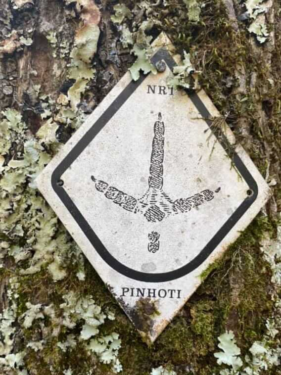

Pinhoti was my seventh hundred-miler, and I was hoping it might be my fastest. Its elevation profile, along with the relative smoothness of its trails and an expectation of mellow southern fall weather, had me thinking this was a perfect opportunity to achieve one of the gold standards of ultra competency for an aging mid-pack runner like myself: 100 miles in a single day, a sub-24 finish.

**It’s an arbitrary standard to fixate on**, but it’s also a beautiful and resonant one, symbolically round and pure, definitive. From the moment we entered the race back in March, this standard was on my mind, and I intended to achieve it.

I had a solid train-up, and I was on track towards that goal, but then I aggravated an old case of knee tendinopathy about 3 weeks before the race. It’s an old and familiar issue, and I did my best to rest and recover, but it was still not in good shape as race day approached.

## Things that made me happy during this race

**These things first** — the parts I’ll remember, the small treasures that made me happy. We’ll be deep into details and analysis soon, but none of that matters nearly as much as these bits of gold.

* **Getting to the rocks.** The first 40 miles or so were beautiful but smooth and easy single track. But about two thirds of the way up Cheaha Mountain (Alabama’s highest point), we came to a rocky section. It wasn’t quite Pennsylvania-rocky, but it still felt like a touch of home (a cold drink of water on a hot day, a breath of fresh air…) It brought a big smile to my face and put energy in my steps.

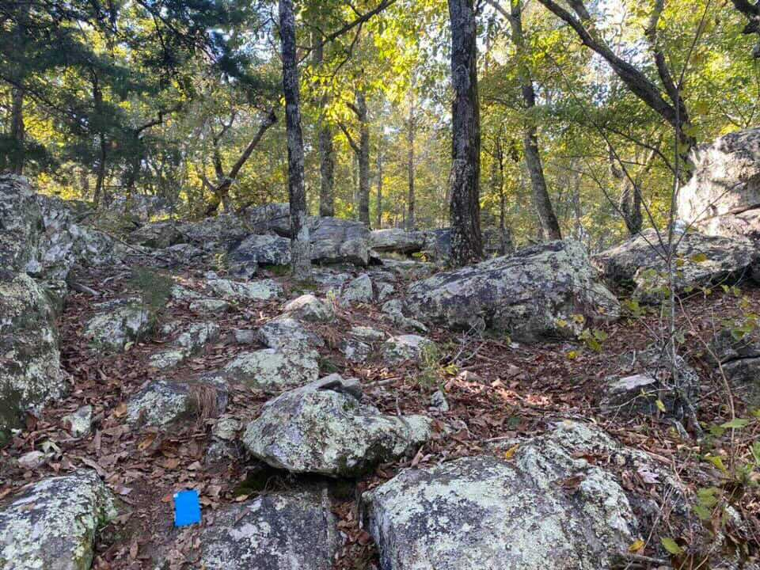

* **Longleaf pines.** The exotic look of those branchless seedlings and saplings, the luxurious cushioning where their foot-long needles lay deep on the trail, the heft and presence of those big heavy-barked trunks…

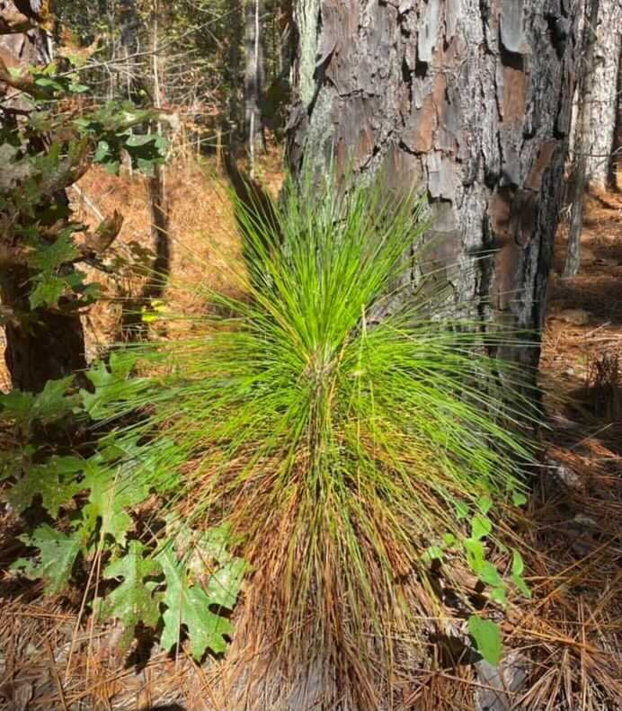

* **More rocks.**  The descent from Cheaha Mountain, a section of trail known as Blue Hell, was even rockier. In fact it was nearly Catskillian, if only for a short distance. It brought me another big smile, and the energy and enthusiasm to make a few passes. Even better, a group of Boy Scouts was out there as I went down (yes, sadly I do like to show off sometimes).
* **Hot apple cider.**  I don’t remember which aid station had this magical elixir, but it was exactly what I needed at that moment. Thank you!
* **Single-track after the roads.** Somewhere in the second half of the race, deep in the night, we spent a long time on a high and rolling ridge-line forest road. And just when I thought I could take no more of it, we made a left-hand turn that plunged us back into the woods on a single-track descent that was as fully stimulating as the road had been dull. Beauty lives in the contrasts.
* **Solitude.**  Not for the entire race of course, but for the final 25 miles I was completely alone, and it was perfect.
* **Victories.** When I made it to the finish line, Kayla was there to greet me, after finishing over 2 hours earlier as the female winner and 5th place overall. Sometimes things go really well for people who work really hard.

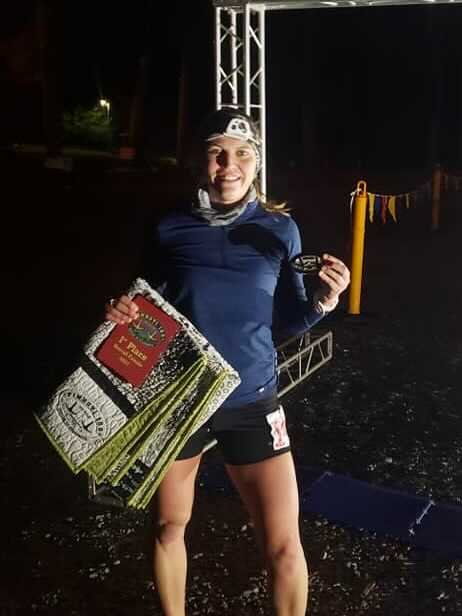

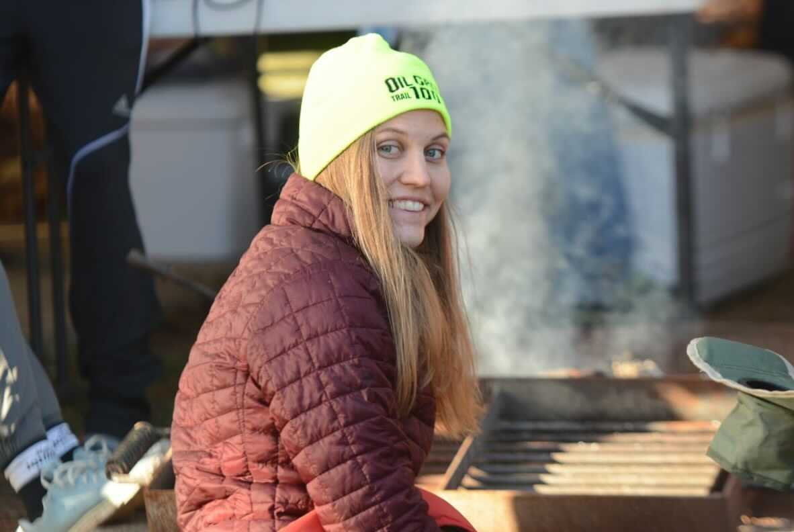

* **Thresholds.** Renee’s sprint to a 26:59:59 finish (and the smile on her face as she did it).

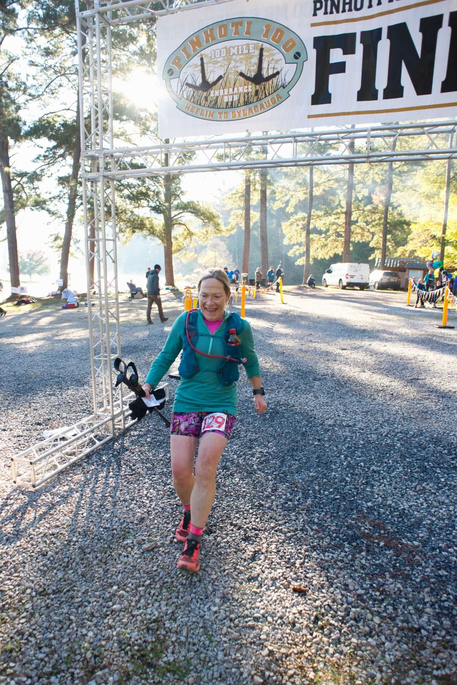

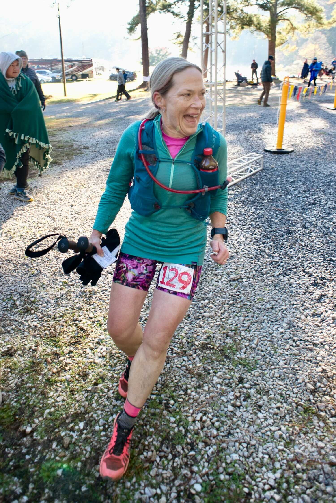

* **Tenacity**. Jason endured a back issue that held him to a walk for much of the second half of the race. He pushed on and finished (with a smile).

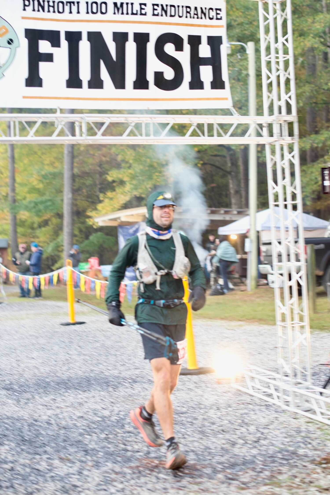

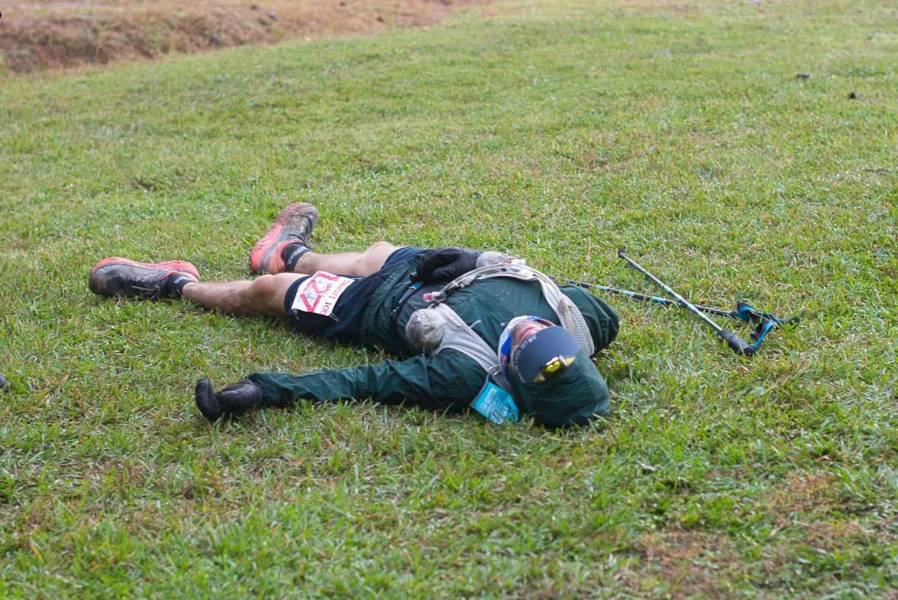

---

## Goals and a plan

**At the operational level**, I built my standard hierarchy of goals to structure my psychology and guide my tactics. In long-distance races (and probably in most aspects of life), this is an important self-protective hedge against the harsh dichotomy of the success-or-failure worldview — define multiple layers of success, give yourself the comfort of knowing that success is not a yes-or-no question.

For me in this race that hierarchy of goals looked like this:

1. **My reach goal: 24 hours**, that elusive standard, that round and pure symbolic performance. I knew this was my best chance so far at achieving that, but I also knew almost everything would still have to go well for me to have a shot at it.
2. **My A goal: a personal best** at the hundred-mile distance. While almost everything would have to go right for me to hit the reach goal, a lot of things would have to go wrong for me not to get this one. My previous best (26:32:19) came at No Business 100 in 2020, and the trails and elevation profile here looked to be even faster. Which doesn’t mean this goal is a given. Something goes wrong in almost every hundred (your knee might not work properly, for example).
3. **My B goal: a finish**. The list of things that can go wrong is long. Which is why in many, many ways, a finish is a win, and this is always my most basic goal.
4. **My C goal: dignity**. I absolutely do not believe the fluff about “you’re a winner just for starting” and I find no solace in “at least you tried”. To me it’s weak self-deception. Which doesn’t mean that a DNF (“Did Not Finish”) necessarily means failure. For me, there’s a middle place, some level of effort (beyond the point of pain, but short of death) where my dignity lives. It’s hard to describe that place, and there can be no external judge of it. The determinant question is whether I can look myself in the metaphorical eye and meet my own gaze without feeling disappointed with what I’ve done.

**An extra note about this**… I imagine this is different for each of us and for each unique situation we find ourselves in. You might have a different but equally valid philosophy — we each define the parameters of our own games. My personal threshold for the acceptability of a DNF for myself is pretty high. I’ve only been there once, on my very first long ultra (at the 70.5-mile Laurel Highlands Ultra back in 2013) and I’m still not sure if my decision to drop that time passes that meet-my-own-gaze test (I revisit that question with myself every so often and think it might not).

**My tactical plan** was built around the unknown status of my knee. I wanted to start slow and do a lot of walking as the knee warmed up and as I assessed how it was going to react. What I really expected was that I’d get a certain number of okay miles from it, and then it would gradually (at least I hoped for “gradually”) get worse, and at some point I’d be forced into only walking, and I’d be in death-march mode from that point on, for as far as I could manage to go.

My benchmark for how far I can go in that state is Kerry Way Ultra, where I went 50 miles or more with progressive dysfunction and pain. I was dreading (and fully expecting) something similar this time.

**I even had a potential bail-out** in mind at the mile 55 aid station where Tim was parking his van to start his pacer gig with Jason. In the early miles of the race, and probably into the 20s and 30s, I would focus on that as my decision point, and all of my movement before that was going to be directed at keeping me from falling into complete disrepair before I got that far.

I intended to do that with a solid mix of walking and running from the beginning, probably at a 25:25 run-walk step ratio. The running was to be very careful, gentle and conservative, and the walking was to be aggressive — maybe not quite the sub-13:00 pace that I practiced during my taper, but at least sub-14:00 most of the time.

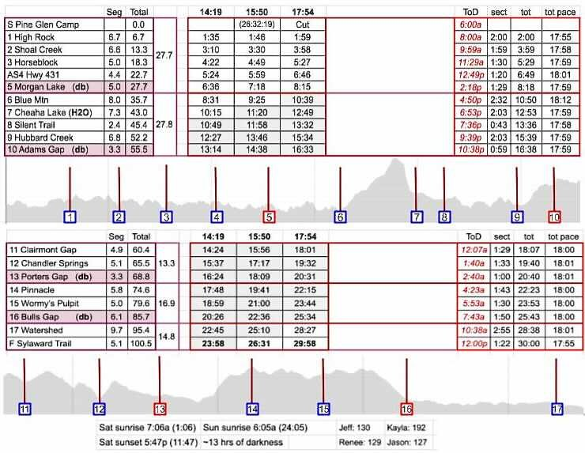

**So, my tactical plan was to combine gentle, conservative running with aggressive walking** to protect my potentially fragile knee and get me as deep into the race as possible before that knee became debilitating.

But there were layers to that plan to match my hierarchy of goals.

**Because I still had that reach goal**,and the secret thought that I might still be able to get it. It might be possible to run conservatively, walk aggressively, and stay at or near a 24-hour pace. I intended to do that for as long as I could.

But at the moment it became clear I couldn’t hold that pace, I intended to drop off the “reach” goal and down to the A goal, and allow myself to settle into the considerably slower pace needed for that. (A sub-24 hundred requires an average pace of 14:19 minutes per mile; I only needed an average pace of 15:50 for a PR. Having an extra 90 seconds for each mile is a very significant difference.)

Likewise, if things were going badly and that A goal slipped away, I’d decided to let it go, embrace my B goal, shift into survival mode, and focus everything on staying ahead of cutoffs and making it to the finish line (and gaining an additional 2 minutes of average pace per mile).

**In other words, I’d keep the highest-level goal active as long as it was tenable**, and when it wasn’t, I’d drop straight to the next goal, with no interest in anything intermediate. In this particular race, there was nothing in between for me. If I can’t make 24 hours, I won’t push hard and risk hurting myself to get 25 hours, and if there’s no PR I don’t really care if I finish in 27 hours or 30 hours. This is an accommodation for the state of my knee, a compromise between achievement and physical self-protection. It’s not my normal approach.

## Execution (the race)

Start slow, run gently, walk aggressively, protect the knee, hold on at each threshold for as long as possible.

**Good plan, but…** I didn’t realize just how slow things are at the back of the pack. I let people stream by me at the start, as I shuffled along, which was as planned. But we hit single track very soon, probably at about a third of a mile, and I was instantly reduced to a *very* slow walk.

I passed where I could, but for the most part I was polite about it and didn’t pick my way forward unless there was a gap I could get too.

But it stayed congested and the miles (and time) clicked by, and I simply had to become more aggressive, or the whole thing would slip away.

So I did things like this…. I skipped the line at water crossings where runners were queued-up and waiting their turns to carefully pick their way across these little streams without getting their feet wet. I slipped by and splashed on through and jumped maybe 20 runners at a time that way.

**Eventually it did thin out**. The conga line had pretty much broken up by the end of the first hour or so, and I’d transitioned into that middle ground where you are passing smaller groups to get to the open ground between them and the next clog. It’s hard to get into a rhythm during this time, but it’s better than what preceded it.

I suppose this enforced slow start might be the reason my knee never got bad. I don’t really believe that, but to be fair with myself, the knee situation truly was an unknown, and it would have been a foolish risk to try to go fast at the very beginning in the interest of beating the conga lines. I needed to err on the side of caution, and that was the right call.

During this phase, the biggest challenge for an older man like me, with older-man bladder issues, was that I’d get past a clog or two, then need to pee, and face the distinct possibility that those clogs would go right back in front of me as I stood behind a tree.

**But that phase passed, too.** It was followed by more open-field running, and I settled into a more sustainable and enjoyable long-range pace. I could concentrate more on my knee and how it was doing, and somehow, it was doing alright.

In the early miles, it was twinging regularly, just as it had been since it went bad a few weeks earlier. But that faded as the miles went by, and the twinges become less and less frequent. They were still there every so often, and they were loud enough to remind that there was still this potentially debilitating threat riding along with me, but my confidence was growing as the miles went by.

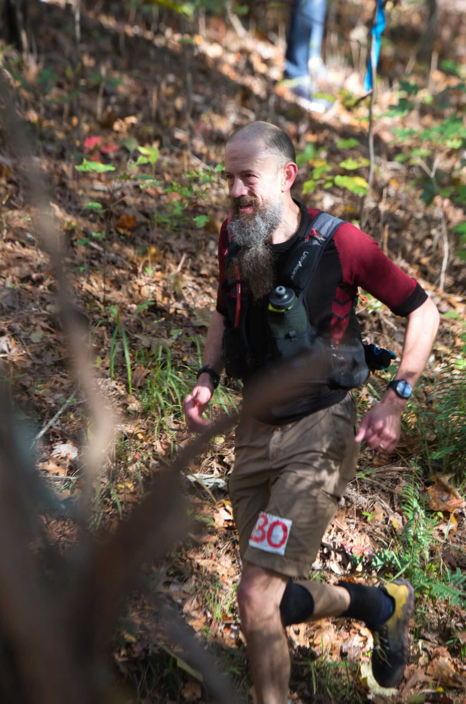

**Anti-social racer that I am**, I still had periods of frustration with other runners. In particular I’m thinking of one group of young men who were chugging along at about the same pace as me, but in front of me, and playing music. Not headphone or earbud music, but mini-boom-box music, broadcasting it loudly enough to hear from 20 yards away.

This is completely uncool, not part of our trailrunning ethic. Most of us go to the woods and the trails to get away from other people’s music, not to have it blasted at us as we run.

The trouble with situations like this one, where you catch up to a slightly slower group, is that to pass them you have to accelerate around them, and then maintain a faster pace long enough to pull farther ahead of them (and, ideally, to build gap large enough to cover a potty break).

Irritation aside, these music bros likely gave me a net gain. Because after I finally got past them, they haunted me — I had to make sure I stayed ahead of them. That kept me more focused, and probably got me through some aid stations faster than I otherwise might have.

**I caught up to Jason and Tim** at the mile 69 aid station — they were leaving as I was arriving. I never expected to see them, as Jason should be considerably faster than I am if things are going well. I caught them again within the next mile and walked with them for a while. Jason was having a bad day with a back problem, and he was unable to run. He was in his own version of the long slog/slow hell I was dreading for myself.

I stayed with them for 2 or 3 miles — probably longer than I should have. It was just so nice to socialize, and to settle into their pace. I needed that, but I should have taken a smaller dose — I lost time I didn’t need to lose.

Eventually I did move on as we started up the Pinnacle climb, and I was soon by myself again.

**I was perpetually on an edge, liminal.** Somehow I was fast enough to stay at a point where the vagaries of distance measurement kept me just ahead of that first ratcheting, the place where my target would slow from 24 hours to 26.5 hours. For the entire second half of the race I was just barely viable for sub-24 — probably not able to make it, but close enough that I couldn’t let myself reduce my effort to the PR target instead.

**Look at the last two segments of the race, for example**.

The official distance from station 16 to station 17 was 9.7 miles, with another 5.1 to the finish, a total of 14.8 miles. I left AS16 at 20:58, meaning I had 182 minutes for those 14.8 miles, meaning I needed to hold an average pace of 12:18 for that distance. At that point, my official average pace was 14:41 (and actual measured pace was 15:24) so I’d need to speed things up, which didn’t feel likely, but this section was entirely on dirt roads, with very little climbing. It wasn’t quite impossible, and therefore sub-24 was still possible, and therefore I had to keep pushing.

(My alternative at that point, if I’d been willing to give up the reach goal and ratchet down to the A goal? I’d have had over 334 minutes. I could have slowed down to a 22:36 pace, had a leisurely 5-hour walk to the finish, and still have my PR.)

**But those (self-imposed) rules…** they said I had to push, so I pushed. My abilities were degraded by then, though, and I found I couldn’t hold anything close to the pace I needed. In fact I was a couple minutes per mile slower than that, barely able to keep myself under a 15-minute pace.

Partway through that segment, I realized that sub-24 was gone, and I was ready to let it go.

**But it wasn’t true…**

I arrived at that final aid station 2 miles sooner than expected (official distance: 9.7 miles, my GPS distance: 7.8 miles). Suddenly the math has changed again. Now there are 5.1 miles left and I have about 64 minutes for it, meaning I can make the reach goal with a 12:34 pace. A daunting prospect, but not far enough out of the realm of possibility to allow me to let it go.

**So again, keep pushing**, extract absolutely as much as possible from my body in pursuit of this arbitrary-but-highly-symbolic goal I’d chosen.

Sigh.

I could have limped along at a pace slower than 42 minutes per mile at that point and still had my PR, but I had to put the attraction of that luxury out of my mind and instead push each step, disregard or accommodate the various discomforts, the pain behind my knee where the neoprene of the brace had long since sliced its way through the skin and into the flesh. Etc. (it’s kind of a blur).

**Most of that final section** was on single-track mountain bike trail.

Mountain bike trails are notorious for squeezing as much distance into a small space as possible — they wind back and forth with intricate serpentine twists that I suppose are fun if you’re on a bike. If you’re on foot at the end of a hundred-miler, though, they can be maddening.

They curve back on themselves, they take you close to things that are still far away. They let you hear the finish line far below you, and then take you back away from it, as the time ticks down and it becomes clear that you just aren’t going to make it.

**My watch slipped past 24 hours, and I was still out there**, on this ridiculous serpentine bike trail, so close and yet so far. That’s when I finally let go and let myself quit pushing. Twenty-seven minutes later I trotted out of the woods and crossed the finish line.

It was still dark — my first hundred mile finish without a second sunrise.

## An extra note about my knee (running fixes things)

My knee deserves extra comment. I truly expected that it would not hold up for the entire race. I thought the only question was how long it would take to become debilitating. I’m very familiar with how that can go and what it feels like. No one wants that, and I was very, very close to sitting this one out.

But for whatever reason, I started, and for whatever reason, my knee did not go bad.

In fact, it got better, more solid and reliable, less painful, as the miles went by. I don’t understand why, but I know that our bodies can be incredibly resilient, and that’s especially true for those of us who train them to be that way.

And I know **running fixes things** (all sorts of things).

That appears to be what happened for me during this race, and I can’t explain it, but I’m grateful for it, and I’m so very glad I decided to start the race.

## An extra note about measuring distance

If you’re not familiar with trail ultras, you might be surprised or disturbed by the distance discrepancies I talked about. Don’t be — it’s normal (and no one’s fault).

GPS is a great tool, but it’s only a tool, not the truth. In fact, true distance (and elevation change) is a fairly loose concept on the kind of terrain we run on. GPS collects a series of point locations, then uses an algorithm to connect those dots and approximate your actual movement. Read “approximate” as “educated guess” — on a course like this, with many, many twists and turns and small rolling hills, more can happen between the dots than the algorithm accounts for, and the course is likely to read shorter than reality.

It’s a fact of life, and if it matters to you as a runner, it’s your job to assume it and account for it in your planning.

## A worthy race

**This race was a good choice**, a challenging adventure in a beautiful place, with gracious hosts, dedicated volunteers, and that intangible spirit of our trail tribe that makes events like this one a joy to be around.

And even though I feel some emotional bewilderment at coming so close to my reach goal and missing it, I’m proud of my effort and the result — 1st-place Grand Master (over-50, i.e. old guy) and 19th overall.

**I’m proud of my fellow travelers, too** — they each did quite well. Kayla won the women’s race and placed 5th overall (with a 3-hour PR). Renee was 2nd-place women’s Grand Master (with a 1 and 1/2-hour PR). And despite his personal adversity, Jason was strong and steady through the pain and finished as the 5th-place men’s Master.

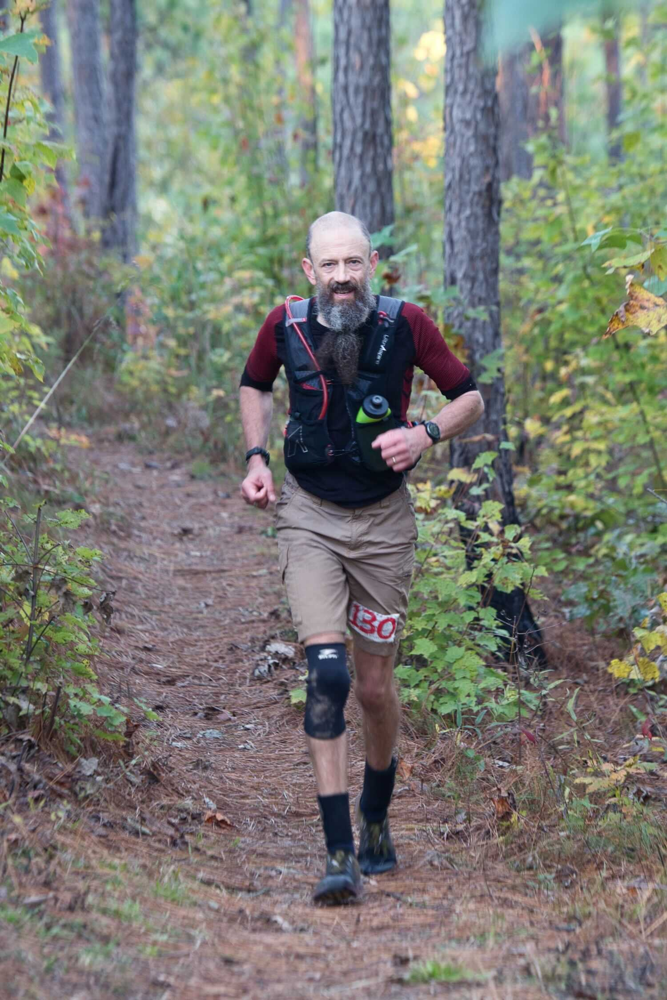
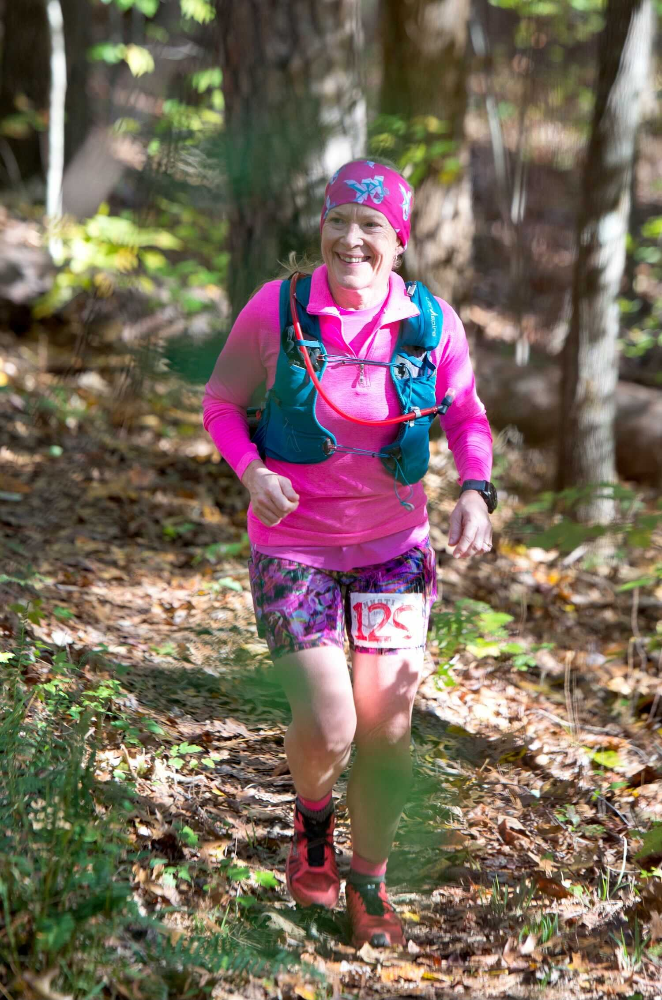
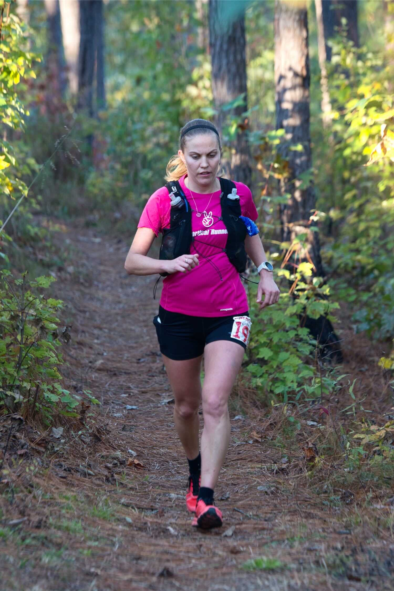
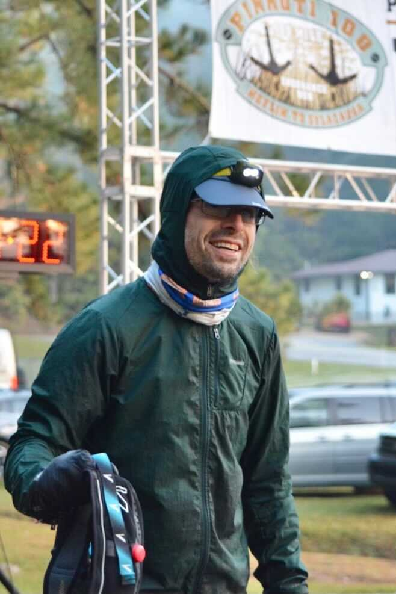

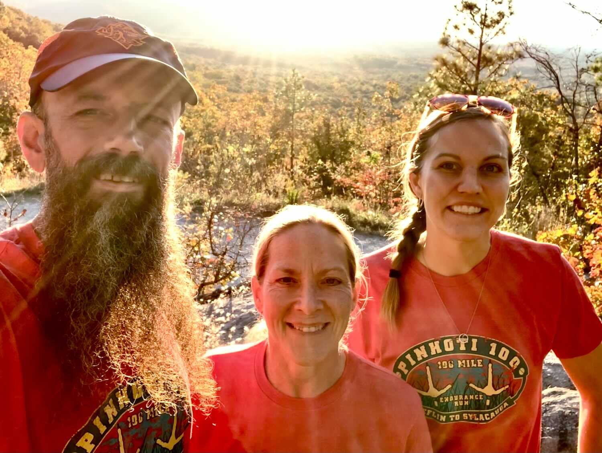

Beyond those numbers, we had a grand and intimate tour of an Alabama I had no idea existed. It was worth the trip.

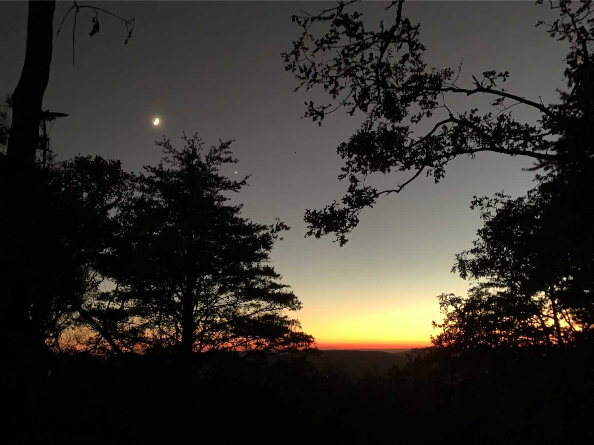

---

## Some Technical Details

This section is mainly for me, to help me with future technical decisions and so on. But if you’re curious about some of the nitty-gritty of this sport, or if you’re a fellow runner, you might find something helpful here.

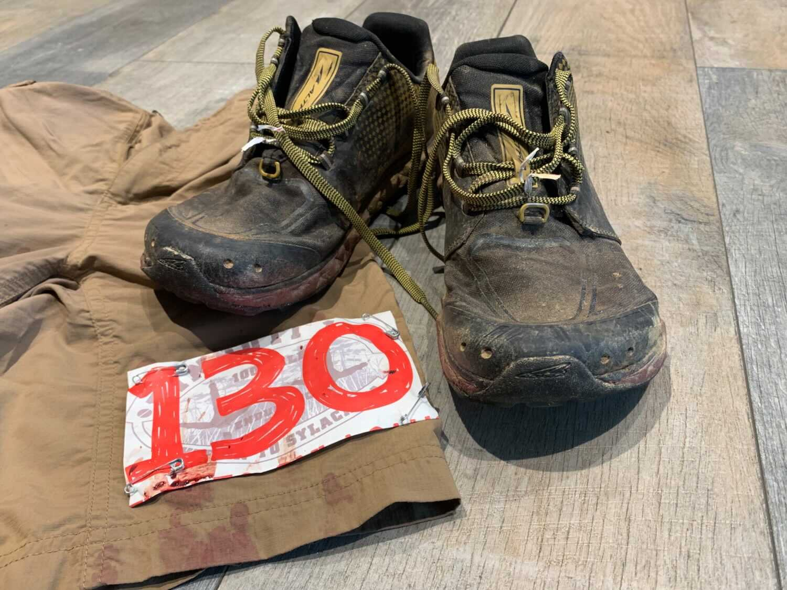

### Clothing

**The weather was mild**, starting at about 38F, getting up to maybe a little above 60F in the afternoon, and back down into the low 30s (or a little lower) towards the finish on Sunday morning. There was a slight chance of rain, but that didn’t happen. So I dressed about the way I dressed for the last Hellgate. I wore my Saxx Strike underwear and Columbia Silver River cargo shorts (which I chose instead of my new Mammut shorts because of the extra pockets — and I think that was a good choice), my XOSkin shirt (and of note, NOT my standard old blue t-shirt — I accidentally left that at home, and decided not to wear a different t-shirt instead of it), Arcteryx vest, soccer sleeves, Hyner-sock wrist warmers, standard old Sub-4 magic hat, XOSkin crew socks, Hyner wool socks, and my new Altra Superior 4.5s, my standard short neoprene shin braces (in place on each leg, but very loose), and a neoprene knee brace on my problem knee. I carried my SmartWool windbreaker and my Berghaus emergency rain coat, and I had fleece gloves that I might have worn at the start and then quickly stashed once we were moving.

**As things warmed up after daybreak**, I adjusted my clothing, first by stashing the hat into a cargo pocket, then by rolling down the soccer sleeves, pushing up the sleeves of my shirt, and rolling up the wrist warmers. At some point I stopped and stashed all of this into my pack for the rest of the daylight portion of the race.

At another point (probably it was at my 2nd drop bag, at AS10, as darkness took control and the temperature fell) I reloaded this cold-weather gear from the back of the pack where I jammed it when I took it off earlier. I think this was my longest aid station stop, and it probably could have gone faster, but I think it was still a benefit, because I got all that gear relocated to places where I’d be able to access it as I needed to add layers later on, without having to stop and take off the pack. I guess it might have been better if I’d stowed in those accessible locations in the first place, but either way it would have taken a certain amount of time to get it to the right place. And now that I think about it, I guess I put my Arcteryx vest back on there, so I would have had to stop and take the pack off anyway.

**It got cold enough** (and I got slow enough) in the final miles for me to start adding that gear. I probably started with the hat, and I pulled my sleeves down (my shirt sleeves, not the soccer sleeves — I intentionally left them behind in the drop bag because I didn’t think I needed them), and I put the wrist warmers back on, and eventually the fleece gloves. I was on the edge of being cold even with all of that, but I never got to the point of being too cold, and I never stopped to put my SmartWool jacket on. (It was a different story when I was done, sitting at the finish line trying to stay warm, but that is later on.)

**There are two other clothing-related decisions of note**, and they both involve things I could have done but decided not to, on the rationale that my knee was stable and I didn’t want to do anything to change that. First, I should have removed the neoprene knee brace when the chaffing (and eventual cutting) it was causing became painful. Second, I should probably have changed my shoes when I had the chance.

Both of these changes would have happened at the same time, at my third drop bag at AS13 around mile 68. I had my size 10 Terraultra G270s waiting for me there, and I could have changed into them and removed the brace there. But instead I opted to leave well enough alone and drive on without spending that time or taking that risk of changing the dynamics of my knee situation.

I understand my reasoning, but I think it would have been worth the time to make those changes, and I think I might have been faster and in better shape in the final miles if I’d done that. I really doubt that either change would have effected my knee in a bad way (though there’s really no way to know).

Without the brace, I would have stopped that painful process of tissue erosion the was happening on the back of my knee (that made a sizable lesion that still is not healed).

With the larger shoes, I wouldn’t have had to be so cautious about not kicking things (and wouldn’t have suffered nearly as much when I did kick things, which seemed to happen more and more as the miles went by). I also might have benefited from the extra cushioning of those shoes.

But I stuck with what I had, and I doubt it would have made a large enough difference to get me under 24 hours anyway.

### Lights

**My lighting plan worked well**, which was particularly important in a late-season race with over 13 hours of darkness. The first 45 minutes or so of the race was in darkness, so I started with my Petzl Bindi. I carried my Swift RL (with two extra battery packs) as my main light, and I had my BD Spot as a fog light and spare main light (with an extra set of batteries in my pack, plus another set in a late drop bag). I packed both the Swift and the Spot in my side pouches where I’d be able to get to them without dropping my pack.

At some point I put the BD Spot around my waist, thinking that way it would already be in position if I needed it, and also thinking that it would be there ready to use when I needed to change the battery pack on the Swift RL. This was not a terrible idea, but if I do that again, I need to see if I can make it just a little bit larger, as it was a little annoying keeping it in the right place, as it was slightly too tight and kept riding up (and also it gave me a slight rub spot on my back, the only spot like that).

The first battery pack for the Swift lasted a full 7 hours before it gave its first warning blink. I stopped immediately and changed it, and the second one lasted to the finish, another 5+ hours. I guess I remembered to switch to low power when I was either climbing or on a road most of the time, and so maybe it was a 60:30 mix of medium power and low power to get that amount of battery life.

So the light plan was fine, and while three lights might seem like overkill, there is value in the reassurance that this is redundantly covered.

### Nutrition and hydration

**My nutrition plan** was similar to most of my recent races. I had a Vespa about 30 minutes before the start, I had my first maple syrup at about 2 or 2.5 hours, and then I roughly tried to have about 100 calories per hour. After reading my Hellgate AAR from last year, I realize that I was not nearly as disciplined about that in this race as I was in that one, though. I didn’t use much of the nutrition I brought with me or stashed in my drop bags, and I don’t have a good idea of how many calories I consumed.

I used less water than normal, and I was nauseous in some of the final hours and pretty much quit eating much of anything. It never got terrible, and I never threw up, but it was there. I also never felt bonky, although it’s really hard to tell if the fatigue of those final 15 or 20 miles might have been partly from a need for easy calories.

I used another two doses of Vespa, at about 10 hours and 15 hours, but I’m pretty sure I didn’t take the 4th dose that I had along and planned to use at 20 hours — I’m really not sure about that. And as far as whether the stuff actually works… I have no idea, and I’m not sure how I’d know if it did or didn’t. I think I’ll keep using it though, on the chance that it really is helping with my fat metabolism.

**One significant change I made this time was to carry a hard flask** in a front pocket of my vest. “Hard” is an exaggeration, because it is actually fairly soft and flexible, but it is still a structured bottle that doesn’t collapse as you drink from it. So there is some annoying sloshing going on whenever it’s not either full or empty, but the flexibility I got from it made it worth enduring that annoyance (and most of the time, I was able to squeeze a lot of the air out and take most of the sloshing away).

I chose this formed bottle instead of a soft flask because it’s much easier to get it back into the vest pocket after using it. It’s also easier to handle, both for drinking and for refilling, than the soft ones.

This bottle allowed me to limit the number of times I needed to fill my hydration bladder. In fact I think I only topped that bladder off twice through the entire race, and I never actually filled it. I started with about 50 ounces in it, I never emptied it, and when I filled it, I probably only took it back to about 50 ounces.

**This is significant because** it takes far longer to fill the bladder than the bottle. Yes, I have to fill the bottle more often, but I think I came out ahead on hydration time. Plus, I was able to use Tailwind if I wanted it, by just dumping a sleeve of that powder into the bottle. I don’t need Tailwind particularly, and I might not bother with it in a shorter race, but it was a nice change this time — I think I used at least two bottles of it.

The same is true for Vespa. Because I had that bottle, I could use Vespa concentrate instead of the big pre-mixed packs, so I could carry all I needed in a small space and not have to get it from my drop bags.

**One last note on hydration…** I think I got behind on it in the midday. In my train-up, I’d pretty much abandoned any sort of heat training or IOD (intentionally over dressed) training, and when it got into the high 50s and full sun during the day, I was sweating a lot, and it was salty.

And even though I was moving slowly, and even though there was very little sustained climbing, I got crampy in a way that at least might have to do with dehydration. I never got to the point of complete cramping, but I was on the edge of that for what seemed like a long time in the middle miles.

### My caffeine fast

As part of my Sober October experiment, I gave up caffeine. In fact I was completely free of caffeine from late September until mile 28 of this race, when I guzzled a bottle of Coke from my first drop bag.

I expected this to be a big thing, expected my rebooted system was going to catch that first dose of its old friend and be supercharged by it. Articles I’d read talked about the first coffee after a long caffeine fast as a brilliant experience, with fresh and clean energy and clarity, and that’s what I was looking for and expecting.

As far as I can tell, I missed that experience completely. To be fair, I have no control group, and no way of knowing how I would have felt in the next hours if I hadn’t had the caffeine (which I consumed steadily from that point forward), but I didn’t notice anything, no clarity or extra burst of energy or endurance.

### Aid Stations

My total aid station time was less than 43 minutes, an average of only about 2:31 per station. I don’t have my numbers for previous races, but I’m certain this is the least time I’ve ever given up to these seductive oases of luxury.

**I feel guilty sometimes about passing through so quickly** (in fact not even stopping at five of them), like I owe it to the volunteers to partake of the temptations they so graciously provide. But hanging out at aid stations is not compatible with my goals (and they are an excellent opportunity to pass less self-sufficient runners).

I still have some room to improve here, but not much — I’ll call this a success.

### Running with music

I had tried this before in a race, at The Bear in 2019, and it hadn’t worked for me, but I’m either a slow learner or a hopeless optimist, because I thought this time might be different.

(To be clear, this is **a single earbud that only I can hear**, at a volume that lets me hear what’s going on around me.)

In truth it *was* slightly different, in that I was planning to do a lot of aggressive, motivated and intentional walking, and I’d been practicing that for the past 2 weeks. I was going to use it on the roads, and I was going to use my 130-cadence playlist to keep me moving, just as I’d practiced. So I carried my Jaybirds.

I think I was at about mile 90 (+/-) when I started the music, on the long road section leading to the final aid station. It was a good idea, but it didn’t work as intended.

**I was unable to hold a 130 cadence at that point** — I was just too tired to go that fast. So the music was off from my pace, just as it had been when I tried it at Bear. And also as at Bear, it just didn’t feel right, felt sacrilegious in some way.

I kept it playing for a few miles, though. I switched from my 130 cadence playlist to my Bear in-race playlist, hoping that something would catch (in the way that something often catches for me when I’m on the treadmill and the music pushes me and pulls me and keeps me going longer and faster than I otherwise could), but it just didn’t work that way.

**When I finally put the music away, it was a relief**, and I’m left with this freshly reinforced lesson that I now know is true for me: the music in my mental jukebox is far better for me during a race, and it’s much simpler to bring along. It is infinitely adjustable in tempo and selection and variety, and unlike the sacrilege of blocking out the sounds of the world I’m running through, it compliments it, sometimes perfectly.
