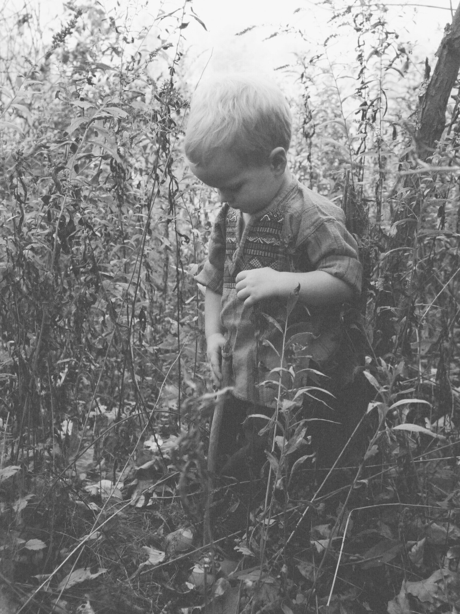

*Written March 22, 1999.*

I crave the solitude of running alone, the private battles and private joy. But two years ago I became a father, and solitude became scarce. It also became less important, because my son is now my running partner.

Lucas was three months old on our first run, a two-miler on the local rail-trail. He was so small, engulfed by the generous seat of the jogging stroller. But he grabbed the side-bars and pulled himself forward so he could see out beyond the purple nylon. That first day, I knew he was hooked. We both were, and after hundreds of miles together, we still are.

When we run, he's not just “looking at,” he's "moving through". And our trail is a good place to move through. It's nature-rich, with steep, wooded banks, lots of boulders and laurel, a wide rocky river at the side, and wildlife. This is where he saw his first deer and wild turkeys, where he flushed his first grouse. When a train roars by on the other side of the river, he twists himself around to watch until it's completely gone around the bend. He points out the butterflies and songbirds to me, and he waves to the cows on the farm we pass.

He embraces the weather — all of it. If the sun is bright, he pulls the brim of his little blue hat down. He giggles when it rains. He tries to catch snowflakes in his hand. He turns his head and squints his eyes and smiles when the wind turns the stroller into a sail. On a misty-black night run, he's completely silent.

Sometimes I talk to him, or sing. Sometimes he talks and sings back. Occasionally he gets bored with the whole thing, and he reaches his hand out to touch the spinning tires, or gives voice to the discomfort that we're both feeling. I point out new things, or I grab a leaf from an overhanging branch or a goldenrod or daisy for him to hold. Mostly we're very quiet, though. The beat of my feet on the soft trail and the faint crunchy sound of the tires on cinder and sand is hypnotic. Sometimes he sleeps, lulled by those rhythms, and the monotonous beauty of it all. But usually he just sits there and takes it all in, watching the world go by, working on the most sublime look of contentment.

"Someday he'll be pushing me around like this."

That's my standard line for people who comment when we pass. I'm joking — I hope to be self-mobile forever. But the "someday" part is true. Someday I hope he'll be running beside me, or better, out in front, faster than I've ever gone. Someday when he's older, I hope he'll still have the same look of wonderment on his face from time to time. And someday I hope he'll introduce his own child to the world, in his own way.

That's my gift to him. Not the running itself — that's just a means to an end — but the desire to be out in the world, really in it.

And I get a gift, too.

Sometimes after running, we walk through the woods to the edge of the river, and climb out onto the long, low boulders that jut into the flow. On a perfect day, the air is cool, the sun has heated the rocks, and I can lean my tired body against them and soak up the warmth. Lucas splashes in a shallow pool next to me, or plays with driftwood sticks. Or I help him climb down to the current and we watch trout swimming in the deep shadows, or water beetles whirling on the surface.

My gift from him is that curiosity, that embrace of everything. It's that attitude of grabbing the side-bars and pulling yourself forward into the wind so you can see out. I think that's what I chase after every time I run. And he shows me a vision of it and reminds me of a difference I'm trying to remedy: I move by force of will, he moves by force of wonder.

