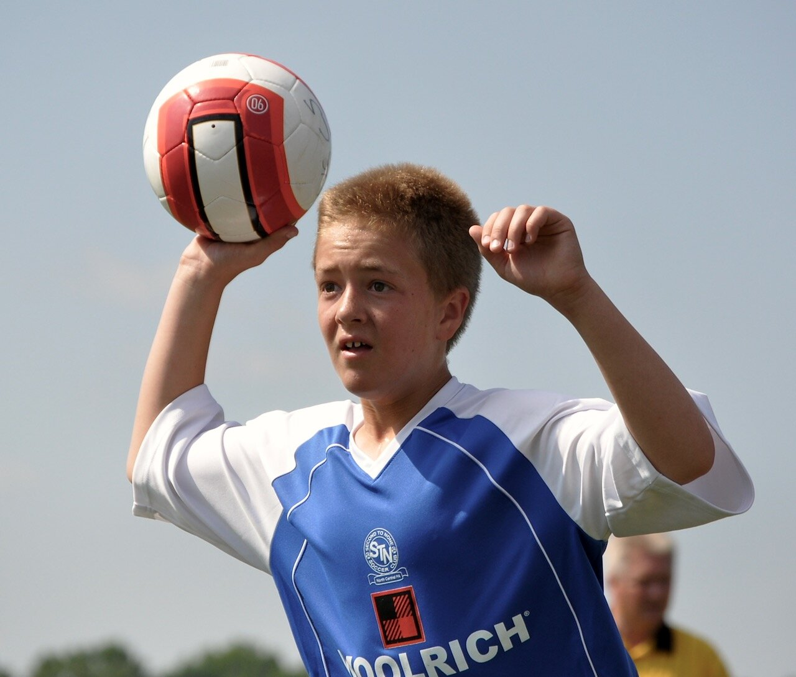
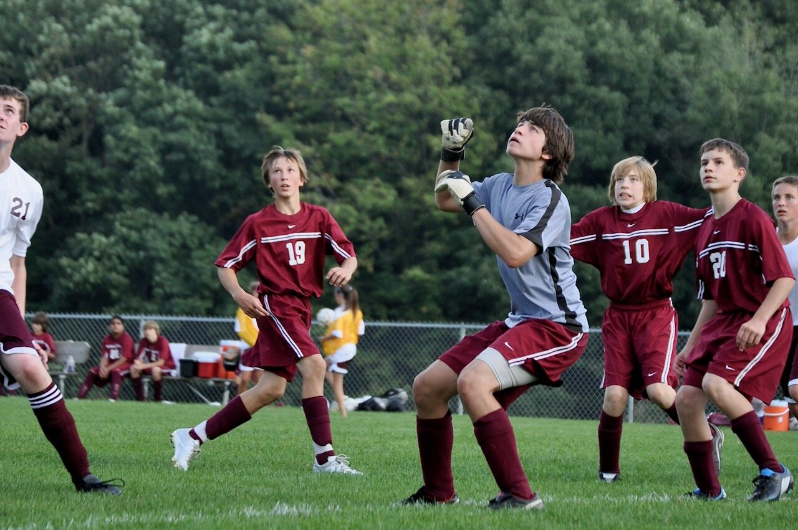

*Originally published on rushofitall.blogspot.com on 30 March 30 2010*

**Sometimes I need to restore my faith** in the basic soundness of our species, because sometimes I see and hear too much that takes me in the opposite direction. So I watch for examples of our better nature. I look for displays of people at their best, in moments of earnest engagement when they are so involved in doing something they love that they forget to pose, when they lower their defenses and let go of their cynicism and sarcasm and pretension and become pure.

One place I can reliably find this is on the faces of athletes engaged in their sport. Since my son’s a soccer player, and since I’m not a very good spectator, I spend my time at his games target shooting for those moments with my camera. And regardless of the season or the age or whether it’s boys or girls, it’s a target-rich environment.

**Out on the field**, in head-to-head competition, those sparks of authenticity follow the ball back and forth across the field and flow with the tides of the game. But it’s not really about the game. The game, the score, the stats, winning and losing — it’s all just a vehicle (or an excuse) for getting to those moments of maximal effort when nothing’s held back.

**It’s striking in its purity** because in those moments at the peak of the action, in those brief seconds of total concentration and full engagement, there’s no room in the mind for anything else. That animal focus on a physical act of athleticism drowns out all the noise, the social anxiety and the complexities of life.

**Something primal comes through** — the look in the eye, the set of the body, the physicality and the energy — and you can’t help but feel you’re gazing upon something fundamental to our nature. And it’s something fundamentally powerful and good.

See all of my soccer photos in [my gallery](https://rushofitall.smugmug.com/Photos/Soccer).
