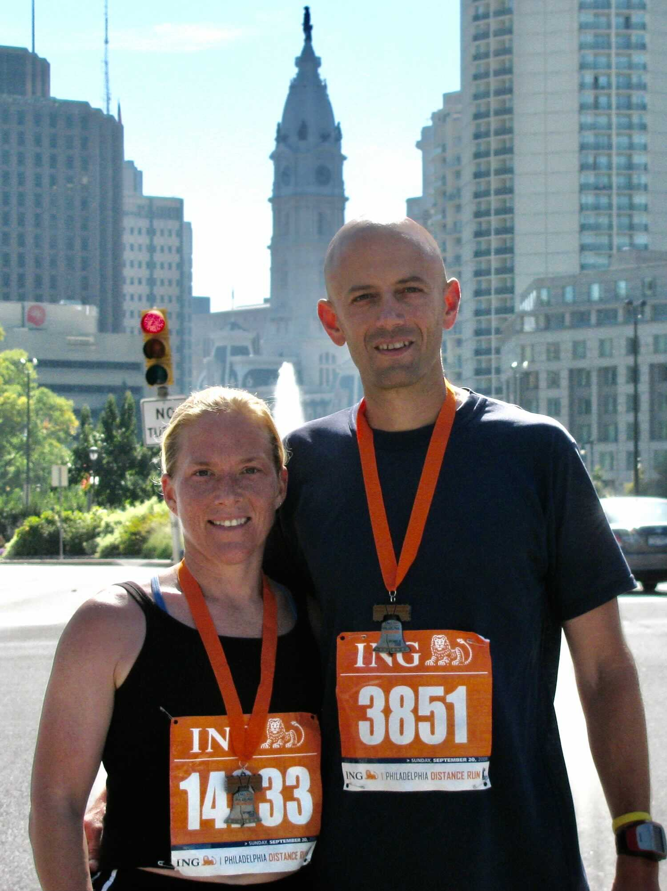
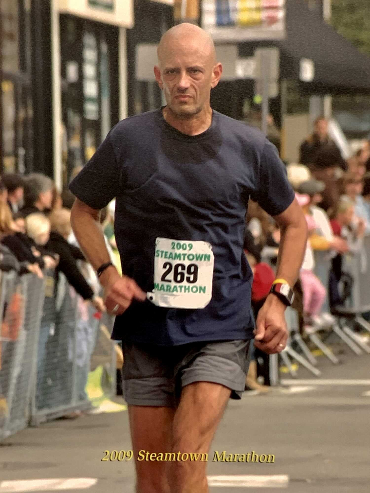

The 2009 Steamtown Marathon was the apex of my pre-trail, pre-ultra running career. As I post this, late in 2021, it also marks (almost exactly) the midpoint of my “serious” running career, halfway between my first marathon (June 1998) and my 7th hundred-miler (November 2021).

The fact that I remember it mainly for the “emotional bewilderment” it brought me makes it particularly poignant and pertinent, as I revisit that feeling after just running my fastest hundred so far, but coming up just a little bit short of my goals.

**This is all straight from my journal** in a fairly raw form, so it’s long and self-indulgent. I’m posting it anyway, because while the details don’t matter much, the process itself might. And a condensed version would give you the sausage without showing you how that sausage was made.

The flow of my thoughts and emotions around an undertaking like this is high-volume and often turbulent. My monkey-mind often intrudes, I get distracted by minutia that I don’t recognize as minutia, and there’s usually some self-therapy involved. But this is how it goes for me, and it usually gets me through.

Also, I have very little memory of this race — the journal is really all I have from it.

**Except for this one very clear memory**: just as I arrived at the start line before the race, “Hard Sun” (the Eddie Vedder version, from *Into the Wild*) started playing over the loudspeaker. It felt like the best possible omen… “When I go to cross that river / She is comfort by my side / When I try to understand / She just opens up her hands…”

# Inspiration and intention

*From my journal: 7 July 2008 (Monday)*

**I just took a detour into marathon land**. I read an article in *Marathon & Beyond* about a guy who was turning 40 and trying to qualify for Boston in honor of that, so I went to the Boston website and started working things out — looking for the intersecting lines of age and qualification times that would give me my best shot at meeting the Boston standard. Turns out the standard goes up to 3:30:59 when you turn 45, and I’ll be 45 for the April 2011 race.

That sounds far off, but here’s the thing I hadn’t considered before: you qualify based on your age on the day of the Boston, not on the day of your qualifying race. So I could qualify for that April 2011 Boston anytime after September 2009.

So… I’m going to do that, and I think I’ll do it at the place the guy in the article did — at the Steamtown Marathon in Scranton PA, on or about 11 October 2009.

**I have 461 days between now and then**, 65 weeks. And only 47 weeks between now and the start of my standard 18-week training period for it. In that 47 weeks I have this fall’s marathon, in maybe late November or early December, and the train-up for that starts this month.

So… the train-up and marathon this fall, then about 28 weeks between train-ups, and then into it.

I’m glad I did this research now. It gives me a renewed sense of focus. It’s far enough out that there is no sense of panic (even though I’m averaging 9 ½ or 10 minutes per mile right now and need to get that down to 8 minutes per mile). I think I’m positioned pretty well, all things considered.

Yes, I’m coming off a real slacking-off period where my running has been pretty minimal. But at the same time I have not given it up — I have a 103-week streak of weeks with at least a 10-miler, so there’s still some consistency and some toughness left. I think the layoff will give me a sense or freshness when I really get back into the training, and I’ll recover pretty quickly, and soon be back to the place I was last fall.

**Which, of course, is not good enough**. But it’s a starting point, a launching point. If I can get myself back into basically sound condition leading up to the marathon this fall, run a decent sub-4, and then not allow myself to slack off through the winter, I’ll have a good shot at it.

It will take more than just doing the same thing I always do. It will take some good solid cross-training and strength training and maintaining my weight and being a little more focused in my training, with some speed work thrown into the mix.

**But the long-term nature of the goal** promotes a long and patient view of the effort, so there’s no real pressure to get faster immediately, and no reason to try to ramp up quickly or anything like that.

The main thing is to keep that long focus and make sure I don’t over-train or injure myself or anything like that. It is far enough out to allow for some good natural cycles of peaks and recovery and so on, but not so far away as to be notional.

**I can see the pathway between here and there** and it is real and challenging but also attainable.

And I think this is exactly what that I needed to figure out right now, to get me excited again about running and to help keep me going out there and doing it regularly. Really, it makes me want to go out there right now and start running.

# A year later:

## Plan the runs…

*From my journal: 9 June 2009 (Tuesday)*

…**I need to give myself every advantage** I possibly can, and take it seriously enough to follow through on all these things I should be doing. Like making up a good and effective schedule. I started into that last night, but I’m not even close to having a plan I’m ready to execute. I need to get on with that and not let the weeks slip away in an ad hoc fashion as I’ve done the past couple years.

Success this year is going to require something more disciplined and more scientific.

**Because it will really be quite a feat** if I’m able to do what I’ve said I’ll do. I have to run a 3:30 marathon to qualify for Boston, and that’s almost an hour faster than the last one I ran, and it’s 14 minutes faster than my best time ever, and it’s a full minute and 20 seconds of pace faster than what I ran today. So calling it a challenge is an understatement — it will take everything I can give and then some.

But I know what I need to do, and I have 18 weeks in which to do it.

I just have to decide exactly how to do it, put it down on a schedule, and then commit to it, stick to it — **plan my runs and then run my plan**, make myself fast enough and strong enough to qualify.

Pretty straightforward, isn’t it?

\* \* \*

*From my journal: 9 July 2009 (Thursday)*

…I made some further refinements to my plan and I’m pretty satisfied with it now. It’s still aggressive, but intelligently so, I think. And it has flex built into it so I can vary the mileage up or down to match the way I’m feeling and the way the training is going.

The next thing is to analyze the course and see what analogs I can find around here for the hills I’ll face there. The big thing I get from reading all the advice on the Steamtown website is that I have to find some hills to practice running down, and make sure I’m ready for that part of it. My first thought is that the hill I’ve run over in Rothrock [Laurel Run Road] would be the best thing I can find around here. I can get a continuous 1.5 miles downhill there…

## Then run the plan…

*From my journal: 25 August 2009 (Tuesday)*

**Sometimes I amaze myself**. I did my 22-mile run this morning, and it was a breeze. My 5-mile splits were each faster than the one before, the final 2 miles were the fastest at 8:25, and I managed an average pace of 8:42 for the whole thing.

But the amazing part is that I felt good through the whole thing, felt like I could have kept going for another 10 miles if I wanted to. And when I got home, I was feeling energized, ready to play soccer or jump around or do something. So very different from many of my other long runs. In fact I’ve had 10-milers that felt much worse than this run, and fifteens that had me in misery.

**What was the difference today?**

Well it was somewhat cooler, especially at the start, but the Real Feel still got above 80F, so I don’t think that was it. Maybe my hydration plan made the difference. Instead of the stuff I’ve been using — the low carb, low calorie “energy” drink — I went with good old Gatorade that I mixed from powder. It’s truly an energy drink, in that it has lots of carbs and lots of electrolytes and lots of calories. I mixed it full strength and took three bottles along, and I think I stayed pretty well hydrated and energized through the whole run.

Of course those three bottles weren’t enough for that distance — I refilled a bottle from a fountain, and I also drank from a couple fountains. And I had a Power Gel and a CarBoom along the way, and I suppose they did their part, too.

Anyway, this was a good one and I should adopt some significant pieces of it for the real thing.

\* \* \*

*From my journal: 3 September 2009 (Thursday)*

**I ran the third fastest 10 miles of my life today**. I did it on what is supposed to be my hard course — over through Toftrees and around the game lands loop and back — with an average pace of 8:06, and I think I could have gone faster if I were trying. I felt so fast and so solid that I really didn’t want to stop so early, but I stuck with the plan and accelerated a little bit as I went by the water tower trail where I might have turned off to add a couple miles to the run.

If I can have that feeling next month, and run like that, I’ll get that 3:30.

And the thing is, I have a few more weeks of improvement ahead of me, and I’m only getting faster. I’m going to get a little bit lighter, and the weather is getting cooler, and I have another 70 miles next week and then an easier week (like this one) after that, and the half-marathon, and more speed work… and if I can just manage to keep myself healthy I’m going to be flying in Steamtown and I’ll get that BQ.

**It’s a good feeling to see real progress**, measurable and steady improvements in response to hard work — it makes it so much easier to keep doing it, and it builds my faith in my system and in my body’s ability to respond. I’m already feeling eager to head out again tomorrow for another one.

## Test yourself…

*From my journal: 19 September 2009 (Saturday)*

In about an hour we’re off to Philadelphia for the Distance Run tomorrow morning. It’s nice to have a day off from running (although the 4 hours of driving might be worse than running). Anyway, by this time tomorrow I’ll hopefully be nearing the end of the run.

I don’t know how fast I can or will run the thing, but my stated time in the registration should be attainable (1:40). I’ll stick with my plan of trying to hold back at an 8:00 pace for the first half and then gradually let myself go so I’m finishing fast and smooth, passing people, getting faster as I go, building confidence in myself for the race 3 weeks from now — the one that really matters to me.

**I’m ready, but** the storm clouds are gathering and I think I’ll be very fortunate to make it to the Steamtown start in good health. Lucas is sick with a cold or flu or something, and Renee has been blowing her nose, and I feel fine right now but if I use my imagination (something I really have to try to make myself not do on this topic) I can start to feel some symptoms myself.

I guess there’s little I can do beyond the simple things like getting lots of sleep and lots of fluids and washing my hands and not touching my face and maybe I should be taking vitamins and I should be taking echinacea and generally trying to avoid people.

But if it’s going to hit me, it’s going to hit me, and I’ll be alright.

This run will give me my 8th week in a row over 50 miles, and three of those have been over 60 and one over 70, and I’m in good shape such that if I got really sick tomorrow I could probably still manage a good marathon in 3 weeks. I’ll have confidence that I’m ready, and that even if I get sick I’ll be alright, and I will just go forward with that presumption and not let it bother me.

\* \* \*

*From my journal: 21 September 2009 (Monday)*

So honestly, how did I feel yesterday during the run?

**Well, there were moments of doubt** early on. I saw my heart rate go up faster than I was used to, and I wasn’t hitting an 8-minute pace consistently, kept going faster or slower, and it was feeling tedious.

**But at the same time**, I was trying to hold myself back, trying to decide how long I had to hold back, and when I finally decided I’d waited long enough, I felt great.

 PC: Lucas Calvert

I did a nice acceleration through the final miles and I felt strong at the end and I’m sure I could have started that acceleration earlier and held it, or done a more extreme acceleration. That is reassuring, as is the fresh experience of that great feeling of passing people at the end of the run.

**That’s a feeling I can focus on**, grab hold of during meditation and visualization sessions, and use during the race as an enticement to hold off just a little bit longer.

Holding off too long might mean not making the time I need, but not holding off enough could put me in that other mode that I’ve experienced far more than I want to at the end of races — the death-march mode where the only thing is to keep yourself moving some way until you get to the line.

**I also feel good about** the way I handled the slight hills yesterday.

Slight is an understatement, and I guess I can only really think of one — leading up to the bridge to cross the river. But I liked it. I was happy to feel it and I felt good with the slope and didn’t feel the normal despair that comes with an up-grade. I’m sure the hill training I’ve done is responsible, and I know that’s going to be important to my success at Steamtown.

At Steamtown there’s a hill of some sort around 18 miles, similar to the Harrisburg course, and that’s been a problem for me in the past. The way I handle that hill may make or break this effort. And I think I’m ready for it, that it’s something I can look forward to because I have this experience-based knowledge that I can run that hill and even if it hurts I am strong enough to recover, to absorb that hurt without damage to the rest of the effort.

**I have achieved a new level of resilience** as the main product of the miles I’ve logged, and especially those brutal hill sessions that I’ve done, and that is my main weapon.

It’s a good feeling to have — to be confident about a hill at mile 18.

## …then gather yourself and run your race

*From my journal: 8 October 2009 (Thursday)*

**I find myself viewing things in simple terms** at the moment — everything is either pre-marathon or post-marathon.

If it’s post, I’m not worrying about it.

Sometimes that takes a conscious effort, but it’s full of promise in many ways. I think I’ll be very happy by the end of the race on Sunday. But happy or not, I will certainly be relieved and feel like I’m set free. This is a gateway coming up, and I’ll pass through it, and on the other side is a new chapter with new priorities and new opportunities.

I’m anxious to get there.

\* \* \*

*From my journal: 10 October 2009 (Saturday)*

**It’s hard to realize that this is finally here**, that in 11 hours the event I’ve been focused on for so long, that I’ve put so much of myself into, begins. But it *is* here, and tomorrow night when I’m back at this keyboard I’ll know how it turned out.

I’m trying not to think too much about my real chances, because that doesn’t really matter at this point.

**At this point all I need to know is** that I did the hardest and most intense train-up I’ve ever done, and I’ve paid my dues for it to come out right. I know I have the ability and none of the rest matters — if I master my mind, my body will follow and I will be successful at this, and it will all have been worth it and I can get back to the rest of my life with a huge dose satisfaction and sense of accomplishment.

# Post-race

## Bewildered

*From my journal: 11 October 2009 (Sunday)*

**I’m home, and the race is over, and I am a little dazed** by it at the moment — lots of thoughts, but no good sense of how I really feel about it or what it means or where I go from here.

So I‘m going to wait awhile to write much about it, let it sit before I go into it. All I’ll say right now is that it is bittersweet, with more emphasis at the moment on the bitter part.

**Because I just ran the farthest and fastest I have ever run**, and I beat my old best by about 14 minutes. At the same time, I missed the time I need to qualify for Boston by 95 seconds.

Tough to feel good about it at the moment. So again, I’ll let it sit. We are going to go have a steak dinner somewhere, and I’ll get back to it tomorrow.

\* \* \*

*From my journal: 12 October 2009 (Monday)*

It’s Monday, and I’m still not in the mood to write about the run. There are a lot of thoughts working themselves out in my head, and there’s this phrase that I think describes my state at the moment: **emotional bewilderment**. I will develop that idea, but not today.

\* \* \*

*From my journal: 14 October 2009 (Wednesday)*

OK, I’m really back now, and I’m going to sit here and do a real entry in the journal and I’m going to go into the run and think about it and talk about it and see where I go from here. That run was significant, and there’s nothing wrong with taking a little extra time to get over it, but now it’s time, and the best thing is to discuss it with a clear mind and then just move on.

**So... I ran a good run, and I came up short.**

One minute and 36 seconds short, as a matter of fact.

At the same time I was 13 minutes and 48 seconds better than my previous best marathon time. It’s also the greatest improvement in my PR ever. And I ran a 9:01 negative split [the second half of the race was that much faster then the first half], which is pretty huge.

So there’s good and bad, and as I mentioned before, this leads to some emotional bewilderment.

Should I feel good about this PR race? Should I feel bad about coming so close and yet failing at the primary goal I set for myself?

**How could I *not* feel both of these things?**

I *do* feel both of them, and in many ways they cancel each other out. I knew that unless there was a disaster, I’d break my old records. I’m happy about that, but it’s a matter-of fact happiness, not joyful happiness in the way it should be. I expected it, and now I have it, but I still don’t have what I really wanted.

So, no deep joy, but also no deep disappointment from the failure.

I ran a good race. I was completely spent at the end of it, yet I did not yield to walking on the hills at the end, and I ran that huge negative split, and it was a good strong, honest effort that just came up short.

The feeling I have now about it is not good, but it has very little similarity to the way I felt after that disaster I had in Chicago in 1999, when I started fast and hit the wall and ended in a death march and a slower time than my first marathon, all after what I thought was a much better train-up.

That one hit me hard, and had me depressed for weeks. This one isn’t like that.

Instead, I have this vague emptiness and a general disappointment.

## AAR

*From my journal: 14 October 2009 (Wednesday)*

**This is not a list of excuses**, it’s a list of things to improve upon, an attempt at understanding what happened and why. It won’t change the bottom line or excuse me, but maybe it can give me answers and actions to take next time.

So, some observations, in no particular order...

### The taper

**I think I tapered too much.**

This was somewhat the result of being sick, but maybe if I hadn’t rested so much after the half-marathon, I wouldn’t have gotten sick in the first place. I had great momentum going at that point, and I believe at that point I could have done this marathon maybe 5 minutes faster. I lost that edge in the taper.

My heart rate response, for example (and the way I was feeling in general), changed substantially in the period after the half, when my mileage was dropping and I wasn’t running daily or every-other-daily. That’s evidence that I lost a lot in that taper period.

**Now I question my whole concept of the taper**.

Clearly, you need to rest and gather your physical resources and let your body heal so it’s ready for a full effort on race day. But the pertinent question is how long that takes.

Most muscle recovery is a 48-hour thing (thus the every-other-day approach to weight lifting and so on). And it supposedly takes 72 hours for most of the microscopic muscles tears to mend after a long run. The 3-week taper model I’ve been using doesn’t appear to fit those timeframes.

Of course it depends on how your training is going and what your body feels like. But if you’ve been doing high-mileage weeks like I was, hitting them hard and handling them well and not being burnt out by them, and you’re feeling good and strong about your running, then maybe you should keep going hard until you get near that 72-hour recovery horizon.

Maybe you should at least be running good hard mileage up to one week out.

### The sickness

Very related to the taper, perhaps, at least chronologically, and possibly as a result of it, and this is the one factor I’ll list here that I might have little control over.

I say “might not” because I’m starting to believe a theory I found online when I was sick and looking for answers on how to handle it and found that it’s a very common thing for runners to get sick when they start their taper.

The theory is that the daily thermogenic fever you give yourself when you do a tough run is helping your body fight the things it’s exposed to. But then you taper and you cut back on those little fevers and at the same time your body drops out of the high-defense mode it was in when you were putting so much stress on it, and the result is that the pathogens that were there before, that you were successfully holding off, are now able to get through the relaxed defenses, and you get sick.

No real science behind that theory as far as I know, but from a common sense standpoint, it makes sense to me.

### The start (race tactics)

**I knew about Steamtown’s big early downhill**. I knew it required restraint, that it was dangerous to view it as an opportunity to bank time for the end. I thought I’d make a little time on that descent, but in a conservative way — I’d allow myself maybe a 7:50 or 7:55 pace.

Then I heard the pros at the pre-race expo say things like “if you’re going for an 8:00 pace it wouldn’t hurt to do those initial downhills even slower, like 8:10 or 8:15”. I decided to follow that advice.

**To reinforce my restraint**, I got into the pack at the back of the 8-minute group, sort of in with the 8:30s or 9:00s.

I ran the first mile in 9:22 — *way* too slow.

I just couldn’t get out around people to hold anything close to my target pace. So I sped up, and at some points surely went too fast, and there was this see-saw or yo-yo effect that I’m sure was not efficient for me.

This was not a big, crowded marathon (only about 2,200 people), but it was enough to throw me off that way, and I’m sure it effected my time at the end.

### Hydration (and peeing)

I’m not sure how many times I had to stop, but it was at least four, and if you total up the time I spent standing behind a tree, it’s way more than enough to close the gap and give me a qualifying time.

But it’s not as simple as that, because the need to urinate is a symptom of being well-hydrated, which I know from experience is a performance enhancer. Was the net a gain or a loss? Did the performance I gained from being well-hydrated make up for the time I lost standing behind trees?

I have no way of knowing that.

A better question — was I over-hydrated, could I have the same performance gains with less less fluids?

I think the clear answer is yes. I think I drank too much before, and I was taking too much additional on board at the water stations, where I was taking two cups of Gatorade each time. These were not full cups, and I’m not sure how many ounces I was getting each time, but it must have been more than I needed.

I was conscious of this beforehand.

I hydrated well through the night, but the last drink I had was with breakfast (two Power Bars at 0500, plus some coffee before and after). It was apparently still too much and if I could fine tune that, if I could manage to be hydrated enough to run strong without being so hydrated that I have to stop behind trees, I’d have a faster race.

### Road math

This is an irritating one and a true lapse on my part.

I used my Garmin Forerunner GPS to track my progress. I had it set to show me both my current and average pace, and I knew I needed an average pace of 8:03. I can’t precisely modulate my pace based on the readings on the watch, but I usually can make adjustments that work on average.

The average pace on my Forerunner at the end of the race was 8:03.

The problem is, the Forerunner also said I ran 26.4 miles. So the average pace calculation I was guiding on was based on that longer distance. And to run 26.4 (versus 26.2) in qualifier time, I needed an average pace of 7:59 or so, *not* 8:03.

**It was a stupid mistake**. Even if you cut the corners just right, it’s almost impossible to follow the measured course precisely — when you race a marathon, you’re almost guaranteed to run further than 26.2 miles.

Would it have mattered? I don’t know.

I *do* know that at the halfway point my road math told me I needed to average 7:54 per mile for the second half. I did considerably better than that, with a second half pace of 7:42 (after a first half average of 8:24).

But there were several times when I was going faster. When I noticed this, I thought about that 7:54 target and decided to slow down. If I’d been thinking of a faster target for that period, I’d surely have been faster.

Or, a faster pace might have crashed me.

**Here’s how it went in real life**: I didn’t realize my mistake or the situation I was in until it was too late. I was into mile 26 with my watch telling my average pace was good, but the clock telling me I was definitely NOT good, that I needed to run far faster than I was capable of.

[I suspect this photo from the homestretch captures the precise moment I realized I wasn’t going to make it in time. At first glance, it might look like determination on my face, but more likely it’s self-disgust, me realizing that my big ol’ brain has failed me.]

 PC: Steamtown Marathon

**So there you have it…**

…my list of things that contributed to my failure on Sunday: the taper, the sickness, my tactics at the start, the peeing, and bad math. There are concrete steps I can take to address each of them next time, and that’s the real reason for taking the time to look at them.

**Which leads to the next question**: When is the next time?

I was really hoping this might be the last road marathon I would do (other than the Boston it was supposed to qualify me for).

Since spring I’ve been excited by the prospect of getting off the roads and onto the trails (real trails, not the rail-trails). Sometimes I think I should follow that idea regardless of the fact that I haven’t gotten that magical BQ.

But part of me knows I’d regret that, knows I’d be leaving something undone, closing a chapter before I get to the end of it.

---

# Afterword (November 2021)

I ran two more marathons after this one. The following June I made another concerted effort, with an even more intense train-up, but a lesser outcome. The next year (2011, the year of my first trail race) I did another one for “fun” because Renee and Lucas were running it.

Five months later, I ran my first ultra.

I do still have regrets about things left undone. But that marathon world feels foreign to me now, a relic from another time and place that I’ve long since left behind.

I treasure that period of my life now mainly for the launchpad it provided, the larger world it led me to, that next phase of my running life when I got out onto the real trails, and soon after started running long.

It’s all part of the body of work I’m still building. And it’s all good in its own way.
