So back in 2017, I ran the Ultra Trail du Mont Blanc. UTMB is a 105-mile race around the Mont Blanc massif. It starts in Chamonix, France and goes counter-clockwise around the mountain through Italy, into Switzerland, and back to Chamonix. It’s mainly single-track trail, and it has about 30,000 feet of climbing.

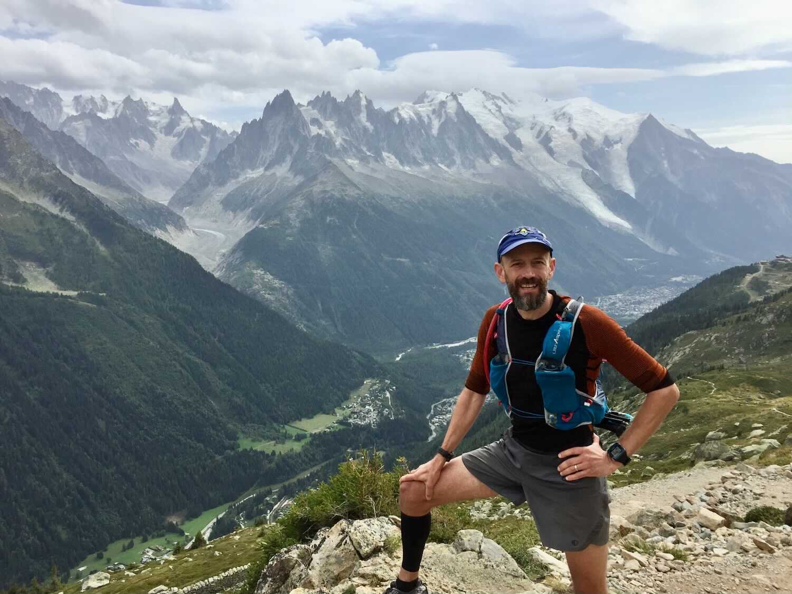

I’m writing this account in August of 2021, so it skips a lot of details (my trail amnesia is notorious), and relies mainly on the notes I took back then. Thankfully, UTMB also publishes detailed tracking data for every runner, which is how I know my arrival times, my position in the field, and other details.

My Facebook post on the day of the race is probably a good way to begin. Here it is:

> Under 5 hours to the start of UTMB 2017, and I’m feeling incredibly privileged to be here, thankful for family and friends here with me, touched by all the messages of support from afar, and mainly very eager to get underway.  I’m feeling all-systems-go: well-rested, physically/mechanically sound, gear and nutrition packed-up and ready (final pack weight 12.8 lbs.), race plan (and charts, of course) in place.
>
> There’s some dramatic weather (that’s the best kind) in store (message from the race this morning: “ATTENTION snow >2000m and temperature felt -9C”), and lots of climbing in some tough and beautiful mountains.  I intend to savor every moment of it, and do my best to represent our PA trailrunning culture and community in a worthy fashion — I am both overwhelmed and inspired at the thought of that responsibility.  Thank you all.

## The Start

It was exhilarating, the crush of so many runners in such a small space, the nerves and the cheering and all that crowd energy — I’ve not been part of a start like that in any other ultra, nor in any race since maybe the Chicago Marathon back in the 90s. This is truly the closest I’ll ever get to the Olympics.

In a start like this, you have almost no autonomy, no option other than to go with the flow of the people around you, no faster or slower. And you’d best balance your desire to take in the spectacle of it all with some concentration on the surface at your feet, especially as the road gets rougher on the outskirts of town. If you fall here, you’ll be trampled.

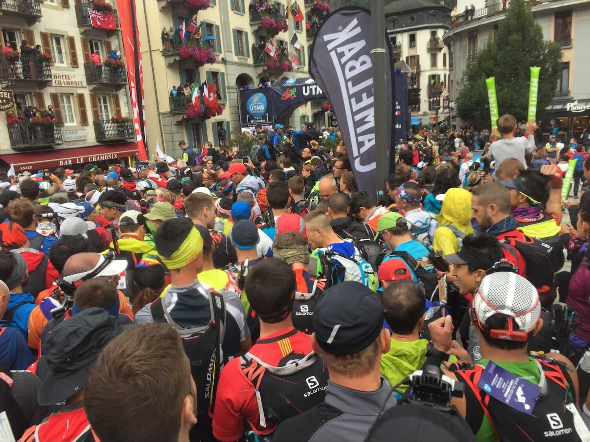 My view at the start.
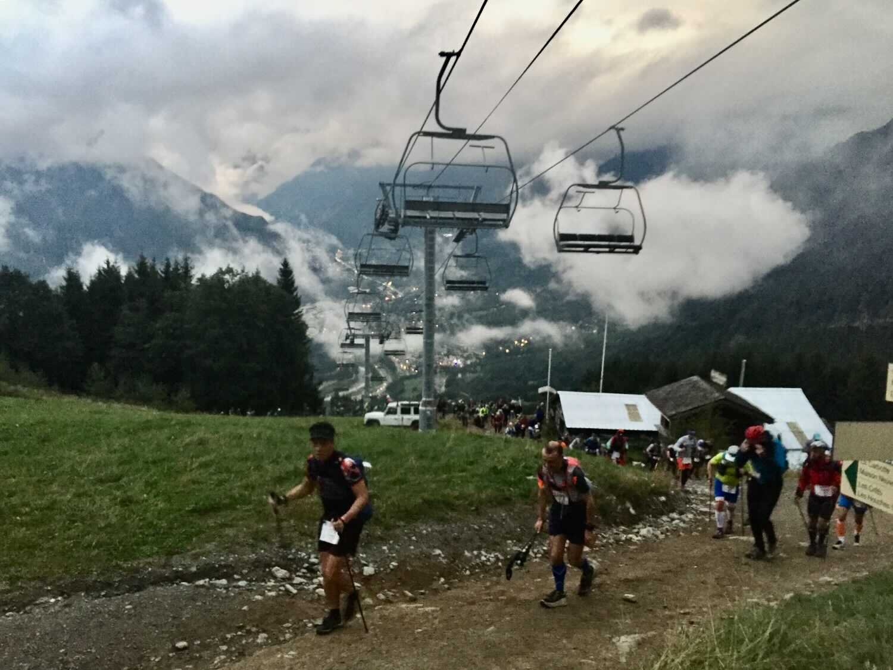 Conga line on the first climb (Les Houches and Chamonix in the background)
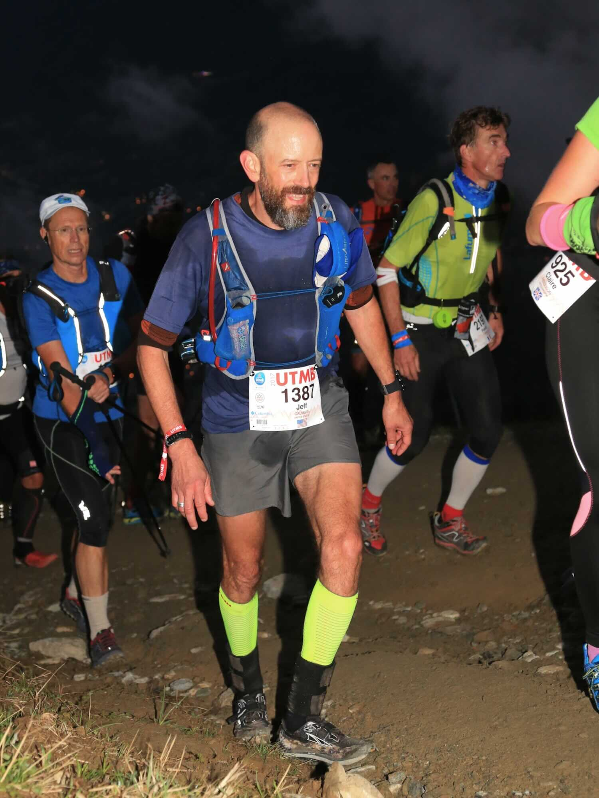 … and my place in it. (I’m probably sweating more than I should be so early in the race.) ( PC: Maindru Photos)

## First Night: Crowds, a collision, allez-allez, and finally some peace in the very early morning

The first night is a blur. I have a few clear images in my mind, but not much context for them other than “first night” — no real sense of where exactly I was. The images mainly involve the dreadful crowd, the endless conga line that is unavoidable in the early stages of a race with over 2500 people.

Patience in a crowd is easier on the climbs. You know you should go slowly anyway, and the crowd helps with that. You pass every so often when an opportunity presents, but mainly you just slog along with everyone else.

But the downs… these early descents were maddening. They were easy, and they should have been fast. They were slick, yes (from heavy dew and mud and maybe some rain), but I train for that (and I was wearing my Altra Kings), and I wanted to go. But the crowd, that slow, hesitant, maddening crowd…

Some people were frustrated enough to take risks. We were on a long grassy down, a giant sloped pasture laced with a meandering web of interlocking cattle paths. These multiple paths allowed for a large speed differential between the confident and the hesitant, but there were some tight turns. One overeager young speedster in front of me lost control on one of those turns, and smashed into another runner at full speed in a brutal collision that left them both lying in the grass.

Patience, patience.

The first town, Saint-Gervais, was a welcome introduction to how it would be in villages for the rest of the journey — Tour de France-style crowds lining the entire route through town. Cheering and waving, high fiving kids…

…and that perfect French cheer “Allez Allez” that rolls off the tongue so smoothly and hits your ear and your mind so perfectly. It holds no judgment or false hope, only an insistent “go”, and it’s so much better than our own weak “nice work” and “you’re looking good”.

The only other notable thing from that night was some time I spent with friend Lee Connor. We had leapfrogged a couple times through the night, but somewhere past Les Chapieux (mile 31) we started running together. The field was beginning to string out by then and we settled into a smooth and chill late-night cruise, with maybe 10 miles of good running and good conversation, through the final couple hours before dawn.

It was a slow start, but through the first night I moved up steadily and by morning I was solidly into the mid-pack.

## Second Sunrise

Second sunrise is a special time, and it usually means you’re nearing the end. But in a race like this, you’re just getting started. Which means you have to fight to maintain intensity.

I might not have done that.

The first rays of the rising sun caught the south face of Mont Blanc as I climbed from Lac Combal (mile 41) towards Arete du Mont Favre. It was the most striking and beautiful second sunrise I’ve ever experienced.

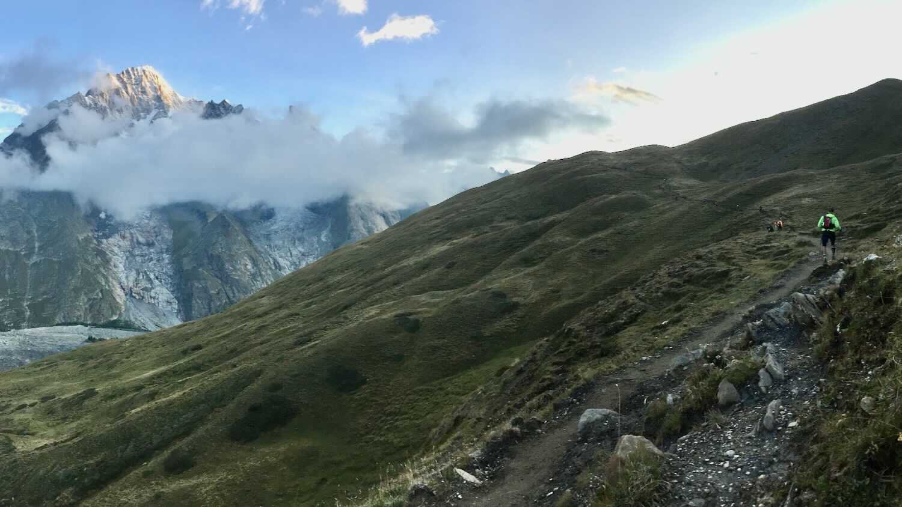

I don’t regret pausing for that photo. But it wasn’t the only one.

That’s how it goes for me, and it’s the reason I rarely do this in a race — taking pictures flips some subtle switch, and I drift into tourist mode. Racing and “just running” are two very different experiences and they give me different things, different views of a place. Both are valid and both are beautiful, but I enjoy them in different, non-interchangeable ways.

In tourist mode I lose my focus and I drift from my purpose. I drifted in many ways through this second day.

## Day Two: Drifting, aid station lollygagging, and a magnificent blizzard

Maybe you can see it here as I’m leaving Col Checrouit (mile 47). The glory of that sunrise is past and I’m settling into the warmth of the day and the long miles still ahead. My mouth is full of food, my stride is relaxed, the look on my face is just a little too satisfied… it’s not bad, and it’s sustainable (which is important, since I’m not even halfway), but I’m clearly not pushing the way I did through the night. I’m in tourist mode, autopilot, just drifting through a beautiful day in the mountains.

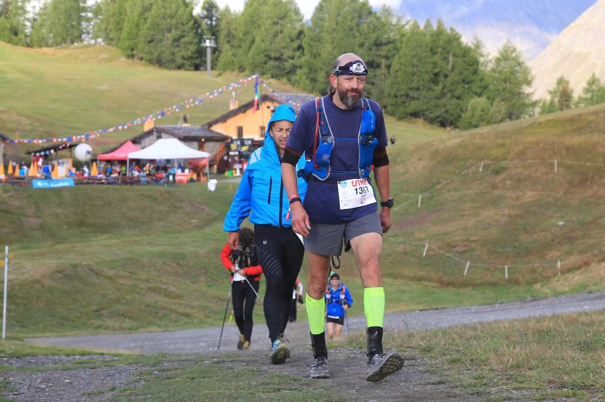 Leaving Col Checrouit — mile 47 ( PC: Maindru Photos)

By the time I got to Courmayeur (mile 49), that drift was taking its toll, and I was getting sleepy. Renee was delayed getting through the tunnel from France to Italy, and by the time she arrived, I was slipping into that stupor state of the sleep deprived. The rising heat of the day accentuated the effect.

Movement is the answer for that, and I finally did move on. And of course I cycled through the slump as I always do, kept on keeping on, but it was uninspired.

The most notable part of day two (other than sunrise) was the blizzard.

I’m not sure when the weather changed, but in this photo on the descent to Arnouvoz (mile 60) at about 1:45pm, it’s cloudy and I’ve got my hat and raincoat on. At Arnouvoz, no one could leave without donning rain pants. I was irritated — as long as it’s above 0F, I’m in shorts. I thought of trying my “it’s okay, I’m an American” line, but instead I just went along with the indignity of it and put the pants on.

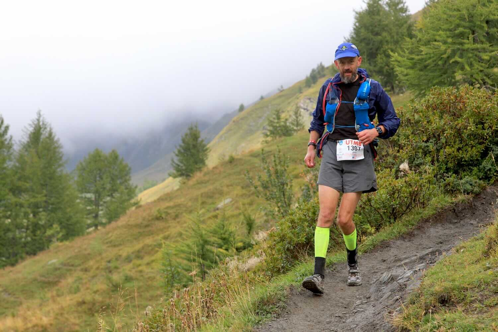 Descending to Arnouvoz— mile ~59 ( PC: Maindru Photos)

An hour and a half later (and 2400 feet higher), I crossed from Italy into Switzerland over the fabled Gran Col Ferret in high wind and a horizontal snowstorm, baggy pants and all. It was one of the coolest, most magical and surreal things I’ve ever done.

Another hour and a half, and I was to La Fouly (mile 68), invigorated by the spectacle of the mountains and the storm, but also tired, and facing another full night of running. I stalled again.

I was there in that station, trying to get myself to move on, but instead getting yet another cup of strong black tea, when Elle Spacek arrived. We’d never met, but we both had an American flag on our race bibs. We chatted a bit, I mentioned I was having trouble leaving, and she asked if I wanted to join her for a while. I did, and it was a good choice.

## Late Day Two: A critical alliance

We turned out to be a *really* good team.

We left La Fouly together, and through the next couple hours of evening, we got acquainted, told our trail stories. More importantly, we started to realize we were compatible. Elle was a powerful climber, just on the edge of my capability — she pulled me up the hills. I was stronger on the descents, maybe more practiced and confident with the technicality (and the mud) — I lead her down the hills. There was just enough difference to push us both, without blowing us up. I know for certain I was faster with her than I’d have been on my own, and I think the same was true for her.

By the time we got to Champex-Lac (mile 77) we realized it was worth extending this temporary union, and we agreed to leave the station together (and we set a time for that departure).

## Night Two: Turning point at Champex-Lac, rabbit hunting, and a decision

We arrived at Champex-Lac as night was falling, and we left in darkness.

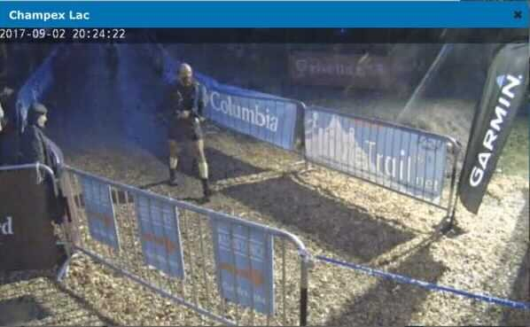
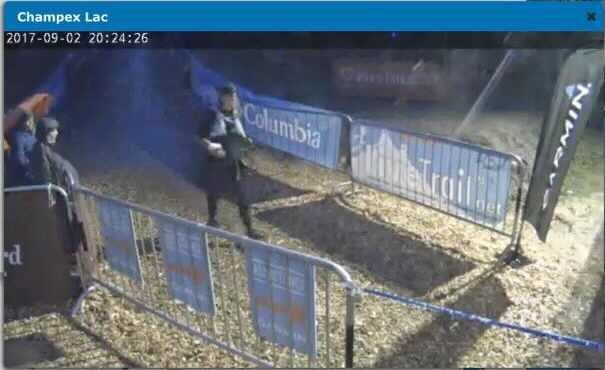

Arriving to Champex Lac (captures from the race camera — me on the left, Elle on the right)

It was a brief but powerful stop, the turning point of my race. Up to that point I’d had some good moments, and even with that day-two fade, I was still towards the front of the mid-pack. But it still felt mediocre, and something had to change.

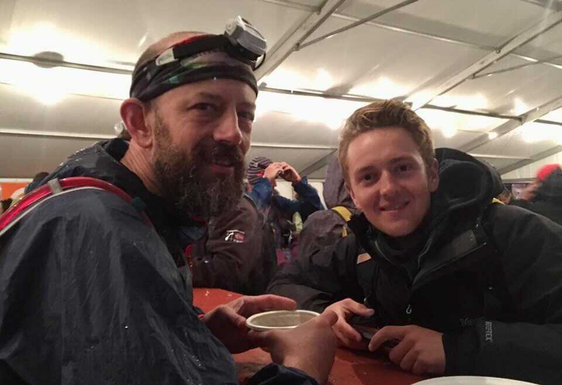 Hot soup and a crew visit at Champex-Lac — the turning point of the race.

It might have been seeing both Renee and Lucas, and knowing I had someone to leave here with (and an appointed time to meet her for departure, fast approaching). Or it might just have been time for it to happen. Either way, the sense of urgency returned, and I started to remember how I’d felt late in the race at Manitou’s earlier in the year. I realized that I wanted that feeling again — I wanted to pass people, to wear them down and knock them off one by one in the late miles. It’s a powerful feeling, addictive, and it’s hard to get to, but it’s also what I was really here for.

As we left that station, I got on that track, and through the remaining 28 miles of this race, I was the best runner I’ve ever been.

The details of it are hazy. Elle led the climbs, I led the descents, and we passed people. Over and over again we passed people, and it was incredibly fun. The fatigue faded, the miles went by, and soon we were at Col des Montets, less than 10 miles from the finish.

Our teamwork had been paying off: the race record shows that at that point we’d passed 162 people since leaving Champex-Lac. In just the short climb from Vallorcine to Col des Montets, we passed 17 people, and there were many more ahead, ripe for the plucking. I was in rabbit-hunting mode, feeling the surge. But now Elle was fading — she was so sleepy, after going so hard for so long.

I had a decision to make.

Before we seriously joined forces, I asked Elle to agree that if I couldn’t keep up, she wouldn’t let me hold her back. That was clearly the most likely scenario — she had just caught me, she was strong and I’d been fading, and it was the right deal to make. I figured I’d manage to hang with her for a little while, get a temporary boost for a few miles, and then I’d watch her pull away on a climb.

But that hadn’t happened, and now it was me about to pull away. I hesitated, thought about waiting, but then I thought about watching them go by, all those people we’d just worked so hard to pass on the last climb. It was too much — my inner good-teammate/protector yielded to my inner animal (“first, be a good animal”), and I pushed on.

I’m not particularly proud of that moment or that decision, but I *am* proud of the rest of the race.

## Early Morning, Third Sunrise, and the Finish

The high route from Montets to the final aid station at La Flegere was closed by the weather, and the course shifted to a route that stuck to the side of the mountain below treeline. It was rougher and rockier, not quite as extreme as Manitou’s, but similar. It fit my mood, and it was like an answer to the feeling that had started at Champex-Lac, and my memory of that race. This was my kind of trail and my kind of running — late race, tired-but-strong technical running, and it felt so good.

I was cruising, passing runner after runner, but a rising fog started to slow me down. I pulled out my backup headlamp (a Black Diamond Spot), opened the head strap as wide as it goes, stepped through, and pulled it up to my waist. The low-angle light cut through the fog and let me keep on moving on, let me pass people like they were standing still.

The final climb to La Flegere felt endless, but the sun was rising again, as was the sense that this was almost done. I passed another 58 people between Col Des Montets and La Flegere, and I got a solid dose of that rush I was seeking.

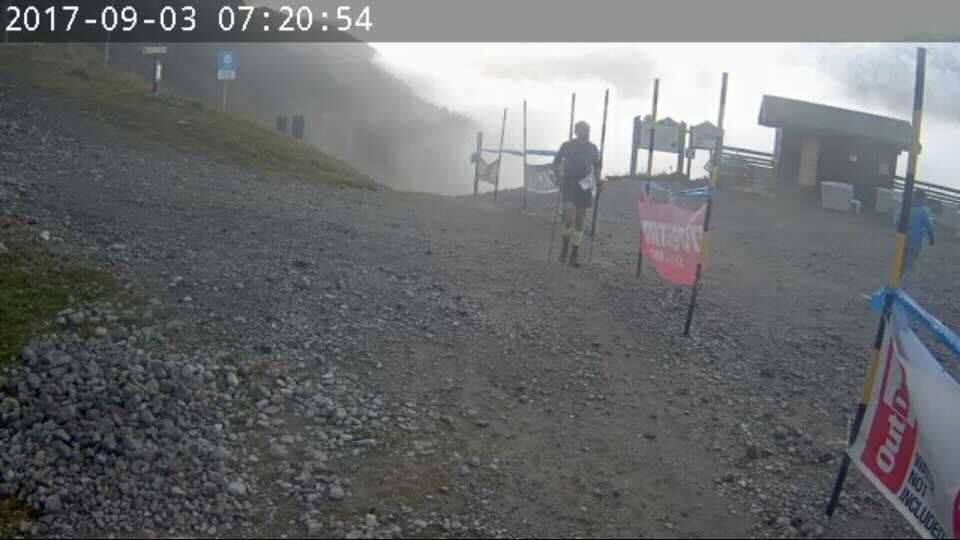 I wish I had a better shot than this race video capture, but it’s all here: me rising from the fog at the top of the final climb in the light of Third Sunrise, a very good moment.

The last 5 miles, a long and twisting descent on gravel roads and rooty, washed-out trails, went by quickly. At the bottom, back in Chamonix, it was just past 8am, too early for the big crowds. It was still loud, still more people than are likely to ever be cheering for me at a finish again. You wind your way through town, the crowd gets louder, and then you’re in that finish chute and 37 hours and 52 minutes after you started, it’s over, just like that.

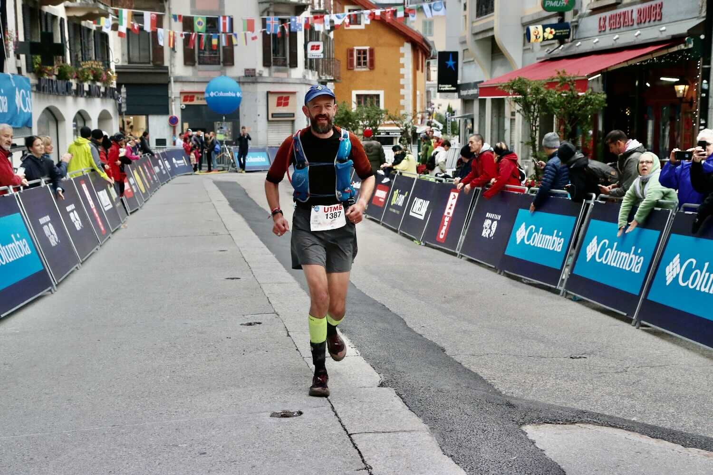 (PC: Maindru Photos)
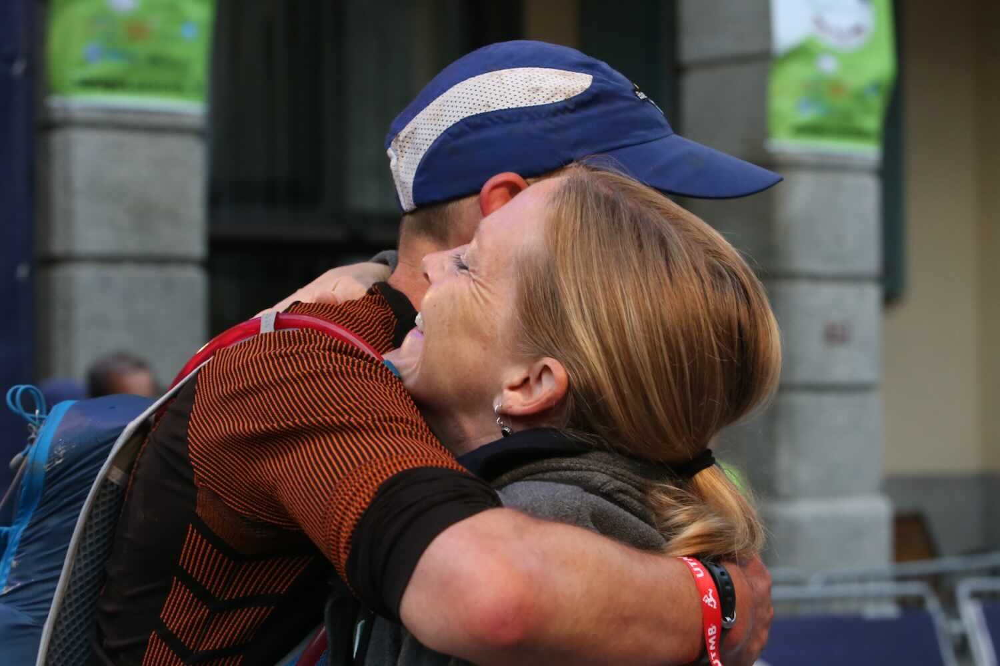 (PC: Maindru Photos)

It wasn’t long until Elle came in, too, recovered enough to finish strong and smooth — a good ending.

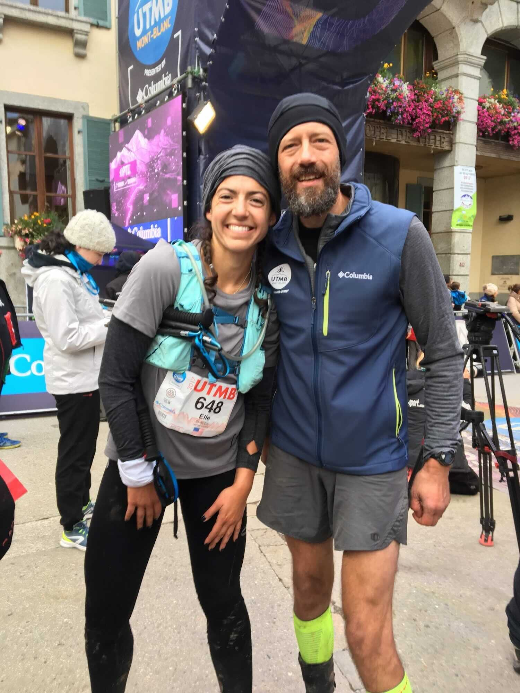

## Post Race

I don’t think I can say it better now than I did back then with my Facebook post from the day after the race. Here it is:

> So, that’s that.  UTMB was an amazing race — the hardest I’ve ever run.  Going in, I was thinking that a finish would be success, that this was probably a 40-hour race for me, and that if I had a really good weekend where everything went right, I had a shot at 38 hours.  Well everything did not go right (does it ever?), but some of them did, and it was enough to get me in at just under 38 hours.  I can look back at things I’d change (I spent far too much time in aid stations, for example), but I also made some very good choices along the way, and I can say without hesitation that in the final 25 miles of this race, I was the best I’ve been so far as a runner.  In that span I went from having visions of a death-march struggle against cut-offs, to feeling strong and smooth and getting stronger with each climb and each person I passed.
>
> This was not all me.  I’m deeply indebted to a lot of people — especially Elle (who I met and teamed-up with on the trail — thank you!) and my family (crewing this race was probably more of an ordeal than running it).  And also to those of you following from a distance — I don’t generally make my racing so public, but I felt a different level of responsibility with this one, and I wanted help in holding myself accountable for a full effort.  Carrying the GPS unit that let you track my progress, knowing you were watching and “with me” — it really did make a difference, and I thank you for that.

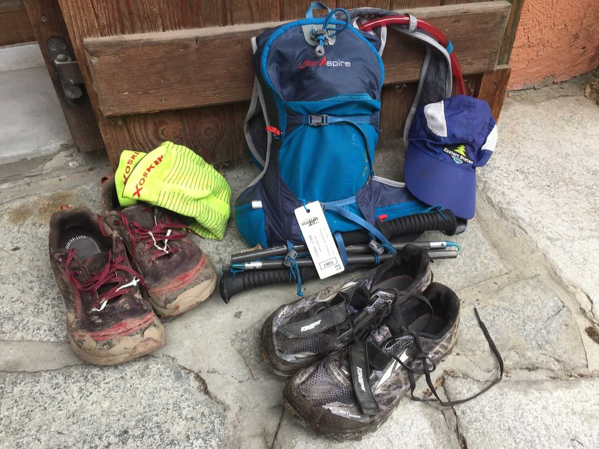
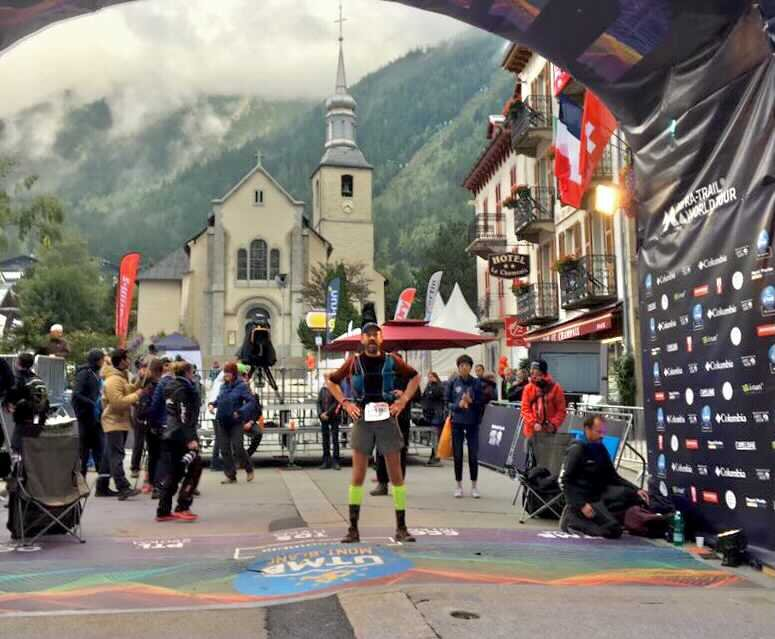
